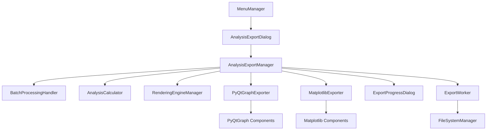

# Design Document

## Overview

本设计文档描述了图像分析数据导出功能的技术实现方案。该功能将通过顶部菜单栏提供访问入口，导出当前所有作业中图像的分析图表，支持PyQtGraph和Matplotlib两种渲染引擎，并提供清晰的文件层级结构。

## Architecture

### Core Components



### Design Principles

1. **Menu Integration**: 通过顶部菜单栏提供统一的访问入口
2. **Job-Based Export**: 基于作业系统导出处理后的图像分析结果
3. **Engine Independence**: 支持PyQtGraph和Matplotlib两种渲染引擎
4. **Hierarchical Organization**: 提供清晰的文件层级结构和命名规范
5. **Async Processing**: 独立于UI异步渲染机制，确保数据完整性

## Components and Interfaces

### 1. MenuManager Extension

**Responsibility**: 在顶部菜单栏添加分析数据导出入口

**Interface**:
```python
class MenuManager:
    # 新增信号
    export_analysis_data_triggered = pyqtSignal()
    
    def _create_tools_menu(self, menu_bar: QMenuBar):
        # 在工具菜单中添加"导出分析数据..."选项
        pass
```

### 2. AnalysisExportDialog

**Responsibility**: 提供导出配置界面

**Interface**:
```python
class AnalysisExportDialog(QDialog):
    def __init__(self, batch_handler: BatchProcessingHandler, parent=None)
    def get_export_config(self) -> ExportConfig
    def show_job_preview(self) -> None
    def validate_export_settings(self) -> bool
```

**UI Components**:
- 作业预览列表（显示所有作业及其图像数量）
- 分析类型选择（RGB直方图、亮度波形图、RGB parade、色相分布、饱和度分布）
- 输出目录选择
- 文件格式选择（PNG、JPEG）
- 渲染引擎显示（当前使用的引擎）

### 3. AnalysisExportManager

**Responsibility**: 核心导出管理器，协调整个导出流程

**Interface**:
```python
class AnalysisExportManager:
    def __init__(self, 
                 batch_handler: BatchProcessingHandler,
                 analysis_calculator: AnalysisCalculator,
                 rendering_engine_manager: RenderingEngineManager)
    
    def export_job_analysis(self, config: ExportConfig) -> ExportResult
    def create_export_directory(self, base_path: str) -> str
    def get_job_processed_images(self, job) -> List[ProcessedImageData]
    def generate_analysis_data(self, image_data: ProcessedImageData, 
                             analysis_types: List[str]) -> Dict[str, Any]
```

### 4. Rendering Engine Exporters

#### PyQtGraphExporter
```python
class PyQtGraphExporter:
    def export_histogram(self, data: np.ndarray, filepath: str, config: ExportConfig) -> bool
    def export_rgb_parade(self, data: List[np.ndarray], filepath: str, config: ExportConfig) -> bool
    def export_waveform(self, data: np.ndarray, filepath: str, config: ExportConfig) -> bool
    def export_hue_saturation(self, hue_data: np.ndarray, sat_data: np.ndarray, 
                            filepath: str, config: ExportConfig) -> bool
```

#### MatplotlibExporter
```python
class MatplotlibExporter:
    def export_histogram(self, data: np.ndarray, filepath: str, config: ExportConfig) -> bool
    def export_rgb_parade(self, data: List[np.ndarray], filepath: str, config: ExportConfig) -> bool
    def export_waveform(self, data: np.ndarray, filepath: str, config: ExportConfig) -> bool
    def export_hue_saturation(self, hue_data: np.ndarray, sat_data: np.ndarray, 
                            filepath: str, config: ExportConfig) -> bool
```

### 5. Data Models

#### ExportConfig
```python
@dataclass
class ExportConfig:
    output_directory: str
    analysis_types: List[str]  # ['histogram', 'rgb_parade', 'waveform', 'hue_distribution', 'saturation_distribution']
    file_format: str = 'PNG'  # PNG, JPEG
    resolution: Tuple[int, int] = (1920, 1080)
    quality: int = 95  # for JPEG
    include_job_effects: bool = True
```

#### ProcessedImageData
```python
@dataclass
class ProcessedImageData:
    original_path: str
    image_name: str
    processed_image: np.ndarray
    job_effects: List[ImageOperation]
    unique_suffix: str = ""  # for duplicate names
```

#### ExportResult
```python
@dataclass
class ExportResult:
    success: bool
    total_images: int
    exported_files: int
    failed_files: int
    output_directory: str
    error_messages: List[str]
    export_summary: Dict[str, int]  # analysis_type -> count
```

## Data Models

### File Organization Structure

```
{渲染引擎类型}_{导出时间}/
├── RGB直方图/
│   ├── image1_RGB直方图.png
│   ├── image2_RGB直方图.png
│   └── image1_RGB直方图_1.png  # duplicate name handling
├── 亮度波形图/
│   ├── image1_亮度波形图.png
│   └── image2_亮度波形图.png
├── RGB_parade/
│   ├── image1_RGB_parade.png
│   └── image2_RGB_parade.png
├── 色相分布/
│   ├── image1_色相分布.png
│   └── image2_色相分布.png
├── 饱和度分布/
│   ├── image1_饱和度分布.png
│   └── image2_饱和度分布.png
└── export_info.json  # export metadata
```

### Naming Convention

- **Main Directory**: `{Engine}_{YYYYMMDD_HHMMSS}` (e.g., "PyQtGraph_20241128_143022")
- **Analysis Subdirectories**: Chinese names for clarity
- **Image Files**: `{ImageName}_{AnalysisType}.{ext}`
- **Duplicate Handling**: Add numeric suffix `_{number}`

## Error Handling

### Error Categories

1. **Job System Errors**
   - No jobs available: Show user message
   - Job processing failed: Skip and log error
   - Image loading failed: Skip and continue

2. **File System Errors**
   - Directory creation failed: Prompt for alternative location
   - Insufficient disk space: Show space warning
   - Permission denied: Suggest running as administrator

3. **Rendering Errors**
   - Analysis calculation failed: Skip and log
   - Export format not supported: Fallback to PNG
   - Memory allocation failed: Reduce resolution and retry

4. **Data Processing Errors**
   - Invalid image data: Skip and continue
   - Effect application failed: Export original image analysis
   - Async rendering timeout: Extend timeout and retry

### Error Recovery Strategies

- **Graceful Degradation**: Continue with remaining images if some fail
- **Automatic Retry**: Retry failed operations with reduced parameters
- **User Notification**: Provide detailed error summary at completion
- **Partial Success**: Allow partial exports and report statistics

## Testing Strategy

### Unit Tests
- Individual exporter functionality
- File naming and conflict resolution
- Configuration validation
- Error handling scenarios

### Integration Tests
- End-to-end export workflow
- Job system integration
- Rendering engine compatibility
- File system operations

### Performance Tests
- Large job batch processing
- Memory usage monitoring
- Export speed benchmarking
- Concurrent operation handling

### User Acceptance Tests
- Menu integration usability
- Export quality verification
- Error message clarity
- File organization validation