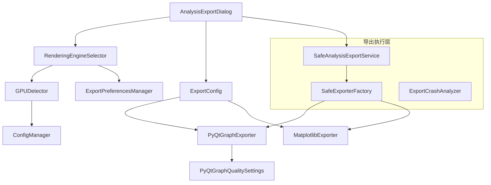
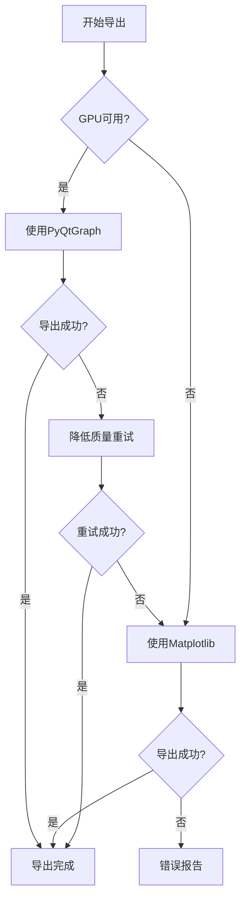

# 数据分析图表导出引擎选择功能设计文档

## 概述

本设计文档描述了如何在现有的数据分析导出系统中添加渲染引擎选择功能。设计将扩展现有的导出配置对话框，添加GPU检测机制，实现PyQtGraph导出器，并确保与现有架构的无缝集成。

## 架构设计

### 核心组件架构



### 数据流设计

1. **初始化阶段**：GPU检测 → 配置更新 → UI状态设置
2. **用户交互阶段**：引擎选择 → 质量设置 → 配置验证
3. **导出执行阶段**：配置传递 → 导出器选择 → 图表生成 → 文件保存

## 组件设计

### 1. GPU检测器 (GPUDetector)

**职责**：检测系统GPU支持情况并更新配置

```python
class GPUDetector:
    """GPU支持检测器"""
    
    def detect_gpu_support(self) -> GPUSupportInfo:
        """检测GPU支持情况"""
        
    def detect_nvidia_gpu(self) -> bool:
        """检测NVIDIA GPU"""
        
    def check_pyqtgraph_gpu_support(self) -> bool:
        """检查PyQtGraph GPU支持"""
        
    def get_gpu_memory_info(self) -> dict:
        """获取GPU内存信息"""
```

**检测逻辑**：
- 使用`nvidia-ml-py`检测NVIDIA GPU
- 检查PyQtGraph的OpenGL支持
- 验证GPU内存容量
- 测试基本GPU渲染功能

### 2. 渲染引擎选择器 (RenderingEngineSelector)

**职责**：提供引擎选择UI组件

```python
class RenderingEngineSelector(QWidget):
    """渲染引擎选择器控件"""
    
    engine_changed = pyqtSignal(str)
    quality_changed = pyqtSignal(str)
    
    def __init__(self, gpu_supported: bool):
        """初始化选择器"""
        
    def set_available_engines(self, engines: List[str]):
        """设置可用引擎"""
        
    def get_selected_engine(self) -> str:
        """获取选中的引擎"""
        
    def get_quality_settings(self) -> dict:
        """获取质量设置"""
```

**UI设计**：
- 引擎选择下拉框（PyQtGraph/Matplotlib）
- 质量等级滑块（仅PyQtGraph可用时显示）
- 引擎特性说明标签
- GPU状态指示器

### 3. PyQtGraph导出器 (PyQtGraphExporter)

**职责**：实现基于PyQtGraph的图表导出

```python
class PyQtGraphExporter(BaseExporter):
    """PyQtGraph导出器"""
    
    def __init__(self):
        """初始化导出器"""
        
    def export_histogram(self, data: List[np.ndarray], 
                        filepath: str, config: ExportConfig) -> bool:
        """导出RGB直方图"""
        
    def export_rgb_parade(self, data: List[np.ndarray], 
                         filepath: str, config: ExportConfig) -> bool:
        """导出RGB parade"""
        
    def export_waveform(self, data: np.ndarray, 
                       filepath: str, config: ExportConfig) -> bool:
        """导出亮度波形图"""
        
    def _create_pyqtgraph_widget(self, config: ExportConfig) -> pg.PlotWidget:
        """创建PyQtGraph控件"""
        
    def _apply_quality_settings(self, widget: pg.PlotWidget, 
                               quality: str) -> None:
        """应用质量设置"""
```

**质量设置映射**：
```python
QUALITY_SETTINGS = {
    'low': {
        'resolution': (800, 600),
        'antialias': False,
        'samples': 1
    },
    'medium': {
        'resolution': (1280, 720),
        'antialias': True,
        'samples': 2
    },
    'high': {
        'resolution': (1920, 1080),
        'antialias': True,
        'samples': 4
    },
    'ultra': {
        'resolution': (2560, 1440),
        'antialias': True,
        'samples': 8
    }
}
```

### 4. 导出配置扩展 (ExportConfig)

**扩展字段**：
```python
@dataclass
class ExportConfig:
    # 现有字段...
    
    # 新增字段
    rendering_engine: str = "matplotlib"  # 选择的渲染引擎
    pyqtgraph_quality: str = "medium"     # PyQtGraph质量等级
    gpu_acceleration: bool = False        # 是否启用GPU加速
    fallback_enabled: bool = True         # 是否启用回退机制
    
    def get_pyqtgraph_settings(self) -> dict:
        """获取PyQtGraph特定设置"""
        
    def validate_engine_compatibility(self) -> bool:
        """验证引擎兼容性"""
```

### 5. 导出对话框扩展 (AnalysisExportDialog)

**UI布局修改**：
```
┌─────────────────────────────────────┐
│ 作业预览                              │
├─────────────────────────────────────┤
│ 分析类型选择                          │
├─────────────────────────────────────┤
│ 渲染引擎设置                          │
│ ┌─────────────────────────────────┐ │
│ │ 引擎: [PyQtGraph ▼] [GPU状态]   │ │
│ │ 质量: [中等 ────●────] (仅GPU)   │ │
│ │ 说明: GPU加速渲染，适合实时...    │ │
│ └─────────────────────────────────┘ │
├─────────────────────────────────────┤
│ 输出设置                              │
├─────────────────────────────────────┤
│ 按钮组                                │
└─────────────────────────────────────┘
```

**新增方法**：
```python
def _create_rendering_engine_group(self, parent_layout: QVBoxLayout):
    """创建渲染引擎设置组"""
    
def _on_engine_selection_changed(self, engine: str):
    """处理引擎选择变化"""
    
def _on_quality_changed(self, quality: str):
    """处理质量设置变化"""
    
def _update_engine_info(self, engine: str):
    """更新引擎信息显示"""
```

## 数据模型设计

### GPU支持信息

```python
@dataclass
class GPUSupportInfo:
    """GPU支持信息"""
    has_nvidia_gpu: bool
    gpu_name: str
    gpu_memory_mb: int
    pyqtgraph_gpu_support: bool
    opengl_version: str
    recommended_quality: str
```

### 导出引擎信息

```python
@dataclass
class ExportEngineInfo:
    """导出引擎信息"""
    name: str
    display_name: str
    description: str
    supported_formats: List[str]
    requires_gpu: bool
    quality_levels: List[str]
    performance_rating: int  # 1-5
```

## 错误处理设计

### 错误类型定义

```python
class GPUDetectionError(Exception):
    """GPU检测错误"""
    
class PyQtGraphExportError(ExportRenderError):
    """PyQtGraph导出错误"""
    
class QualitySettingError(Exception):
    """质量设置错误"""
```

### 回退机制

1. **引擎级回退**：PyQtGraph失败 → Matplotlib
2. **质量级回退**：超高质量失败 → 高质量 → 中等质量
3. **功能级回退**：GPU加速失败 → CPU渲染
4. **格式级回退**：PNG失败 → JPEG

### 错误恢复流程



## 测试策略

### 单元测试

1. **GPUDetector测试**
   - 模拟不同GPU环境
   - 测试检测逻辑准确性
   - 验证配置更新

2. **PyQtGraphExporter测试**
   - 测试各种分析类型导出
   - 验证质量设置效果
   - 测试错误处理

3. **配置管理测试**
   - 测试配置保存/加载
   - 验证兼容性检查
   - 测试默认值处理

### 集成测试

1. **端到端导出测试**
   - 完整导出流程测试
   - 多引擎切换测试
   - 错误恢复测试

2. **UI交互测试**
   - 引擎选择交互
   - 质量设置交互
   - 状态同步测试

### 性能测试

1. **GPU性能测试**
   - 不同质量级别性能对比
   - 内存使用量测试
   - 导出速度测试

2. **回退性能测试**
   - 回退机制响应时间
   - 资源清理效率
   - 错误恢复速度

## 兼容性考虑

### 向后兼容性

- 现有导出配置自动迁移到新格式
- 不支持GPU的系统自动使用Matplotlib
- 保持现有API接口不变

### 平台兼容性

- Windows：完整GPU检测支持
- macOS：基础GPU检测（Metal支持）
- Linux：NVIDIA GPU检测支持

### 版本兼容性

- PyQt6：完整支持
- PyQtGraph：要求0.12.0+
- NVIDIA驱动：要求460.0+

## 部署考虑

### 依赖管理

```python
# requirements.txt 新增
nvidia-ml-py>=11.495.46  # GPU检测
pyopengl>=3.1.5         # OpenGL支持
```

### 配置迁移

```python
def migrate_export_config(old_config: dict) -> dict:
    """迁移旧版本导出配置"""
    new_config = old_config.copy()
    
    # 添加新字段默认值
    new_config.setdefault('rendering_engine', 'matplotlib')
    new_config.setdefault('pyqtgraph_quality', 'medium')
    new_config.setdefault('gpu_acceleration', False)
    
    return new_config
```

### 性能优化

1. **延迟加载**：GPU检测和PyQtGraph导出器按需加载
2. **缓存机制**：GPU信息和引擎能力缓存
3. **资源管理**：及时释放GPU资源，避免内存泄漏