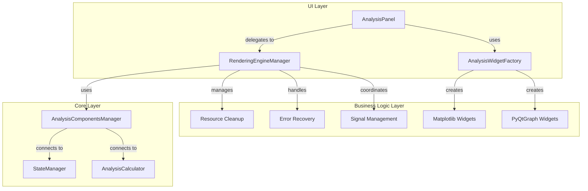

# 分析面板重构设计文档

## 1. 概述 (Overview)

- **目标**: 将 `AnalysisPanel` 中的复杂逻辑分离到专门的类中，提高代码的可维护性和可测试性
- **背景**: 当前 `AnalysisPanel` 承担了过多职责，包括UI管理、引擎切换、资源管理、错误处理等
- **范围**: 重构 `app/ui/panels/analysis_panel.py` 并创建新的管理类

## 2. 架构设计 (Architecture Design)

### 重构后的架构图



### 类职责分离

**AnalysisPanel (简化后)**:
- UI布局管理
- 用户交互处理
- 委托业务逻辑给管理器

**RenderingEngineManager (新增)**:
- 渲染引擎切换逻辑
- 资源生命周期管理
- 错误处理和回退
- 信号连接管理

**AnalysisWidgetFactory (新增)**:
- UI组件创建
- 引擎特定组件的工厂方法
- 组件创建错误处理

## 3. 组件设计 (Component Design)

### RenderingEngineManager

```python
class RenderingEngineManager:
    """渲染引擎管理器，负责引擎切换和资源管理"""
    
    def __init__(self, state_manager, image_processor, analysis_calculator):
        pass
    
    def switch_engine(self, engine_name: str, tabs_widget: QTabWidget, 
                     info_widget: QWidget) -> bool:
        """切换渲染引擎"""
        pass
    
    def cleanup_current_engine(self):
        """清理当前引擎资源"""
        pass
    
    def get_current_engine(self) -> str:
        """获取当前引擎名称"""
        pass
    
    def get_analysis_manager(self) -> AnalysisComponentsManager:
        """获取分析组件管理器"""
        pass
```

### AnalysisWidgetFactory

```python
class AnalysisWidgetFactory:
    """分析组件工厂，负责创建不同引擎的UI组件"""
    
    @staticmethod
    def create_widgets(engine_name: str) -> Dict[str, QWidget]:
        """根据引擎名称创建组件"""
        pass
    
    @staticmethod
    def get_supported_engines() -> List[str]:
        """获取支持的引擎列表"""
        pass
```

## 4. 实施计划 (Implementation Plan)

### 阶段一: 创建新的管理类
- 创建 `RenderingEngineManager` 类
- 创建 `AnalysisWidgetFactory` 类
- 将相关逻辑从 `AnalysisPanel` 迁移过来

### 阶段二: 重构 AnalysisPanel
- 简化 `AnalysisPanel` 的职责
- 使用新的管理类替换原有逻辑
- 保持公共接口不变

### 阶段三: 测试和验证
- 验证功能完整性
- 测试错误处理
- 确认性能没有退化

## 5. 文件结构

```
app/ui/panels/
├── analysis_panel.py (简化)
└── managers/
    ├── rendering_engine_manager.py (新增)
    └── analysis_widget_factory.py (新增)
```

## 6. 向后兼容性

- 所有公共方法保持不变
- 信号名称和参数保持不变
- 外部调用接口完全兼容