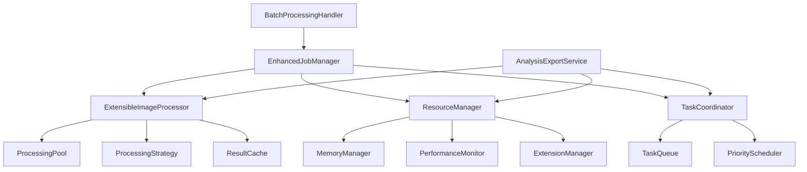
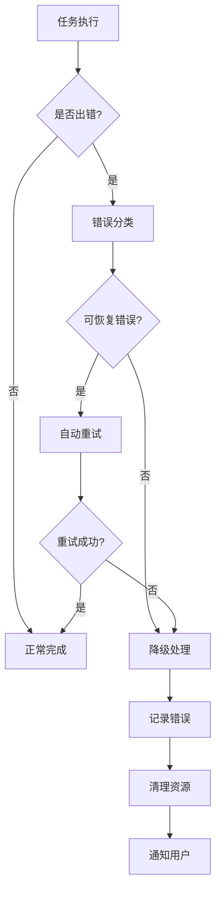

# 批处理系统与分析导出集成设计文档

## 概述

本设计文档描述了如何扩展现有批处理系统以更好地支持图像数据分析导出功能。通过深度集成和架构优化，解决当前导出功能中的稳定性问题。

## 架构设计

### 核心组件关系



### 设计原则

1. **线程安全优先**：所有共享资源访问都必须是线程安全的
2. **统一资源管理**：统一管理内存、线程和I/O资源，为未来扩展预留接口
3. **任务协调机制**：避免不同类型任务之间的资源竞争
4. **渐进式增强**：在不破坏现有功能的基础上逐步增强
5. **性能监控内置**：内置性能监控和优化机制
6. **可扩展架构**：为未来功能扩展预留接口和扩展点
7. **向后兼容**：确保新功能不影响现有批处理和分析导出功能
8. **抽象化设计**：通过抽象层支持未来的处理设备和算法扩展

## 组件设计

### 1. EnhancedJobManager（增强作业管理器）

**职责：** 扩展现有的BatchJobManager，增加分析导出支持，并为未来功能扩展预留接口

**新增接口：**
```python
class EnhancedJobManager(BatchJobManager):
    def create_analysis_export_task(self, job_id: str, config: ExportConfig) -> AnalysisExportTask
    def create_extensible_task(self, job_id: str, task_type: str, config: Dict) -> ExtensibleTask
    def get_job_with_processed_images(self, job_id: str, include_effects: bool) -> JobWithImages
    def update_export_progress(self, job_id: str, task_id: str, progress: int)
    def get_export_history(self, job_id: str) -> List[ExportRecord]
    def cleanup_export_resources(self, job_id: str, task_id: str)
    def register_task_handler(self, task_type: str, handler: TaskHandler)
```

**数据模型扩展：**
```python
@dataclass
class EnhancedBatchJob(BatchJob):
    export_tasks: Dict[str, AnalysisExportTask] = field(default_factory=dict)
    extensible_tasks: Dict[str, ExtensibleTask] = field(default_factory=dict)
    export_history: List[ExportRecord] = field(default_factory=list)
    resource_usage: ResourceUsageInfo = field(default_factory=ResourceUsageInfo)
    extension_data: Dict[str, Any] = field(default_factory=dict)  # 为未来扩展预留
```

### 2. ExtensibleImageProcessor（可扩展图像处理器）

**职责：** 提供线程安全的图像处理接口，支持未来处理方式扩展

**核心特性：**
- 线程池管理
- 可扩展的处理策略
- 结果缓存机制
- 内存使用监控
- 异常隔离处理
- 插件式架构支持

**接口设计：**
```python
class ExtensibleImageProcessor:
    def __init__(self, 
                 max_workers: int = 4, 
                 cache_size: int = 100,
                 extension_config: Dict = None)
    
    def render_pipeline_async(self, 
                            image: np.ndarray, 
                            operations: List[ImageOperation],
                            processing_hint: str = "default",
                            callback: Callable[[np.ndarray], None]) -> Future
    
    def render_pipeline_batch(self, 
                            images: List[np.ndarray], 
                            operations: List[ImageOperation],
                            processing_hint: str = "default") -> List[np.ndarray]
    
    def register_processor_extension(self, name: str, processor: ProcessorExtension)
    def get_available_processors(self) -> List[str]
    def get_processing_stats(self) -> ProcessingStats
    def clear_cache(self)
    def shutdown(self)
```

### 3. ResourceManager（资源管理器）

**职责：** 统一管理系统资源，防止资源耗尽，为未来资源类型扩展预留接口

**核心功能：**
- 内存使用监控和限制
- CPU使用率控制
- 磁盘空间检查
- 资源预分配和回收
- 可扩展的资源类型支持

**接口设计：**
```python
class ResourceManager:
    def __init__(self, config: ResourceConfig)
    
    def allocate_resources(self, task_type: str, estimated_usage: ResourceEstimate) -> ResourceAllocation
    def release_resources(self, allocation: ResourceAllocation)
    def get_available_resources(self, resource_type: str = "all") -> ResourceInfo
    def set_resource_limits(self, limits: ResourceLimits)
    def get_performance_metrics(self) -> PerformanceMetrics
    
    # 扩展接口
    def register_resource_provider(self, resource_type: str, provider: ResourceProvider)
    def get_supported_resource_types(self) -> List[str]
    
    # 资源监控回调
    def on_memory_threshold_exceeded(self, callback: Callable)
    def on_cpu_threshold_exceeded(self, callback: Callable)
    def register_threshold_callback(self, resource_type: str, callback: Callable)
```

### 4. TaskCoordinator（任务协调器）

**职责：** 协调不同类型的异步任务，避免资源冲突

**核心机制：**
- 任务优先级管理
- 资源冲突检测
- 任务依赖管理
- 负载均衡

**接口设计：**
```python
class TaskCoordinator:
    def __init__(self, resource_manager: ResourceManager)
    
    def submit_task(self, task: Task, priority: TaskPriority) -> TaskHandle
    def cancel_task(self, handle: TaskHandle) -> bool
    def get_task_status(self, handle: TaskHandle) -> TaskStatus
    def wait_for_completion(self, handles: List[TaskHandle], timeout: float) -> List[TaskResult]
    
    def set_concurrency_limits(self, task_type: str, max_concurrent: int)
    def get_queue_status(self) -> QueueStatus
```

### 5. 任务数据模型

#### AnalysisExportTask（分析导出任务）
```python
@dataclass
class AnalysisExportTask:
    task_id: str
    job_id: str
    config: ExportConfig
    status: TaskStatus = TaskStatus.PENDING
    progress: int = 0
    start_time: Optional[datetime] = None
    end_time: Optional[datetime] = None
    result: Optional[ExportResult] = None
    error_info: Optional[str] = None
    resource_allocation: Optional[ResourceAllocation] = None
```

#### ExtensibleTask（可扩展任务）
```python
@dataclass
class ExtensibleTask:
    task_id: str
    job_id: str
    task_type: str
    config: Dict[str, Any]
    status: TaskStatus = TaskStatus.PENDING
    progress: int = 0
    start_time: Optional[datetime] = None
    end_time: Optional[datetime] = None
    result: Optional[Dict[str, Any]] = None
    error_info: Optional[str] = None
    resource_allocation: Optional[ResourceAllocation] = None
    extension_data: Dict[str, Any] = field(default_factory=dict)
```

## 数据流设计

### 集成后的导出流程

#### 1. 分析导出流程
```
用户请求导出 → EnhancedJobManager.create_analysis_export_task()
→ ResourceManager.allocate_resources() → TaskCoordinator.submit_task()
→ ExtensibleImageProcessor.render_pipeline_batch() → AnalysisCalculator.calculate_analyses()
→ 渲染引擎导出器 → 文件写入 → 进度更新 → 资源清理
```

#### 2. 可扩展任务流程（为未来功能预留）
```
用户请求扩展功能 → EnhancedJobManager.create_extensible_task()
→ ResourceManager.allocate_resources() → TaskCoordinator.submit_task()
→ 扩展处理器.process() → 结果处理 → 进度更新 → 资源清理
```

### 错误处理流程



## 性能优化策略

### 1. 内存管理优化

- **分层缓存**：L1缓存（处理结果）、L2缓存（分析数据）
- **内存池**：预分配大块内存，减少频繁分配/释放
- **垃圾回收**：主动触发垃圾回收，避免内存泄漏

### 2. 并发处理优化

- **工作窃取**：空闲线程可以处理其他队列的任务
- **批处理合并**：相似任务合并处理，提高效率
- **流水线处理**：图像处理、分析计算、导出写入并行进行

### 3. I/O优化

- **异步I/O**：使用异步文件操作，避免阻塞
- **批量写入**：合并小文件写入操作
- **压缩传输**：对大数据进行压缩处理

## 兼容性保证

### 1. 向后兼容

- 现有BatchJob模型保持不变
- 新功能通过扩展类实现
- 原有API继续可用
- 现有的AnalysisExportService保持功能完整

### 2. 渐进式迁移

- 阶段1：增加线程安全支持，不影响现有批处理功能
- 阶段2：集成资源管理，统一管理批处理和分析导出资源
- 阶段3：优化性能和错误处理，提升整体稳定性

### 3. 配置兼容

- 新增配置项有合理默认值
- 支持运行时配置调整
- 提供配置迁移工具
- 保持现有导出配置的完整性

### 4. 功能隔离保证

- 批处理功能和分析导出功能在逻辑上完全隔离
- 通过ResourceManager统一协调资源使用，避免冲突
- 使用独立的线程池处理不同类型的任务
- 错误隔离：一个功能的失败不会影响另一个功能

## 扩展性数据模型定义

### ProcessorExtension（处理器扩展接口）
```python
class ProcessorExtension(ABC):
    @abstractmethod
    def process(self, image: np.ndarray, config: Dict[str, Any]) -> np.ndarray:
        pass
    
    @abstractmethod
    def get_name(self) -> str:
        pass
    
    @abstractmethod
    def get_supported_configs(self) -> List[str]:
        pass
```

### ResourceProvider（资源提供者接口）
```python
class ResourceProvider(ABC):
    @abstractmethod
    def get_available_resources(self) -> ResourceInfo:
        pass
    
    @abstractmethod
    def allocate(self, amount: int) -> ResourceAllocation:
        pass
    
    @abstractmethod
    def release(self, allocation: ResourceAllocation) -> None:
        pass
```

### TaskHandler（任务处理器接口）
```python
class TaskHandler(ABC):
    @abstractmethod
    def handle_task(self, task: ExtensibleTask) -> TaskResult:
        pass
    
    @abstractmethod
    def get_supported_task_types(self) -> List[str]:
        pass
```