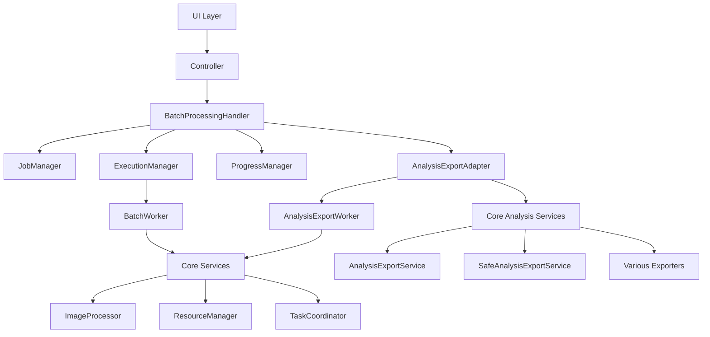

# 批处理与资源管理重构设计文档

## 概述

本设计文档详细描述了将现有Python应用从按技术类型组织转换为按功能模块组织的重构方案。重构将采用分阶段实施策略，确保在整个过程中应用的稳定性和可维护性。

## 架构设计

### 目标架构概览

```
app/
├── core/                       # 核心服务层 - 通用基础服务
│   ├── processing/             # 图像处理核心能力
│   ├── resources/              # 系统资源管理
│   ├── tasks/                  # 异步任务协调
│   └── monitoring/             # 性能监控
│
├── features/                   # 功能层 - 业务功能模块
│   └── batch_processing/       # 批处理功能模块
│       ├── managers/           # 批处理专属管理器
│       ├── ui/                 # 批处理UI组件
│       ├── analysis/           # 分析导出功能
│       │   ├── services/       # 分析导出服务
│       │   ├── exporters/      # 导出器适配
│       │   └── worker.py       # 分析导出工作线程
│       ├── handler.py          # 批处理协调器
│       ├── worker.py           # 批处理工作线程
│       └── models.py           # 批处理数据模型
│
└── controllers/                # 控制器层 - UI与业务逻辑桥梁
```

### 分层设计原则

1. **核心服务层 (Core Layer)**
   - 职责：提供通用的、可复用的基础服务
   - 特点：与具体业务无关，高度抽象
   - 依赖方向：不依赖功能层

2. **功能层 (Features Layer)**
   - 职责：实现具体的业务功能
   - 特点：高内聚，功能完整
   - 依赖方向：可依赖核心服务层

3. **控制器层 (Controllers Layer)**
   - 职责：连接UI与业务逻辑
   - 特点：薄层，主要负责协调
   - 依赖方向：依赖功能层

## 组件和接口设计

### 核心服务层组件

#### 1. 图像处理服务 (app/core/processing/)

```python
# interfaces.py
from abc import ABC, abstractmethod

class ProcessorExtension(ABC):
    @abstractmethod
    def process(self, image_data): pass

# image_processor.py  
class ExtensibleImageProcessor:
    def __init__(self):
        self.extensions = []
    
    def register_extension(self, extension: ProcessorExtension):
        self.extensions.append(extension)

# extensions.py
class ConcreteProcessorExtension(ProcessorExtension):
    def process(self, image_data):
        # 具体实现
        pass
```

#### 2. 资源管理服务 (app/core/resources/)

```python
# interfaces.py
class ResourceProvider(ABC):
    @abstractmethod
    def allocate_resource(self, resource_type): pass
    
    @abstractmethod
    def release_resource(self, resource_id): pass

# manager.py
class ResourceManager:
    def __init__(self):
        self.providers = {}
        self.allocated_resources = {}
    
    def register_provider(self, resource_type, provider: ResourceProvider):
        self.providers[resource_type] = provider

# providers.py
class MemoryResourceProvider(ResourceProvider):
    def allocate_resource(self, resource_type):
        # 内存资源分配实现
        pass
```

#### 3. 任务协调服务 (app/core/tasks/)

```python
# interfaces.py
class TaskHandler(ABC):
    @abstractmethod
    def handle_task(self, task): pass

# coordinator.py
class TaskCoordinator:
    def __init__(self):
        self.handlers = {}
        self.task_queue = []
    
    def register_handler(self, task_type, handler: TaskHandler):
        self.handlers[task_type] = handler

# handlers.py
class BatchTaskHandler(TaskHandler):
    def handle_task(self, task):
        # 批处理任务处理实现
        pass
```

### 功能层组件设计

#### 批处理功能模块 (app/features/batch_processing/)

```python
# models.py
from dataclasses import dataclass
from typing import List, Optional
from enum import Enum

class JobStatus(Enum):
    PENDING = "pending"
    RUNNING = "running"
    COMPLETED = "completed"
    FAILED = "failed"

class AnalysisType(Enum):
    RGB_HISTOGRAM = "rgb_histogram"
    LUMINANCE_WAVEFORM = "luminance_waveform"
    RGB_PARADE = "rgb_parade"
    HUE_DISTRIBUTION = "hue_distribution"
    SATURATION_DISTRIBUTION = "saturation_distribution"

@dataclass
class BatchJob:
    id: str
    name: str
    status: JobStatus
    input_files: List[str]
    output_path: str
    progress: float = 0.0
    error_message: Optional[str] = None
    analysis_enabled: bool = False
    analysis_types: List[AnalysisType] = None

@dataclass
class AnalysisExportConfig:
    output_directory: str
    analysis_types: List[AnalysisType]
    include_job_effects: bool = True
    rendering_engine: str = "matplotlib"

# handler.py
class BatchProcessingHandler:
    def __init__(self, job_manager, execution_manager, progress_manager, analysis_service=None):
        self.job_manager = job_manager
        self.execution_manager = execution_manager
        self.progress_manager = progress_manager
        self.analysis_service = analysis_service
    
    def start_batch_processing(self, job: BatchJob):
        # 批处理启动逻辑
        pass
    
    def export_job_analysis(self, job_id: str, config: AnalysisExportConfig):
        # 作业分析导出逻辑
        if self.analysis_service:
            return self.analysis_service.export_job_analysis(job_id, config)

# managers/job_manager.py
class JobManager:
    def __init__(self):
        self.jobs = {}
    
    def create_job(self, job_config) -> BatchJob:
        # 作业创建逻辑
        pass
    
    def get_job(self, job_id) -> Optional[BatchJob]:
        return self.jobs.get(job_id)
    
    def get_job_analysis_data(self, job_id: str):
        # 获取作业分析数据
        pass

# analysis/services/analysis_export_adapter.py
class AnalysisExportAdapter:
    """分析导出服务适配器，连接核心导出服务和批处理功能"""
    
    def __init__(self, core_analysis_service, job_manager):
        self.core_service = core_analysis_service
        self.job_manager = job_manager
    
    def export_job_analysis(self, job_id: str, config: AnalysisExportConfig):
        # 适配核心服务到批处理功能
        job = self.job_manager.get_job(job_id)
        if not job:
            raise ValueError(f"Job {job_id} not found")
        
        # 转换配置格式并调用核心服务
        core_config = self._convert_config(config, job)
        return self.core_service.export_analysis(core_config)
```

## 数据模型设计

### 核心数据结构

1. **BatchJob**: 批处理作业的核心数据模型，包含分析导出配置
2. **ProcessingConfig**: 处理配置信息
3. **ResourceAllocation**: 资源分配记录
4. **TaskDefinition**: 任务定义结构
5. **AnalysisExportConfig**: 分析导出配置信息
6. **AnalysisType**: 分析类型枚举
7. **ExportResult**: 导出结果数据结构

### 数据流设计



## 错误处理设计

### 错误分类

1. **导入错误 (ImportError)**
   - 原因：模块路径变更
   - 处理：系统性更新所有import语句

2. **依赖注入错误**
   - 原因：AppContext中的对象实例化失败
   - 处理：修复AppContext中的导入和实例化逻辑

3. **信号槽连接错误**
   - 原因：Qt信号定义中的类型引用失效
   - 处理：更新信号定义中的类型导入

4. **序列化错误**
   - 原因：pickle文件中的类路径失效
   - 处理：提供数据迁移脚本

### 错误恢复策略

```python
# 示例：导入错误的兼容性处理
try:
    from app.features.batch_processing.models import BatchJob
except ImportError:
    # 向后兼容处理
    try:
        from app.core.models.batch_models import BatchJob
        import warnings
        warnings.warn("使用了已弃用的导入路径，请更新代码", DeprecationWarning)
    except ImportError:
        raise ImportError("无法找到BatchJob类，请检查重构是否完成")
```

## 测试策略

### 测试层次

1. **单元测试**
   - 测试各个组件的独立功能
   - 重点测试接口实现的正确性

2. **集成测试**
   - 测试模块间的协作
   - 验证依赖注入的正确性

3. **端到端测试**
   - 测试完整的业务流程
   - 验证UI与后端的连接

### 测试用例设计

```python
# 示例测试用例
class TestBatchProcessingRefactor:
    def test_import_paths_valid(self):
        """测试所有新的导入路径都有效"""
        from app.features.batch_processing.handler import BatchProcessingHandler
        from app.core.processing.image_processor import ExtensibleImageProcessor
        assert BatchProcessingHandler is not None
        assert ExtensibleImageProcessor is not None
    
    def test_dependency_injection(self):
        """测试依赖注入正常工作"""
        from app.context import AppContext
        context = AppContext()
        assert context.batch_handler is not None
        assert context.image_processor is not None
    
    def test_signal_slot_connections(self):
        """测试Qt信号槽连接正常"""
        from app.features.batch_processing.ui.progress_dialog import ProgressDialog
        dialog = ProgressDialog()
        # 验证信号定义和连接
        assert hasattr(dialog, 'job_finished')
```

## 迁移和部署策略

### 分阶段实施计划

1. **阶段1：创建新结构**
   - 创建新的目录结构
   - 复制文件到新位置（保留原文件）

2. **阶段2：修复导入**
   - 系统性更新所有import语句
   - 修复AppContext和依赖注入

3. **阶段3：测试验证**
   - 运行完整测试套件
   - 手动验证关键功能

4. **阶段4：清理旧代码**
   - 删除不再使用的旧文件
   - 清理空目录

### 回滚策略

```python
# 回滚脚本示例
def rollback_refactor():
    """重构回滚脚本"""
    import shutil
    import os
    
    # 恢复备份的原始文件
    if os.path.exists('backup/app'):
        shutil.rmtree('app')
        shutil.copytree('backup/app', 'app')
        print("重构已回滚到原始状态")
    else:
        print("未找到备份文件，无法回滚")
```

## 性能考虑

### 导入性能优化

1. **延迟导入**: 对于大型模块，使用延迟导入减少启动时间
2. **导入缓存**: 利用Python的模块缓存机制
3. **循环导入检测**: 实施静态分析工具检测潜在的循环导入

### 内存使用优化

1. **对象生命周期管理**: 明确定义各组件的生命周期
2. **资源池化**: 在ResourceManager中实现资源池化
3. **垃圾回收优化**: 确保重构后没有内存泄漏

## 监控和日志

### 重构过程监控

```python
# 重构进度监控
class RefactorMonitor:
    def __init__(self):
        self.completed_steps = []
        self.failed_steps = []
    
    def log_step_completion(self, step_name):
        self.completed_steps.append(step_name)
        print(f"✓ 完成步骤: {step_name}")
    
    def log_step_failure(self, step_name, error):
        self.failed_steps.append((step_name, error))
        print(f"✗ 步骤失败: {step_name} - {error}")
```

### 运行时监控

1. **导入时间监控**: 记录模块导入耗时
2. **依赖关系监控**: 跟踪模块间的依赖关系
3. **错误率监控**: 监控重构后的错误发生率

这个设计文档为重构提供了全面的技术指导，确保重构过程的系统性和可控性。