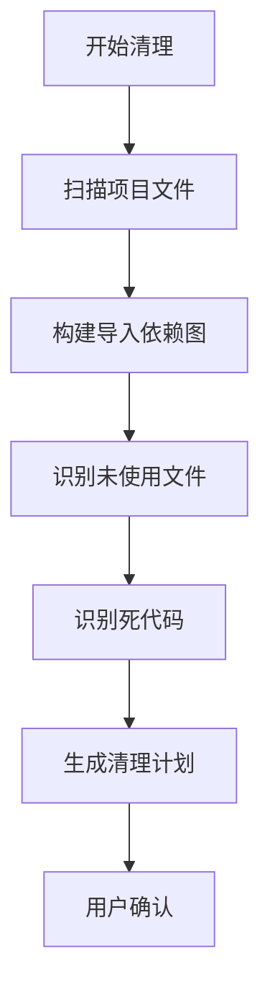
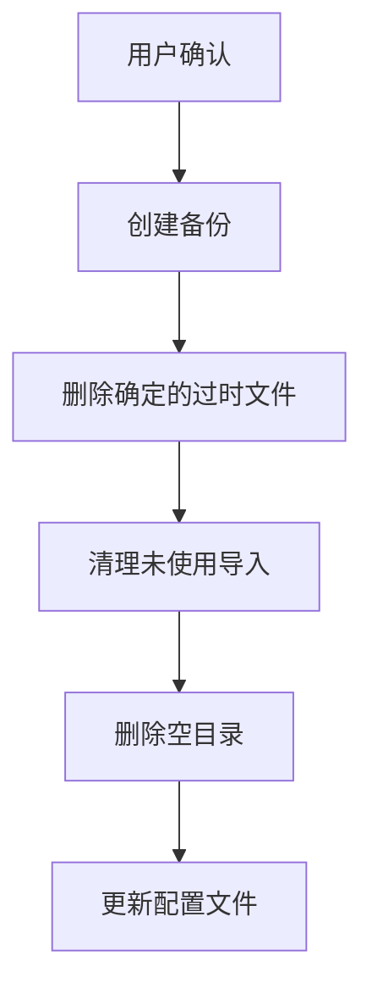
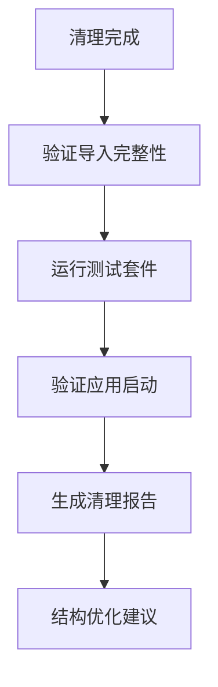

# 重构后代码清理设计文档

## 概述

本设计文档详细描述了重构完成后的代码清理策略和实施方案。清理工作将采用系统化的方法，确保在移除旧代码的同时不破坏现有功能，并优化项目的整体结构。

## 架构设计

### 清理策略概览

```
清理阶段:
1. 分析阶段 - 识别过时文件和代码
2. 验证阶段 - 确认安全删除的文件
3. 清理阶段 - 系统性删除过时内容
4. 优化阶段 - 结构优化和整理
5. 验证阶段 - 功能完整性验证
```

### 清理目标文件分类

#### 1. 确定删除的文件类别

**旧批处理文件:**
- `app/core/batch_processor.py` - 已被 `app/features/batch_processing/handler.py` 替代
- `app/workers/batch_processor_worker.py` - 已被 `app/features/batch_processing/worker.py` 替代
- `app/handlers/batch_processing/batch_processing_handler.py` - 已迁移到新位置

**旧集成层文件:**
- `app/core/integration/extensible_processor.py` - 已被 `app/core/processing/image_processor.py` 替代
- `app/core/integration/resource_manager.py` - 已被 `app/core/resources/manager.py` 替代
- `app/core/integration/task_coordinator.py` - 已被 `app/core/tasks/coordinator.py` 替代
- `app/core/integration/performance_monitor.py` - 已被 `app/core/monitoring/performance_monitor.py` 替代

**旧扩展文件:**
- `app/core/integration/extensions/processor_extensions.py` - 已被 `app/core/processing/extensions.py` 替代
- `app/core/integration/extensions/resource_providers.py` - 已被 `app/core/resources/providers.py` 替代
- `app/core/integration/extensions/task_handlers.py` - 已被 `app/core/tasks/handlers.py` 替代

#### 2. 需要评估的文件类别

**可能的冗余文件:**
- `app/workers/analysis_export_worker.py` - 需要确认是否已被 `app/features/batch_processing/analysis/worker.py` 替代
- `app/core/managers/batch_job_manager.py` - 需要确认是否已被 `app/features/batch_processing/managers/job_manager.py` 替代
- `app/core/managers/job_execution_manager.py` - 需要确认是否已被 `app/features/batch_processing/managers/execution_manager.py` 替代

## 组件和接口设计

### 清理工具设计

#### 1. 文件分析器 (FileAnalyzer)

```python
class FileAnalyzer:
    """文件使用情况分析器"""
    
    def __init__(self, project_root: str):
        self.project_root = project_root
        self.import_graph = {}
        self.usage_map = {}
    
    def analyze_imports(self) -> Dict[str, List[str]]:
        """分析所有文件的导入关系"""
        pass
    
    def find_unused_files(self) -> List[str]:
        """查找未被使用的文件"""
        pass
    
    def find_dead_code(self) -> Dict[str, List[str]]:
        """查找死代码（未被调用的类和方法）"""
        pass
    
    def validate_imports(self) -> List[str]:
        """验证导入语句的有效性"""
        pass
```

#### 2. 清理执行器 (CleanupExecutor)

```python
class CleanupExecutor:
    """清理操作执行器"""
    
    def __init__(self, analyzer: FileAnalyzer):
        self.analyzer = analyzer
        self.backup_dir = ".cleanup_backup"
        self.cleanup_log = []
    
    def create_backup(self, files: List[str]) -> bool:
        """创建文件备份"""
        pass
    
    def remove_files(self, files: List[str]) -> bool:
        """安全删除文件"""
        pass
    
    def clean_imports(self, file_path: str) -> bool:
        """清理文件中的未使用导入"""
        pass
    
    def remove_empty_directories(self) -> List[str]:
        """删除空目录"""
        pass
```

#### 3. 验证器 (Validator)

```python
class PostCleanupValidator:
    """清理后验证器"""
    
    def __init__(self, project_root: str):
        self.project_root = project_root
    
    def validate_imports(self) -> List[str]:
        """验证所有导入是否有效"""
        pass
    
    def run_tests(self) -> bool:
        """运行测试套件验证功能完整性"""
        pass
    
    def check_application_startup(self) -> bool:
        """验证应用能否正常启动"""
        pass
```

## 数据模型设计

### 清理配置模型

```python
@dataclass
class CleanupConfig:
    """清理配置"""
    # 要删除的文件列表
    files_to_delete: List[str] = field(default_factory=list)
    
    # 要删除的目录列表
    directories_to_delete: List[str] = field(default_factory=list)
    
    # 是否创建备份
    create_backup: bool = True
    
    # 是否清理未使用的导入
    clean_unused_imports: bool = True
    
    # 是否删除空目录
    remove_empty_dirs: bool = True
    
    # 验证设置
    run_tests_after_cleanup: bool = True
    validate_startup: bool = True
```

### 清理报告模型

```python
@dataclass
class CleanupReport:
    """清理报告"""
    # 删除的文件
    deleted_files: List[str] = field(default_factory=list)
    
    # 删除的目录
    deleted_directories: List[str] = field(default_factory=list)
    
    # 清理的导入数量
    cleaned_imports: Dict[str, int] = field(default_factory=dict)
    
    # 错误信息
    errors: List[str] = field(default_factory=list)
    
    # 警告信息
    warnings: List[str] = field(default_factory=list)
    
    # 清理统计
    total_files_deleted: int = 0
    total_size_freed: int = 0
    cleanup_duration: float = 0.0
```

## 清理流程设计

### 阶段1: 预分析



### 阶段2: 安全清理



### 阶段3: 验证和优化



## 错误处理设计

### 错误分类和处理策略

1. **文件删除错误**
   - 权限不足：提示用户以管理员身份运行
   - 文件被占用：建议关闭相关进程后重试
   - 路径不存在：记录警告但继续执行

2. **导入清理错误**
   - 语法错误：跳过该文件并记录错误
   - 编码问题：尝试不同编码或跳过
   - 循环导入：提供手动解决建议

3. **验证错误**
   - 测试失败：提供详细的失败信息和回滚选项
   - 启动失败：自动回滚关键文件
   - 导入错误：提供修复建议

## 安全措施设计

### 备份策略

```python
class BackupManager:
    """备份管理器"""
    
    def create_full_backup(self) -> str:
        """创建完整项目备份"""
        timestamp = datetime.now().strftime("%Y%m%d_%H%M%S")
        backup_path = f".cleanup_backup_{timestamp}"
        # 创建备份逻辑
        return backup_path
    
    def create_selective_backup(self, files: List[str]) -> str:
        """创建选择性备份"""
        # 只备份要删除的文件
        pass
    
    def restore_from_backup(self, backup_path: str) -> bool:
        """从备份恢复"""
        pass
```

### 回滚机制

```python
class RollbackManager:
    """回滚管理器"""
    
    def __init__(self, backup_manager: BackupManager):
        self.backup_manager = backup_manager
        self.operations_log = []
    
    def log_operation(self, operation: str, target: str):
        """记录操作"""
        self.operations_log.append({
            'operation': operation,
            'target': target,
            'timestamp': datetime.now()
        })
    
    def rollback_last_operation(self) -> bool:
        """回滚最后一个操作"""
        pass
    
    def rollback_all_operations(self) -> bool:
        """回滚所有操作"""
        pass
```

## 性能考虑

### 清理性能优化

1. **并行处理**: 对于大量文件的分析和清理，使用多线程处理
2. **增量分析**: 只分析自上次清理后修改的文件
3. **缓存机制**: 缓存导入依赖图，避免重复分析
4. **批量操作**: 批量删除文件而不是逐个删除

### 内存使用优化

1. **流式处理**: 对于大文件的分析使用流式处理
2. **分块处理**: 将大型项目分块处理，避免内存溢出
3. **及时释放**: 及时释放不再需要的数据结构

## 监控和日志

### 清理过程监控

```python
class CleanupMonitor:
    """清理过程监控器"""
    
    def __init__(self):
        self.start_time = None
        self.current_phase = None
        self.progress = 0
    
    def start_monitoring(self):
        """开始监控"""
        self.start_time = datetime.now()
    
    def update_progress(self, phase: str, progress: int):
        """更新进度"""
        self.current_phase = phase
        self.progress = progress
    
    def get_status(self) -> Dict[str, Any]:
        """获取当前状态"""
        return {
            'phase': self.current_phase,
            'progress': self.progress,
            'elapsed_time': datetime.now() - self.start_time if self.start_time else None
        }
```

### 详细日志记录

```python
class CleanupLogger:
    """清理日志记录器"""
    
    def __init__(self, log_file: str):
        self.log_file = log_file
        self.logger = self._setup_logger()
    
    def log_file_deletion(self, file_path: str, success: bool):
        """记录文件删除"""
        status = "SUCCESS" if success else "FAILED"
        self.logger.info(f"DELETE {status}: {file_path}")
    
    def log_import_cleanup(self, file_path: str, removed_imports: List[str]):
        """记录导入清理"""
        self.logger.info(f"IMPORT_CLEANUP: {file_path} - Removed: {removed_imports}")
    
    def log_error(self, operation: str, error: str):
        """记录错误"""
        self.logger.error(f"ERROR in {operation}: {error}")
```

这个设计文档为代码清理提供了全面的技术指导，确保清理过程的安全性、完整性和可追溯性。