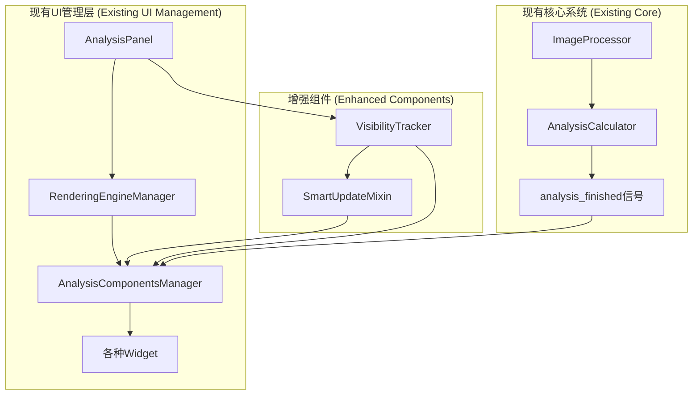
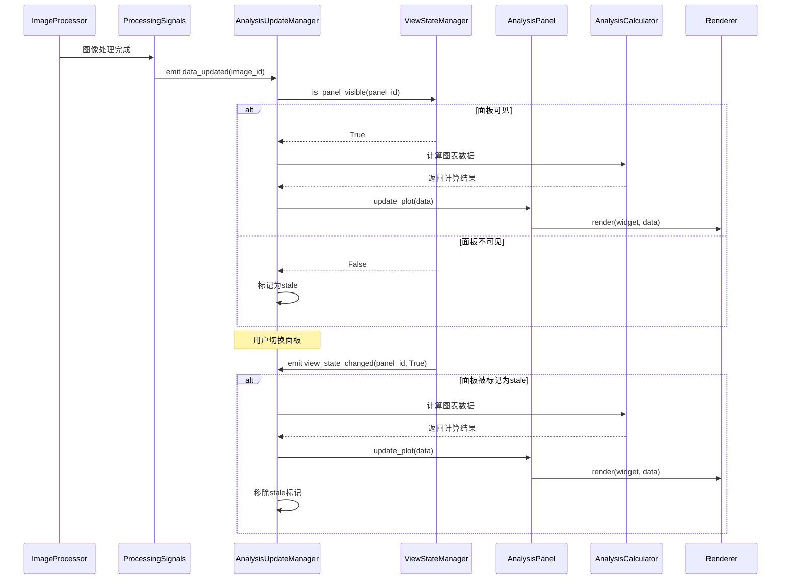

# Design Document: 数据分析图统一更新机制

## Overview

本设计文档描述了一个集中式的、高效的数据分析图更新机制的技术实现方案。该机制旨在解决当前因图像处理操作而导致的图表刷新延迟和不必要的计算资源浪费问题，实现"可见的立即更新，不可见的延迟更新"的核心目标。

设计采用事件驱动架构，通过信号/槽机制实现组件间的松耦合通信，并通过抽象层支持多种渲染引擎。

## Architecture

### 基于现有架构的增强设计

在现有架构基础上进行最小化改进，主要增强 `AnalysisComponentsManager` 的智能更新能力。



### 设计原则

1. **最小侵入**: 只增强现有的 `AnalysisComponentsManager`，不破坏现有架构
2. **Mixin模式**: 使用Mixin为现有组件添加智能更新能力
3. **利用现有信号**: 复用现有的 `analysis_finished` 和标签页切换信号
4. **Qt原生可见性**: 使用Qt的 `isVisible()` 方法，无需额外状态管理

### 数据流设计



## Components and Interfaces

### SmartUpdateMixin (智能更新混入类)

**职责**: 为现有的 `AnalysisComponentsManager` 添加智能更新能力。

```python
class SmartUpdateMixin:
    """智能更新混入类，为现有管理器添加智能更新能力"""
    
    def __init__(self):
        self._stale_tabs = set()  # 记录需要更新的标签页
        self._debounce_timer = QTimer()
        self._debounce_timer.setSingleShot(True)
        self._debounce_timer.timeout.connect(self._process_pending_updates)
        self._pending_update = False
        
    def smart_request_analysis_update(self, tab_index=None):
        """智能的分析更新请求"""
        if self.is_calculating:
            return
            
        if not self.state_manager.image_repository.is_image_loaded():
            return
            
        current_tab = self.analysis_tabs.currentIndex()
        target_tab = tab_index if tab_index is not None else current_tab
        
        # 检查目标标签页是否可见
        if target_tab == current_tab:
            # 当前标签页，立即更新
            self._immediate_update(target_tab)
        else:
            # 非当前标签页，标记为stale
            self._stale_tabs.add(target_tab)
            
    def _immediate_update(self, tab_index):
        """立即更新指定标签页"""
        # 调用原有的更新逻辑
        self.request_analysis_update(tab_index)
        
    def smart_on_analysis_tab_changed(self, index):
        """智能的标签页切换处理"""
        # 如果切换到的标签页被标记为stale，则更新它
        if index in self._stale_tabs:
            self._stale_tabs.remove(index)
            self._immediate_update(index)
        else:
            # 否则调用原有逻辑
            self.on_analysis_tab_changed(index)
            
    def handle_data_changed(self):
        """处理数据变化事件"""
        # 使用防抖机制避免频繁更新
        self._pending_update = True
        self._debounce_timer.start(100)  # 100ms防抖
        
    def _process_pending_updates(self):
        """处理待处理的更新"""
        if self._pending_update:
            self._pending_update = False
            current_tab = self.analysis_tabs.currentIndex()
            self.smart_request_analysis_update(current_tab)
```

### EnhancedAnalysisComponentsManager (增强的分析组件管理器)

**职责**: 继承现有管理器并添加智能更新能力。

```python
class EnhancedAnalysisComponentsManager(AnalysisComponentsManager, SmartUpdateMixin):
    """增强的分析组件管理器，集成智能更新功能"""
    
    def __init__(self, *args, **kwargs):
        AnalysisComponentsManager.__init__(self, *args, **kwargs)
        SmartUpdateMixin.__init__(self)
        
        # 重新连接信号到智能处理方法
        self._reconnect_smart_signals()
        
    def _reconnect_smart_signals(self):
        """重新连接信号到智能处理方法"""
        # 断开原有连接
        try:
            self.analysis_tabs.currentChanged.disconnect()
        except TypeError:
            pass  # 如果没有连接则忽略
            
        # 连接到智能处理方法
        self.analysis_tabs.currentChanged.connect(self.smart_on_analysis_tab_changed)
        
    def request_analysis_update(self, tab_index=None):
        """重写更新请求方法，使用智能更新"""
        self.smart_request_analysis_update(tab_index)
```

### VisibilityTracker (可见性跟踪器)

**职责**: 跟踪分析面板的可见性状态，提供简单的状态查询。

```python
class VisibilityTracker(QObject):
    """可见性跟踪器，跟踪分析面板的显示状态"""
    
    def __init__(self, analysis_panel):
        super().__init__()
        self.analysis_panel = analysis_panel
        self._is_panel_visible = True  # 分析面板默认可见
        
    def is_analysis_panel_visible(self) -> bool:
        """检查分析面板是否可见"""
        return (self.analysis_panel.isVisible() and 
                not self.analysis_panel.visibleRegion().isEmpty())
                
    def connect_to_manager(self, manager):
        """连接到管理器，在可见性变化时通知"""
        # 可以在这里添加更复杂的可见性检测逻辑
        pass
```

## Data Models

### 核心数据结构

```python
@dataclass
class AnalysisViewState:
    """分析视图状态"""
    panel_id: str
    is_visible: bool
    is_stale: bool
    last_update_time: float
    update_count: int = 0

@dataclass
class UpdateRequest:
    """更新请求"""
    panel_id: str
    image_id: str
    priority: int  # 0=highest, 1=normal, 2=low
    timestamp: float
    data: Optional[Any] = None

@dataclass
class PerformanceMetrics:
    """性能指标"""
    panel_id: str
    calculation_time: float
    rendering_time: float
    total_time: float
    memory_usage: int
    timestamp: float
```

### 状态管理

系统维护以下状态信息：

- **面板可见性状态**: 每个面板的当前可见状态
- **数据新鲜度状态**: 每个面板的数据是否为最新
- **更新队列状态**: 待处理的更新请求队列
- **性能监控状态**: 各项性能指标的历史记录

## Error Handling

### 错误分类和处理策略

| 错误类型 | 处理策略 | 用户反馈 | 系统行为 |
|---------|---------|---------|---------|
| 数据计算失败 | 捕获异常，记录日志，保持上次成功状态 | 显示错误提示，提供重试按钮 | 继续处理其他面板 |
| 渲染失败 | 回退到默认渲染器或显示占位符 | 显示"渲染失败"消息 | 标记面板需要重新渲染 |
| 内存不足 | 自动清理缓存，降级到低精度模式 | 提示用户关闭部分面板 | 暂停非关键更新 |
| 线程同步错误 | 重新初始化相关组件 | 显示"系统正在恢复"消息 | 重启更新管理器 |

### 错误恢复机制

```python
class ErrorRecoveryManager:
    """错误恢复管理器"""
    
    def __init__(self):
        self._error_counts: Dict[str, int] = {}
        self._recovery_strategies = {
            'calculation_error': self._handle_calculation_error,
            'rendering_error': self._handle_rendering_error,
            'memory_error': self._handle_memory_error,
        }
    
    def handle_error(self, error_type: str, panel_id: str, exception: Exception) -> bool:
        """处理错误并尝试恢复"""
        pass
```

## Testing Strategy

### 单元测试

- **ViewStateManager测试**: 验证状态管理的正确性和线程安全性
- **AnalysisUpdateManager测试**: 验证更新逻辑和队列管理
- **渲染器测试**: 验证各种渲染器的功能和性能
- **错误处理测试**: 验证各种异常情况的处理

### 集成测试

- **端到端更新流程测试**: 从数据变化到UI更新的完整流程
- **多面板并发测试**: 多个面板同时更新的场景
- **渲染引擎切换测试**: Matplotlib和PyQt模式间的切换
- **性能压力测试**: 高频更新和大数据量场景

### 性能测试

```python
class PerformanceTestSuite:
    """性能测试套件"""
    
    def test_update_latency(self):
        """测试更新延迟"""
        # 目标: 可见面板500ms内更新
        
    def test_memory_usage(self):
        """测试内存使用"""
        # 目标: 内存增长控制在合理范围
        
    def test_concurrent_updates(self):
        """测试并发更新"""
        # 目标: 多面板同时更新不影响性能
```

### 测试数据和场景

- **小数据集**: 100x100像素图像，验证基本功能
- **中等数据集**: 1920x1080像素图像，验证正常使用场景
- **大数据集**: 4K及以上图像，验证性能极限
- **异常数据**: 损坏或格式错误的图像数据

## Performance Considerations

### 优化策略

1. **懒加载**: 只在面板可见时才进行数据计算
2. **缓存机制**: 缓存计算结果，避免重复计算
3. **防抖处理**: 合并短时间内的多次更新请求
4. **异步处理**: 使用工作线程进行耗时计算
5. **内存管理**: 及时释放不再需要的数据

### 性能监控

```python
class PerformanceMonitor:
    """性能监控器"""
    
    def __init__(self):
        self._metrics_history: List[PerformanceMetrics] = []
        self._alert_thresholds = {
            'calculation_time': 2.0,  # 秒
            'rendering_time': 0.5,   # 秒
            'memory_usage': 500 * 1024 * 1024,  # 500MB
        }
    
    def record_update_metrics(self, metrics: PerformanceMetrics) -> None:
        """记录更新性能指标"""
        
    def check_performance_alerts(self) -> List[str]:
        """检查性能警告"""
        
    def get_performance_summary(self) -> Dict[str, Any]:
        """获取性能摘要"""
```

## Security and Thread Safety

### 线程安全设计

- **状态管理**: 使用读写锁保护共享状态
- **信号处理**: 确保信号在主线程中处理UI更新
- **数据访问**: 使用线程安全的数据结构
- **资源管理**: 避免跨线程的资源竞争

### 安全考虑

- **输入验证**: 验证所有外部输入数据
- **资源限制**: 限制内存和CPU使用量
- **错误隔离**: 防止单个面板的错误影响整个系统