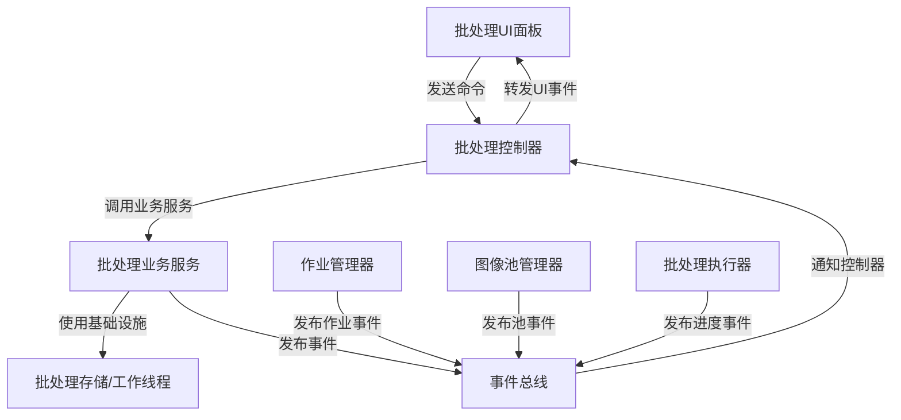

# 代码文件结构重构指导文档

## 概述

本文档详细说明分层架构重构过程中的文件结构变化、各文件职责以及旧代码清理步骤。严格按照此指导执行，确保重构过程中不会产生职责混乱或遗留代码问题。

## 虚拟环境和启动说明

**激活虚拟环境：**
```powershell
Set-ExecutionPolicy -ExecutionPolicy RemoteSigned -Scope Process
.\Rebirth\Scripts\Activate.ps1
```

**启动软件：**
```bash
python -m app.main
```

## 新的目录结构

### 修改后的完整目录结构

```
app/
├── layers/                          # 新增：分层架构根目录
│   ├── application/                 # 新增：应用层
│   │   ├── __init__.py
│   │   ├── bootstrap.py             # 新增：应用引导器
│   │   └── service_registry.py      # 新增：服务注册表
│   ├── presentation/                # 新增：表示层
│   │   ├── __init__.py
│   │   ├── interfaces/              # 新增：表示层接口
│   │   ├── windows/                 # 重构：主窗口
│   │   ├── dialogs/                 # 重构：对话框
│   │   └── panels/                  # 重构：面板
│   ├── controller/                  # 新增：控制器层
│   │   ├── __init__.py
│   │   ├── interfaces/              # 新增：控制器接口
│   │   ├── application_controller.py # 新增：应用控制器
│   │   ├── image_operation_controller.py # 新增：图像操作控制器
│   │   ├── file_operation_controller.py # 新增：文件操作控制器
│   │   └── batch_processing_controller.py # 新增：批处理控制器
│   ├── business/                    # 新增：业务层
│   │   ├── __init__.py
│   │   ├── interfaces/              # 新增：业务层接口
│   │   ├── processing/              # 重构：图像处理
│   │   ├── state/                   # 重构：状态管理
│   │   └── events/                  # 新增：业务事件
│   └── infrastructure/              # 重构：基础设施层
│       ├── __init__.py
│       ├── configuration/           # 重构：配置服务
│       ├── filesystem/              # 新增：文件系统服务
│       ├── logging/                 # 新增：日志服务
│       └── monitoring/              # 新增：监控服务
├── shared/                          # 新增：共享组件
│   ├── __init__.py
│   ├── events/                      # 新增：事件总线
│   ├── commands/                    # 新增：命令处理
│   └── architecture/                # 新增：架构检查工具
├── main.py                          # 保留：应用入口
├── application_startup.py           # 重构：启动协调器
└── config.py                        # 保留：向后兼容层
```

## 文件职责说明

### 新增文件及职责

#### 应用层 (app/layers/application/)

**bootstrap.py**
- 职责：应用引导，按层级顺序初始化服务
- 核心方法：`initialize_layers()`, `setup_event_bus()`, `validate_architecture()`

**service_registry.py**
- 职责：服务注册和生命周期管理
- 核心方法：`register_service()`, `get_service()`, `shutdown_services()`

#### 控制器层 (app/layers/controller/)

**application_controller.py**
- 职责：应用级命令处理和业务流程协调
- 核心方法：`handle_command()`, `subscribe_to_events()`, `publish_event()`

**image_operation_controller.py**
- 职责：图像操作命令处理
- 核心方法：`apply_operation()`, `undo_operation()`, `redo_operation()`

**file_operation_controller.py**
- 职责：文件操作命令处理
- 核心方法：`open_file()`, `save_file()`, `load_recent()`

**batch_processing_controller.py**
- 职责：批处理操作命令处理
- 核心方法：`create_job()`, `add_to_pool()`, `execute_batch()`

#### 业务层 (app/layers/business/)

**processing/image_processor.py** (重构)
- 职责：纯图像处理算法，无状态
- 核心方法：`process_image()`, `apply_pipeline()`, `render_result()`

**state/state_manager.py** (重构)
- 职责：应用状态管理，发布状态变化事件
- 核心方法：`update_state()`, `get_current_state()`, `publish_state_change()`

**events/business_event_publisher.py**
- 职责：业务事件发布
- 核心方法：`publish_state_change()`, `publish_processing_complete()`

#### 共享组件 (app/shared/)

**events/event_bus.py**
- 职责：事件发布订阅机制
- 核心方法：`publish()`, `subscribe()`, `unsubscribe()`

**commands/command_handler.py**
- 职责：命令模式基础设施
- 核心方法：`execute_command()`, `register_handler()`

**architecture/compliance_checker.py**
- 职责：架构合规性检查
- 核心方法：`check_dependencies()`, `detect_violations()`, `generate_report()`

### 重构文件及变更

#### app/application_startup.py
**变更内容：**
- 移除直接创建上层服务的代码
- 使用新的 `ApplicationBootstrap` 进行分层初始化
- 添加架构合规性验证

**需要清理的旧代码：**
- `_create_layer_3_services()` 方法
- 所有对 `handlers` 和 `features` 的直接导入
- `DirectServiceInitializer` 的使用

#### app/ui/main_window.py → app/layers/presentation/windows/main_window.py
**变更内容：**
- 构造函数只接收控制器接口
- 使用事件机制更新UI
- 移除对业务层的直接访问

**需要清理的旧代码：**
- 对 `StateManager`, `ImageProcessor` 的直接引用
- 对 `handlers` 模块的导入
- 直接调用业务方法的代码

#### app/handlers/app_controller.py → 删除
**清理步骤：**
1. 将有用的业务逻辑迁移到新的控制器
2. 删除整个文件
3. 更新所有引用此文件的导入语句

### 需要删除的文件

#### 完全删除的文件列表

**app/core/initialization/direct_service_initializer.py**
- 原因：违反分层架构，直接导入上层服务
- 清理步骤：
  1. 将服务创建逻辑迁移到 `ApplicationBootstrap`
  2. 删除文件
  3. 移除所有对此类的引用

**app/core/dependency_injection/service_builder.py**
- 原因：包含上层服务的直接导入
- 清理步骤：
  1. 将依赖注入逻辑重构到新的服务注册表
  2. 删除文件
  3. 更新依赖注入容器

**app/core/interfaces/upper_layer_service_interface.py**
- 原因：桥接适配器模式违反架构原则
- 清理步骤：
  1. 确认没有其他代码依赖此接口
  2. 删除文件
  3. 移除相关的适配器实现

**app/core/adapters/upper_layer_service_adapter.py**
- 原因：桥接适配器实现，违反分层原则
- 清理步骤：
  1. 删除文件
  2. 移除在依赖注入容器中的注册
  3. 更新使用此适配器的代码

## 代码迁移和清理步骤

### 步骤1：创建新的目录结构
```bash
# 创建新的分层目录
mkdir -p app/layers/application
mkdir -p app/layers/presentation/{interfaces,windows,dialogs,panels}
mkdir -p app/layers/controller/interfaces
mkdir -p app/layers/business/{interfaces,processing,state,events}
mkdir -p app/layers/infrastructure/{configuration,filesystem,logging,monitoring}
mkdir -p app/shared/{events,commands,architecture}
```

### 步骤2：清理旧代码的具体方法

#### 清理 app/application_startup.py
```python
# 删除这些导入和方法
# from app.core.container.application_bootstrap import ApplicationBootstrap
# from app.core.initialization.direct_service_initializer import DirectServiceInitializer
# def _create_layer_3_services(self): pass
# def _setup_ui_interfaces(self): pass

# 替换为
from app.layers.application.bootstrap import ApplicationBootstrap
```

#### 清理 app/ui/main_window.py
```python
# 删除这些导入
# from app.handlers.app_controller import AppController
# from app.features.batch_processing.batch_coordinator import BatchProcessingHandler
# from app.core.managers.state_manager import StateManager

# 重构构造函数
def __init__(self, controller: ApplicationControllerInterface):
    # 只接收控制器接口
    self.controller = controller

# 重构业务调用
# 旧代码：self.state_manager.load_image()
# 新代码：self.controller.execute_command(LoadImageCommand(path))
```

## 代码编写规范

### 注释规范
```python
class EventBus:
    """事件总线 - 处理事件发布订阅"""
    
    def publish(self, event: Event) -> None:
        """发布事件到所有订阅者"""
        # 异步发送事件
        for subscriber in self._subscribers[event.type]:
            subscriber.handle(event)
    
    def subscribe(self, event_type: str, handler: EventHandler) -> None:
        """订阅特定类型事件"""
        # 添加处理器到订阅列表
        self._subscribers[event_type].append(handler)
```

### 单一职责原则
- 每个文件只负责一个明确的功能
- 类名和文件名要准确反映其职责
- 避免在单个文件中混合多个层的逻辑

### 依赖管理
```python
# 正确的依赖注入方式
class ImageOperationController:
    def __init__(self, 
                 image_processor: ImageProcessorInterface,
                 event_bus: EventBus):
        self._image_processor = image_processor
        self._event_bus = event_bus
    
    def apply_operation(self, command: ImageOperationCommand) -> None:
        # 调用业务层服务
        result = self._image_processor.process(command.image, command.operation)
        
        # 发布结果事件
        self._event_bus.publish(ImageProcessedEvent(result))
```

## 功能验证

### 基本功能测试
```python
def test_image_processing_workflow():
    """测试图像处理完整流程"""
    controller.execute_command(LoadImageCommand("test.jpg"))
    controller.execute_command(ApplyFilterCommand("grayscale"))
    controller.execute_command(SaveImageCommand("output.jpg"))
    assert os.path.exists("output.jpg")
```

### 启动验证
```bash
# 激活虚拟环境并启动应用
Set-ExecutionPolicy -ExecutionPolicy RemoteSigned -Scope Process
.\Rebirth\Scripts\Activate.ps1
python -m app.main
```

## 批处理功能文件分布详解

### 重构前的批处理功能分布

**当前结构（违反分层架构）：**
```
app/features/batch_processing/           # 业务逻辑层
├── interfaces/
│   └── batch_processing_interface.py   # 批处理接口定义
├── managers/                            # 各种管理器
│   ├── batch_job_manager.py            # 作业管理
│   ├── batch_execution_manager.py      # 执行管理
│   ├── batch_progress_manager.py       # 进度管理
│   ├── job_effects_manager.py          # 效果管理
│   └── job_selection_manager.py        # 选择管理
├── pools/
│   ├── pool_manager.py                 # 图像池管理
│   └── image_pool_storage.py           # 图像池存储
├── batch_coordinator.py               # 批处理协调器
├── batch_job_models.py                 # 作业数据模型
└── batch_processing_worker.py          # 批处理工作线程

app/ui/panels/batch_processing_panel/   # UI层
├── main_panel.py                       # 主面板
├── job_list_panel.py                   # 作业列表面板
├── job_detail_panel.py                 # 作业详情面板
├── image_pool_panel.py                 # 图像池面板
└── export_settings_panel.py            # 导出设置面板
```

**问题分析：**
- UI层直接导入features层的BatchProcessingHandler
- 批处理协调器直接导入core层和handlers层
- 缺乏清晰的层级边界

### 重构后的批处理功能分布

**新的分层结构：**

#### 1. 业务层 (app/layers/business/batch/)
```
app/layers/business/batch/
├── __init__.py
├── interfaces/
│   ├── __init__.py
│   ├── batch_service_interface.py      # 批处理业务服务接口
│   ├── job_manager_interface.py        # 作业管理接口
│   └── pool_manager_interface.py       # 图像池管理接口
├── models/
│   ├── __init__.py
│   ├── batch_job.py                    # 作业数据模型
│   ├── batch_status.py                 # 状态枚举
│   └── batch_config.py                 # 批处理配置模型
├── services/
│   ├── __init__.py
│   ├── batch_service.py                # 批处理核心业务服务
│   ├── job_manager.py                  # 作业管理服务
│   ├── pool_manager.py                 # 图像池管理服务
│   └── batch_processor.py              # 批处理执行引擎
└── events/
    ├── __init__.py
    ├── batch_events.py                 # 批处理事件定义
    └── batch_event_publisher.py        # 批处理事件发布器
```

**职责说明：**
- `batch_service.py`: 批处理核心业务逻辑，无状态处理
- `job_manager.py`: 作业生命周期管理，发布作业状态事件
- `pool_manager.py`: 图像池管理，发布池状态变化事件
- `batch_processor.py`: 纯粹的批处理算法执行
- `batch_event_publisher.py`: 发布批处理相关业务事件

#### 2. 控制器层 (app/layers/controller/)
```
app/layers/controller/
├── batch_processing_controller.py      # 批处理控制器
└── interfaces/
    └── batch_controller_interface.py   # 批处理控制器接口
```

**职责说明：**
- `batch_processing_controller.py`: 处理批处理相关命令，协调业务层服务
- 核心方法：`create_job()`, `add_to_pool()`, `execute_batch()`, `handle_batch_command()`
- 订阅业务层事件，转换为UI层可理解的事件

#### 3. 表示层 (app/layers/presentation/panels/batch/)
```
app/layers/presentation/panels/batch/
├── __init__.py
├── interfaces/
│   ├── __init__.py
│   └── batch_panel_interface.py        # 批处理面板接口
├── main_panel.py                       # 批处理主面板
├── job_list_panel.py                   # 作业列表面板
├── job_detail_panel.py                 # 作业详情面板
├── image_pool_panel.py                 # 图像池面板
├── export_settings_panel.py            # 导出设置面板
└── progress_dialog.py                  # 进度对话框
```

**职责说明：**
- 所有面板只与控制器接口交互
- 通过事件机制接收状态更新
- 将用户操作转换为命令发送给控制器

#### 4. 基础设施层 (app/layers/infrastructure/batch/)
```
app/layers/infrastructure/batch/
├── __init__.py
├── storage/
│   ├── __init__.py
│   ├── batch_storage_interface.py      # 批处理存储接口
│   ├── job_storage.py                  # 作业持久化存储
│   └── pool_storage.py                 # 图像池持久化存储
└── workers/
    ├── __init__.py
    ├── batch_worker.py                 # 批处理工作线程
    └── progress_tracker.py             # 进度跟踪器
```

**职责说明：**
- `job_storage.py`: 作业数据的持久化存储
- `pool_storage.py`: 图像池数据的持久化存储
- `batch_worker.py`: 后台批处理执行线程
- `progress_tracker.py`: 批处理进度跟踪

#### 5. 共享组件 (app/shared/)
```
app/shared/
├── events/
│   └── batch_events.py                 # 批处理相关事件定义
└── commands/
    └── batch_commands.py               # 批处理相关命令定义
```

### 批处理功能的数据流

**重构后的数据流：**


### 批处理功能迁移步骤

#### 步骤1：创建新的业务层结构
```python
# 创建批处理业务服务
class BatchService:
    """批处理核心业务服务 - 无状态"""
    def __init__(self, event_publisher: BatchEventPublisher):
        self._event_publisher = event_publisher
    
    def create_job(self, job_name: str) -> BatchJob:
        """创建批处理作业"""
        job = BatchJob(name=job_name, status=BatchStatus.CREATED)
        self._event_publisher.publish_job_created(job)
        return job
```

#### 步骤2：重构控制器层
```python
# 批处理控制器
class BatchProcessingController:
    """批处理控制器 - 处理批处理命令"""
    def __init__(self, batch_service: BatchServiceInterface, event_bus: EventBus):
        self._batch_service = batch_service
        self._event_bus = event_bus
        self._setup_event_subscriptions()
    
    def handle_command(self, command: BatchOperationCommand) -> CommandResult:
        """处理批处理命令"""
        if command.operation_type == "create_job":
            return self._create_job(command)
        elif command.operation_type == "add_to_pool":
            return self._add_to_pool(command)
        # ... 其他命令处理
```

#### 步骤3：重构UI层
```python
# 批处理主面板
class BatchProcessingMainPanel:
    """批处理主面板 - 只与控制器交互"""
    def __init__(self, controller: BatchControllerInterface):
        self._controller = controller
        self._setup_event_subscriptions()
    
    def create_job(self, job_name: str):
        """创建作业"""
        command = CreateJobCommand(job_name=job_name, source="ui", correlation_id=generate_id())
        result = self._controller.handle_command(command)
        if not result.success:
            self._show_error(result.error_message)
```

### 清理旧代码的具体步骤

#### 删除违反架构的文件
1. **删除 `app/features/batch_processing/batch_coordinator.py`**
   - 迁移业务逻辑到新的业务层服务
   - 迁移控制逻辑到新的控制器

2. **重构 `app/ui/panels/batch_processing_panel/` 下的所有文件**
   - 移除对 `BatchProcessingHandler` 的直接导入
   - 改为使用控制器接口
   - 使用事件机制更新UI状态

3. **迁移管理器类**
   - `batch_job_manager.py` → `app/layers/business/batch/services/job_manager.py`
   - `pool_manager.py` → `app/layers/business/batch/services/pool_manager.py`
   - 移除对上层的直接依赖

#### 验证批处理功能完整性
```python
def test_batch_processing_workflow():
    """测试批处理完整流程"""
    # 创建作业
    controller.execute_command(CreateJobCommand("测试作业", "ui", generate_id()))
    
    # 添加图像到池
    controller.execute_command(AddToPoolCommand(["image1.jpg", "image2.jpg"], "ui", generate_id()))
    
    # 将图像添加到作业
    controller.execute_command(AddImagesToJobCommand("测试作业", ["image1.jpg"], "ui", generate_id()))
    
    # 执行批处理
    controller.execute_command(ExecuteBatchCommand("测试作业", "ui", generate_id()))
    
    # 验证结果
    assert job_exists("测试作业")
    assert batch_completed_successfully()
```

### 批处理功能特性保证

**确保以下功能完整实现：**

1. **作业管理**
   - 创建、删除、重命名作业
   - 作业状态跟踪（创建、运行、完成、失败）
   - 作业配置管理

2. **图像池管理**
   - 添加图像到池
   - 从文件夹批量导入
   - 图像池清理和管理

3. **批处理执行**
   - 多线程批处理执行
   - 实时进度跟踪
   - 错误处理和恢复

4. **预设应用**
   - 将当前效果保存为预设
   - 批量应用预设到作业

5. **导出配置**
   - 灵活的输出目录配置
   - 文件命名规则
   - 格式转换选项

## 已创建的新文件结构

### 共享组件 (app/shared/)

```
app/shared/
├── __init__.py
├── events/
│   ├── __init__.py
│   ├── event_models.py                  # 事件数据模型
│   └── event_bus.py                     # 事件总线实现
├── commands/
│   ├── __init__.py
│   ├── command_models.py                # 命令数据模型
│   └── command_handler.py               # 命令处理器
└── architecture/
    ├── __init__.py
    ├── violation_models.py              # 架构违反数据模型
    ├── dependency_analyzer.py           # 依赖关系分析器
    ├── compliance_checker.py            # 架构合规性检查器
    ├── check_violations.py              # 架构违反检查脚本
    └── debug_dependencies.py            # 依赖关系调试工具
```

### 测试文件 (tests/)

```
tests/
├── __init__.py
├── test_event_bus.py                    # 事件总线测试
├── test_command_handler.py              # 命令处理器测试
├── test_architecture_checker.py         # 架构检查工具测试
└── test_architecture_violations.py      # 架构违反测试
```

### 待创建的分层目录结构

根据设计文档，以下目录结构将在后续任务中创建：

```
app/layers/
├── application/                         # 应用层
│   ├── __init__.py
│   ├── bootstrap.py                     # 应用引导器
│   └── service_registry.py              # 服务注册表
├── presentation/                        # 表示层
│   ├── __init__.py
│   ├── interfaces/                      # 表示层接口
│   ├── windows/                         # 主窗口
│   ├── dialogs/                         # 对话框
│   └── panels/                          # 面板
├── controller/                          # 控制器层
│   ├── __init__.py
│   ├── interfaces/                      # 控制器接口
│   ├── application_controller.py        # 应用控制器
│   ├── image_operation_controller.py    # 图像操作控制器
│   ├── file_operation_controller.py     # 文件操作控制器
│   └── batch_processing_controller.py   # 批处理控制器
├── business/                            # 业务层
│   ├── __init__.py
│   ├── interfaces/                      # 业务层接口
│   ├── processing/                      # 图像处理
│   ├── state/                           # 状态管理
│   ├── events/                          # 业务事件
│   └── batch/                           # 批处理业务逻辑
└── infrastructure/                      # 基础设施层
    ├── __init__.py
    ├── configuration/                   # 配置服务
    ├── filesystem/                      # 文件系统服务
    ├── logging/                         # 日志服务
    ├── monitoring/                      # 监控服务
    └── batch/                           # 批处理基础设施
```

## 重构后的新增文件结构

### 共享组件层 (app/shared/)
```
app/shared/
├── __init__.py
├── events/
│   ├── __init__.py
│   ├── event_models.py
│   └── event_bus.py
├── commands/
│   ├── __init__.py
│   ├── command_models.py
│   └── command_handler.py
└── architecture/
    ├── __init__.py
    ├── violation_models.py
    ├── dependency_analyzer.py
    ├── compliance_checker.py
    ├── check_violations.py
    └── debug_dependencies.py
```

### 应用层 (app/layers/application/)
```
app/layers/application/
├── __init__.py
├── bootstrap.py
└── service_registry.py
```

### 表示层 (app/layers/presentation/)
```
app/layers/presentation/
├── __init__.py
├── interfaces/
│   ├── __init__.py
│   └── presentation_interface.py
├── windows/
│   ├── __init__.py
│   └── main_window.py
├── dialogs/
│   ├── __init__.py
│   └── [重构后的对话框文件]
└── panels/
    ├── __init__.py
    └── batch/
        ├── __init__.py
        ├── main_panel.py
        ├── job_list_panel.py
        ├── job_detail_panel.py
        ├── image_pool_panel.py
        └── export_settings_panel.py
```

### 控制器层 (app/layers/controller/)
```
app/layers/controller/
├── __init__.py
├── interfaces/
│   ├── __init__.py
│   └── controller_interface.py
├── application_controller.py
├── image_operation_controller.py
├── file_operation_controller.py
└── batch_processing_controller.py
```

### 业务层 (app/layers/business/)
```
app/layers/business/
├── __init__.py
├── interfaces/
│   ├── __init__.py
│   └── business_interface.py
├── processing/
│   ├── __init__.py
│   └── image_processor.py
├── state/
│   ├── __init__.py
│   └── state_manager.py
├── events/
│   ├── __init__.py
│   └── business_event_publisher.py
└── batch/
    ├── __init__.py
    ├── interfaces/
    │   ├── __init__.py
    │   ├── batch_service_interface.py
    │   ├── job_manager_interface.py
    │   └── pool_manager_interface.py
    ├── models/
    │   ├── __init__.py
    │   ├── batch_job.py
    │   ├── batch_status.py
    │   └── batch_config.py
    ├── services/
    │   ├── __init__.py
    │   ├── batch_service.py
    │   ├── job_manager.py
    │   ├── pool_manager.py
    │   └── batch_processor.py
    └── events/
        ├── __init__.py
        ├── batch_events.py
        └── batch_event_publisher.py
```

### 基础设施层 (app/layers/infrastructure/)
```
app/layers/infrastructure/
├── __init__.py
├── configuration/
│   ├── __init__.py
│   ├── config_service.py
│   └── config_manager.py
├── filesystem/
│   ├── __init__.py
│   ├── file_service_interface.py
│   └── file_service.py
├── logging/
│   ├── __init__.py
│   └── simple_logger.py
└── batch/
    ├── __init__.py
    ├── storage/
    │   ├── __init__.py
    │   ├── batch_storage_interface.py
    │   ├── job_storage.py
    │   └── pool_storage.py
    └── workers/
        ├── __init__.py
        ├── batch_worker.py
        └── progress_tracker.py
```

### 测试文件 (tests/)
```
tests/
├── test_event_bus.py
├── test_command_handler.py
├── test_architecture_checker.py
└── test_architecture_violations.py
```

## 重要功能完整性保证

### 数据分析图功能迁移

**当前状态分析：**
- ✅ 分析面板 (`app/ui/panels/analysis_panel.py`) 存在且功能完整
- ✅ 分析组件管理器 (`app/ui/managers/analysis_components_manager.py`) 存在
- ✅ 完整的分析控件库：
  - 直方图控件 (`histogram_widget.py`, `pyqtgraph_histogram_widget.py`)
  - RGB Parade控件 (`rgb_parade_widget.py`, `pyqtgraph_rgb_parade_widget.py`)
  - 色相/饱和度控件 (`hue_saturation_widget.py`, `pyqtgraph_hue_saturation_widget.py`)
  - 亮度波形控件 (`luma_waveform_widget.py`, `pyqtgraph_luma_waveform_widget.py`)
  - 组合分析控件 (`combined_analysis_widget.py`, `pyqtgraph_combined_analysis_widget.py`)
- ✅ 图像分析引擎 (`app/core/engines/image_analysis_engine.py`) 存在
- ✅ 渲染引擎支持 (PyQtGraph 和 Matplotlib 双引擎)

**重构后的分析功能分布：**

#### 业务层 (app/layers/business/analysis/)
```
app/layers/business/analysis/
├── __init__.py
├── interfaces/
│   ├── __init__.py
│   └── analysis_service_interface.py
├── services/
│   ├── __init__.py
│   ├── analysis_service.py              # 从 ImageAnalysisEngine 重构
│   ├── histogram_calculator.py          # 直方图计算服务
│   ├── rgb_parade_calculator.py         # RGB Parade计算服务
│   └── hue_saturation_calculator.py     # 色相饱和度计算服务
└── events/
    ├── __init__.py
    └── analysis_events.py               # 分析完成事件
```

#### 控制器层 (app/layers/controller/)
```
app/layers/controller/
├── analysis_controller.py               # 分析操作控制器
└── interfaces/
    └── analysis_controller_interface.py
```

#### 表示层 (app/layers/presentation/panels/analysis/)
```
app/layers/presentation/panels/analysis/
├── __init__.py
├── analysis_panel.py                    # 从 app/ui/panels/analysis_panel.py 迁移
├── widgets/
│   ├── __init__.py
│   ├── histogram_widget.py              # 从 app/ui/widgets/ 迁移
│   ├── rgb_parade_widget.py
│   ├── hue_saturation_widget.py
│   ├── luma_waveform_widget.py
│   ├── combined_analysis_widget.py
│   └── pyqtgraph/                       # PyQtGraph版本控件
│       ├── __init__.py
│       ├── pyqtgraph_histogram_widget.py
│       ├── pyqtgraph_rgb_parade_widget.py
│       ├── pyqtgraph_hue_saturation_widget.py
│       └── pyqtgraph_combined_analysis_widget.py
└── managers/
    ├── __init__.py
    ├── analysis_components_manager.py   # 从 app/ui/managers/ 迁移
    ├── analysis_update_manager.py
    └── rendering_engine_manager.py
```

### 批处理功能迁移

**当前状态分析：**
- ✅ 批处理协调器 (`app/features/batch_processing/batch_coordinator.py`) 存在
- ✅ 完整的批处理UI面板：
  - 主面板 (`main_panel.py`)
  - 作业列表面板 (`job_list_panel.py`)
  - 作业详情面板 (`job_detail_panel.py`)
  - 图像池面板 (`image_pool_panel.py`)
  - 导出设置面板 (`export_settings_panel.py`)
- ✅ 批处理管理器完整：
  - 作业管理器 (`batch_job_manager.py`)
  - 执行管理器 (`batch_execution_manager.py`)
  - 进度管理器 (`batch_progress_manager.py`)
  - 图像池管理器 (`pool_manager.py`)
- ✅ 批处理数据模型 (`batch_job_models.py`)
- ✅ 批处理工作线程 (`batch_processing_worker.py`)

**重构后的批处理功能分布：**
（已在前面的文件结构中详细列出）

### 核心图像处理功能

**当前状态分析：**
- ✅ 图像处理器 (`app/core/engines/image_processor.py`) 存在
- ✅ 状态管理器 (`app/core/managers/state_manager.py`) 存在
- ✅ 操作流水线 (`app/core/managers/pipeline_manager.py`) 存在
- ✅ 图像操作库 (`app/core/operations/`) 完整
- ✅ 命令模式实现 (`app/core/commands/`) 存在

**重构后的核心功能分布：**

#### 业务层 (app/layers/business/processing/)
```
app/layers/business/processing/
├── __init__.py
├── image_processor.py                   # 从 app/core/engines/ 迁移
├── operations/                          # 从 app/core/operations/ 迁移
│   ├── __init__.py
│   ├── base_operation.py
│   ├── brightness_contrast_op.py
│   ├── grayscale_op.py
│   └── [其他操作类]
└── pipeline/
    ├── __init__.py
    ├── pipeline_manager.py              # 从 app/core/managers/ 迁移
    └── operation_commands.py            # 从 app/core/commands/ 迁移
```

#### 业务层 (app/layers/business/state/)
```
app/layers/business/state/
├── __init__.py
├── state_manager.py                     # 从 app/core/managers/ 迁移
├── image_repository.py                  # 从 app/core/repositories/ 迁移
└── preview_manager.py                   # 从 app/core/managers/ 迁移
```

### 功能完整性验证清单

#### 必须保证的核心功能：
- [ ] 图像加载和显示
- [ ] 基本图像操作（亮度、对比度、灰度转换等）
- [ ] 撤销/重做功能
- [ ] 实时预览功能
- [ ] 数据分析图表显示（直方图、RGB Parade、色相饱和度）
- [ ] 批处理作业创建和执行
- [ ] 图像池管理
- [ ] 预设保存和应用
- [ ] 文件导入导出
- [ ] 配置管理

#### 重构迁移优先级：
1. **高优先级**：核心图像处理、状态管理、基本UI
2. **中优先级**：数据分析功能、批处理功能
3. **低优先级**：高级配置、性能优化功能

### 迁移策略

#### 阶段1：保持功能完整性
- 在新层级中创建接口定义
- 逐步迁移实现类到对应层级
- 保持原有导入路径的兼容性

#### 阶段2：建立事件驱动通信
- 实现业务事件发布机制
- 重构UI更新为事件驱动
- 消除直接的向上依赖

#### 阶段3：完善分层架构
- 移除兼容性导入
- 强制执行层级导入控制
- 完成架构合规性验证

按照此文件结构进行重构，确保所有重要功能在重构过程中保持完整。
## 
重构完成后需要删除的旧代码文件

### 违反分层架构的文件（需要删除）
```
app/
├── core/
│   ├── initialization/
│   │   └── direct_service_initializer.py          # 违反：业务层导入控制器层
│   ├── dependency_injection/
│   │   └── service_builder.py                     # 违反：包含上层服务导入
│   ├── interfaces/
│   │   └── upper_layer_service_interface.py       # 违反：桥接适配器违反架构
│   ├── adapters/
│   │   └── upper_layer_service_adapter.py         # 违反：桥接适配器实现
│   └── configuration/
│       ├── config_data_accessor.py                # 已迁移到基础设施层
│       └── config_data_transfer.py                # 已迁移到基础设施层
├── handlers/
│   ├── app_controller.py                          # 重构：迁移到控制器层
│   ├── file_handler.py                            # 重构：迁移到控制器层
│   ├── processing_handler.py                      # 重构：迁移到控制器层
│   └── preset_handler.py                          # 重构：迁移到控制器层
├── features/
│   └── batch_processing/
│       ├── batch_coordinator.py                   # 重构：拆分到业务层和控制器层
│       ├── managers/
│       │   ├── batch_job_manager.py               # 重构：迁移到业务层
│       │   ├── batch_execution_manager.py         # 重构：迁移到基础设施层
│       │   ├── batch_progress_manager.py          # 重构：迁移到基础设施层
│       │   ├── job_effects_manager.py             # 重构：迁移到业务层
│       │   └── job_selection_manager.py           # 重构：迁移到业务层
│       ├── pools/
│       │   ├── pool_manager.py                    # 重构：迁移到业务层
│       │   └── image_pool_storage.py              # 重构：迁移到基础设施层
│       ├── batch_job_models.py                    # 重构：迁移到业务层models
│       └── batch_processing_worker.py             # 重构：迁移到基础设施层workers
└── infrastructure/
    └── configuration/
        ├── config_manager.py                      # 已迁移到新基础设施层
        ├── config_service_interface.py            # 已迁移到新基础设施层
        └── app_config_service.py                  # 已迁移到新基础设施层
```

### 清理原则

**删除时机：**
- 在对应的新文件创建并测试通过后
- 确认所有导入引用已更新后
- 验证应用功能完整性后

**删除顺序：**
1. 先删除最上层的违反文件（如direct_service_initializer.py）
2. 再删除中间层的桥接适配器文件
3. 最后删除已迁移的基础设施文件
4. 清理空目录和无用的__init__.py导入

**验证步骤：**
1. 运行架构检查工具确认无违反
2. 运行所有测试确认功能完整
3. 启动应用验证正常运行