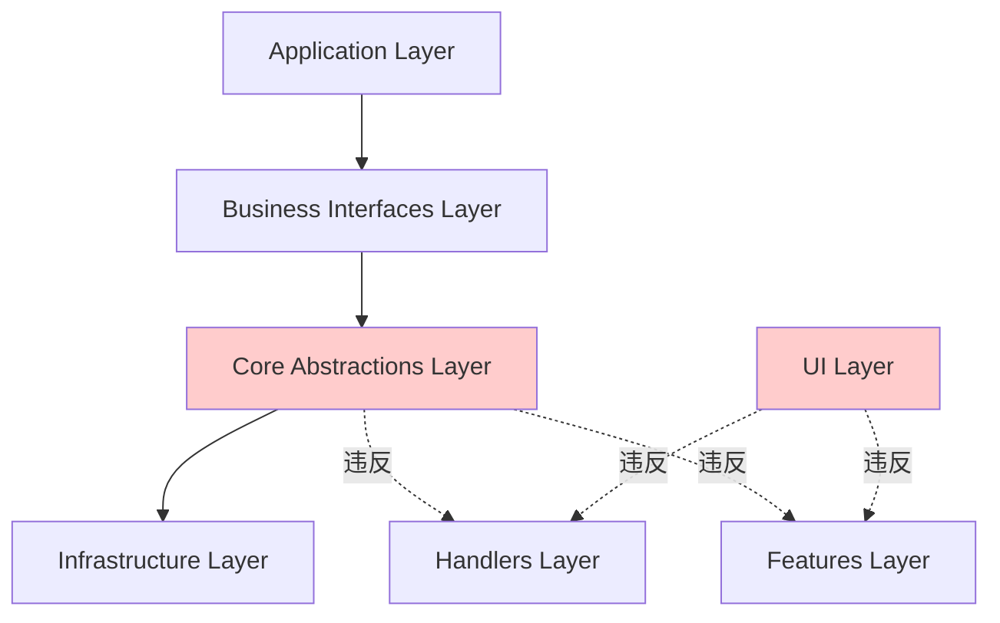
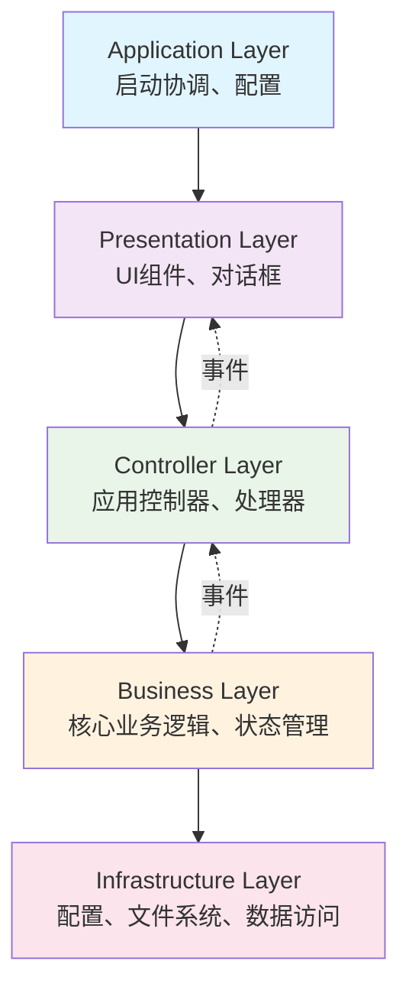

# 分层架构违反问题修复设计文档

## 概述

本设计文档提供了修复当前软件中分层架构违反问题的全面解决方案。通过重新设计服务初始化机制、建立清晰的接口边界、消除循环依赖，并实施架构合规性检查，我们将建立一个真正符合分层架构原则的系统。

## 架构设计

### 当前架构问题分析

当前系统声称实现四层架构，但存在以下严重问题：



### 目标架构设计

重新设计的分层架构将严格遵循单向依赖原则：



## 组件和接口设计

### 1. 应用层 (Application Layer)

**职责**：应用启动、配置管理、生命周期控制

**核心组件**：
- `ApplicationBootstrap`：应用引导器
- `ServiceRegistry`：服务注册表
- `ConfigurationManager`：配置管理器

**接口定义**：
```python
class ApplicationBootstrapInterface(ABC):
    @abstractmethod
    def initialize_infrastructure(self) -> bool: pass
    
    @abstractmethod
    def initialize_business_layer(self) -> bool: pass
    
    @abstractmethod
    def initialize_controller_layer(self) -> bool: pass
    
    @abstractmethod
    def initialize_presentation_layer(self) -> bool: pass
```

### 2. 表示层 (Presentation Layer)

**职责**：用户界面、用户交互、视图渲染

**核心组件**：
- `MainWindow`：主窗口
- `DialogManager`：对话框管理器
- `PanelManager`：面板管理器

**接口定义**：
```python
class PresentationServiceInterface(ABC):
    @abstractmethod
    def show_dialog(self, dialog_type: str, params: dict) -> Any: pass
    
    @abstractmethod
    def update_display(self, display_data: DisplayData) -> None: pass
    
    @abstractmethod
    def handle_user_action(self, action: UserAction) -> None: pass
```

### 3. 控制器层 (Controller Layer)

**职责**：业务流程控制、用户操作处理、业务层协调

**核心组件**：
- `ApplicationController`：应用控制器
- `ImageOperationController`：图像操作控制器
- `FileOperationController`：文件操作控制器
- `BatchProcessingController`：批处理控制器

**接口定义**：
```python
class ControllerInterface(ABC):
    @abstractmethod
    def handle_command(self, command: Command) -> CommandResult: pass
    
    @abstractmethod
    def subscribe_to_events(self, event_bus: EventBus) -> None: pass
    
    @abstractmethod
    def publish_event(self, event: Event) -> None: pass
```

### 4. 业务层 (Business Layer)

**职责**：核心业务逻辑、数据处理、状态管理

**核心组件**：
- `ImageProcessor`：图像处理引擎
- `StateManager`：状态管理器
- `OperationPipeline`：操作流水线
- `BusinessEventPublisher`：业务事件发布器

**接口定义**：
```python
class BusinessServiceInterface(ABC):
    @abstractmethod
    def process_image(self, image: ImageData, operations: List[Operation]) -> ImageData: pass
    
    @abstractmethod
    def get_current_state(self) -> ApplicationState: pass
    
    @abstractmethod
    def publish_state_change(self, state_change: StateChange) -> None: pass
```

### 5. 基础设施层 (Infrastructure Layer)

**职责**：技术基础设施、外部系统集成、数据持久化

**核心组件**：
- `FileSystemService`：文件系统服务
- `ConfigurationService`：配置服务
- `SimpleLogger`：简化日志服务

## 数据模型

### 事件模型

```python
@dataclass
class Event:
    event_type: str
    source_layer: str
    target_layer: str
    payload: Dict[str, Any]
    timestamp: datetime
    correlation_id: str

@dataclass
class StateChangeEvent(Event):
    old_state: ApplicationState
    new_state: ApplicationState
    change_reason: str

@dataclass
class UserActionEvent(Event):
    action_type: str
    user_input: Dict[str, Any]
    context: Dict[str, Any]
```

### 命令模型

```python
@dataclass
class Command:
    command_type: str
    parameters: Dict[str, Any]
    source: str
    correlation_id: str

@dataclass
class ImageOperationCommand(Command):
    operation_type: str
    operation_params: Dict[str, Any]
    target_image: str

@dataclass
class CommandResult:
    success: bool
    result_data: Any
    error_message: Optional[str]
    events_generated: List[Event]
```

## 错误处理

### 分层错误处理策略

1. **基础设施层错误**：技术异常，记录日志，转换为业务异常
2. **业务层错误**：业务规则违反，发布错误事件
3. **控制器层错误**：流程控制错误，转换为用户友好消息
4. **表示层错误**：UI错误，显示错误对话框

### 错误传播机制

```python
class LayeredErrorHandler:
    def handle_infrastructure_error(self, error: InfrastructureError) -> BusinessError:
        # 转换技术错误为业务错误
        pass
    
    def handle_business_error(self, error: BusinessError) -> ControllerError:
        # 发布业务错误事件
        pass
    
    def handle_controller_error(self, error: ControllerError) -> PresentationError:
        # 转换为用户友好错误
        pass
```

## 测试策略

### 单元测试策略

1. **每层独立测试**：使用模拟对象隔离依赖
2. **接口契约测试**：验证接口实现的正确性
3. **事件处理测试**：验证事件的正确发布和处理

### 集成测试策略

1. **层间集成测试**：验证相邻层的正确交互
2. **端到端测试**：验证完整业务流程
3. **架构合规性测试**：验证依赖关系的正确性

### 架构测试工具

```python
class ArchitectureComplianceChecker:
    def check_layer_dependencies(self) -> List[ArchitectureViolation]:
        # 检查层间依赖是否符合架构规则
        pass
    
    def check_circular_dependencies(self) -> List[CircularDependency]:
        # 检查循环依赖
        pass
    
    def check_interface_compliance(self) -> List[InterfaceViolation]:
        # 检查接口实现的合规性
        pass
```

## 核心功能实现策略

### 批处理功能重构

**业务层实现**：
```python
class BatchService:
    """批处理核心业务服务 - 无状态"""
    def __init__(self, event_publisher: BatchEventPublisher):
        self._event_publisher = event_publisher
    
    def create_job(self, job_name: str) -> BatchJob:
        """创建批处理作业"""
        job = BatchJob(name=job_name, status=BatchStatus.CREATED)
        self._event_publisher.publish_job_created(job)
        return job
    
    def process_batch(self, job: BatchJob) -> BatchResult:
        """执行批处理 - 纯算法实现"""
        # 无状态的批处理算法
        pass
```

**控制器层实现**：
```python
class BatchProcessingController:
    """批处理控制器 - 处理批处理命令"""
    def __init__(self, batch_service: BatchServiceInterface, event_bus: EventBus):
        self._batch_service = batch_service
        self._event_bus = event_bus
        self._setup_event_subscriptions()
    
    def handle_command(self, command: BatchOperationCommand) -> CommandResult:
        """处理批处理命令"""
        if command.operation_type == "create_job":
            return self._create_job(command)
        elif command.operation_type == "add_to_pool":
            return self._add_to_pool(command)
        # ... 其他命令处理
```

**表示层实现**：
```python
class BatchProcessingMainPanel:
    """批处理主面板 - 只与控制器交互"""
    def __init__(self, controller: BatchControllerInterface):
        self._controller = controller
        self._setup_event_subscriptions()
    
    def create_job(self, job_name: str):
        """创建作业"""
        command = CreateJobCommand(job_name=job_name, source="ui", correlation_id=generate_id())
        result = self._controller.handle_command(command)
        if not result.success:
            self._show_error(result.error_message)
```

### 图像处理功能重构

**业务层重构**：
- 将 `ImageProcessor` 重构为完全无状态的纯函数
- 移除所有对上层的直接依赖
- 实现事件发布机制通知处理完成

**控制器层重构**：
- 创建 `ImageOperationController` 处理图像操作命令
- 订阅业务层事件，转换为UI可理解的通知
- 实现命令到业务操作的路由

### 状态管理重构

**业务层状态管理**：
- 重构 `StateManager` 为纯业务组件
- 实现状态变化事件发布
- 移除对控制器的直接调用

## 遗留代码清理策略

### 核心层清理

**需要删除的文件**：
1. `app/core/initialization/direct_service_initializer.py` - 违反架构的服务初始化器
2. `app/core/interfaces/upper_layer_service_interface.py` - 桥接适配器接口
3. `app/core/adapters/upper_layer_service_adapter.py` - 桥接适配器实现
4. `app/core/dependency_injection/service_builder.py` 中的上层服务构建方法

**清理步骤**：
```python
# 1. 识别所有使用这些组件的代码
grep -r "DirectServiceInitializer" app/
grep -r "UpperLayerServiceAdapter" app/
grep -r "build_app_controller" app/

# 2. 逐个替换为新的架构实现
# 旧代码：
from app.core.initialization.direct_service_initializer import DirectServiceInitializer
initializer = DirectServiceInitializer()

# 新代码：
from app.layers.application.bootstrap import ApplicationBootstrap
bootstrap = ApplicationBootstrap()

# 3. 验证删除后系统仍能正常工作
python -m app.main
```

### 批处理功能清理

**需要删除的文件**：
1. `app/features/batch_processing/batch_coordinator.py` - 违反架构的协调器
2. `app/features/batch_processing/managers/` 下的所有管理器类
3. `app/features/batch_processing/pools/` 下的池管理类

**迁移步骤**：
```python
# 1. 提取可复用的业务逻辑
# 从 BatchProcessingHandler 中提取纯业务逻辑到 BatchService

# 2. 重构UI组件
# 旧代码：
from app.features.batch_processing.batch_coordinator import BatchProcessingHandler
self.handler = BatchProcessingHandler()

# 新代码：
from app.layers.controller.batch_processing_controller import BatchProcessingController
self.controller = BatchProcessingController()

# 3. 验证功能完整性
# 测试所有批处理功能：作业管理、图像池、批处理执行、预设应用、导出配置
```

### UI层清理

**主窗口重构**：
```python
# 旧的构造函数（需要删除）
def __init__(self, 
             state_manager: StateManager,
             image_processor: ImageProcessor,
             analysis_calculator: ImageAnalysisEngine,
             app_controller: AppController,
             batch_processing_handler: BatchProcessingHandler):

# 新的构造函数
def __init__(self, controller: ApplicationControllerInterface):
    self.controller = controller
    self._setup_event_subscriptions()

# 删除所有直接业务调用
# 旧代码：self.state_manager.load_image(image_data, path)
# 新代码：self.controller.execute_command(LoadImageCommand(path, "ui", generate_id()))
```

## 迁移策略

### 阶段1：建立新的分层结构

1. 创建新的层级目录结构
2. 定义各层的接口规范
3. 实现事件总线和命令处理机制

### 阶段2：重构服务初始化

1. 创建新的应用引导器
2. 按层级顺序重构服务创建
3. 消除核心层对上层的直接依赖

### 阶段3：重构UI层

1. 将UI组件与控制器解耦
2. 实现基于事件的UI更新机制
3. 消除UI层对业务层的直接依赖

### 阶段4：建立架构治理

1. 实施架构合规性检查
2. 建立代码审查规则
3. 创建架构文档和培训材料

## 性能考虑

### 事件处理性能

1. **异步事件处理**：避免阻塞主线程
2. **事件批处理**：减少频繁的小事件
3. **事件过滤**：只处理相关事件

### 内存管理

1. **弱引用**：避免事件监听器造成内存泄漏
2. **对象池**：复用频繁创建的对象
3. **延迟加载**：按需加载重型组件

## 简化的日志和诊断

### 基础日志功能

1. **简单日志记录**：基本的错误和信息日志
2. **架构违反日志**：记录架构检查发现的问题

### 诊断工具

1. **依赖关系检查**：使用架构检查工具分析依赖
2. **事件流调试**：简单的事件调试功能