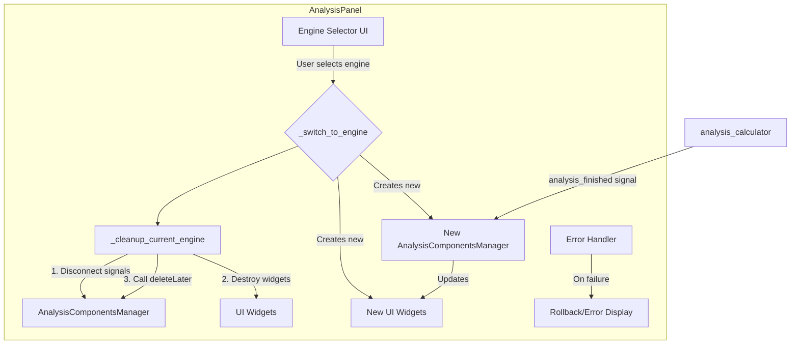
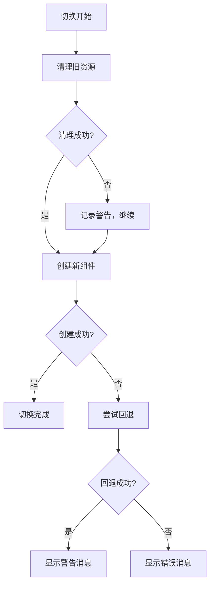

# 技术设计文档

## 1. 概述 (Overview)

- **目标 (Goal)**: 根除在切换渲染引擎时因资源管理不当引发的性能下降和内存泄露问题
- **背景 (Context)**: 当前 `AnalysisPanel` 的实现会在每次切换渲染引擎时创建新的 `AnalysisComponentsManager` 实例，但从不销毁旧的实例和UI组件，导致资源累积，性能雪崩
- **范围 (Scope)**: 本次重构仅限于 `app/ui/panels/analysis_panel.py` 文件。不会影响其他模块的接口和功能

## 2. 架构设计 (Architecture Design)

### 整体架构图 (Overall Architecture)

### 数据/信号流 (Data/Signal Flow)

1. 用户通过UI选择新的渲染引擎并点击"应用"
2. `AnalysisPanel` 的 `_apply_engine_change` 方法触发 `_switch_to_engine`
3. **（新）** `_switch_to_engine` 首先调用 `_cleanup_current_engine` 方法
4. `_cleanup_current_engine` 执行以下步骤：
   - 断开现有 `AnalysisComponentsManager` 的所有信号连接
   - 清理所有当前显示的UI组件
   - 调用 `deleteLater()` 销毁管理器
5. `_switch_to_engine` 接着按需创建新渲染引擎对应的UI组件和唯一的 `AnalysisComponentsManager` 新实例
6. 新的管理器连接所需信号，UI恢复正常交互
7. 如果任何步骤失败，错误处理机制会尝试回退或显示错误信息

## 3. 组件与接口设计 (Component & Interface Design)

### 核心组件: `AnalysisPanel`

#### 组件职责
- **现有职责**: 渲染引擎切换的UI交互
- **新增/强化职责**: 严格管理其子组件（分析图表）和逻辑控制器（`AnalysisComponentsManager`）的完整生命周期，确保在切换时旧资源被彻底清理

#### 接口定义

**公共接口（保持不变）**:
- `request_analysis_update(tab_index: Optional[int] = None)`
- `clear_all_analyses()`

**新增私有方法**:

1. `_cleanup_current_engine()`:
   - **功能**: 负责清理当前激活的引擎所关联的所有资源
   - **实现**: 
     - 检查并断开 `self.analysis_manager` 的信号连接
     - 清理UI组件并调用 `deleteLater()`
     - 处理清理过程中的异常

2. `_disconnect_manager_signals()`:
   - **功能**: 安全地断开管理器的信号连接
   - **实现**: 使用try-catch包装信号断开操作

3. `_create_engine_widgets(engine_name: str)`:
   - **功能**: 根据引擎名称创建对应的UI组件
   - **返回**: 组件字典或None（创建失败时）

4. `_handle_switch_error(error: Exception, target_engine: str)`:
   - **功能**: 处理切换过程中的错误
   - **实现**: 记录错误日志，尝试回退或显示错误信息

#### 内部状态变更
- **移除**: `self.matplotlib_widgets` 和 `self.pyqtgraph_widgets`
- **保留**: `self.current_engine`, `self.analysis_manager`
- **新增**: `self.last_working_engine` (用于错误回退)

## 4. 数据模型 (Data Model)

本次重构不涉及数据模型的更改。

## 5. 错误处理 (Error Handling)

### 异常场景与处理策略

1. **信号断开失败**:
   - 记录警告日志
   - 继续执行销毁流程

2. **组件创建失败**:
   - 尝试回退到上一个工作的引擎
   - 如果回退失败，显示错误消息

3. **管理器创建失败**:
   - 清理已创建的UI组件
   - 回退到上一个工作的引擎

4. **标签页操作失败**:
   - 记录错误日志
   - 尝试重新初始化标签页容器

### 错误恢复流程

## 6. 实施计划 (Implementation Plan)

### 阶段一: 实现清理逻辑
- 在 `AnalysisPanel` 中实现 `_cleanup_current_engine()` 私有方法
- 实现 `_disconnect_manager_signals()` 方法
- 添加异常处理和日志记录

### 阶段二: 重构切换与创建逻辑
- 修改 `_switch_to_engine` 方法，在开头调用 `_cleanup_current_engine()`
- 实现 `_create_engine_widgets()` 方法
- 移除 `_init_widgets` 中的预创建逻辑
- 添加错误处理机制

### 阶段三: 验证与测试
- 手动测试，反复切换引擎，观察内存和UI响应
- 测试错误场景（如组件创建失败）
- 验证信号连接的正确性

## 7. 向后兼容性 (Backward Compatibility)

- **影响分析**: 无负面影响。这是一个纯粹的内部重构和bug修复，不会改变任何对外接口和现有功能
- **兼容策略**: 无需特定策略

## 8. 扩展性考虑 (Extensibility)

- **未来扩展点**: 添加新的渲染引擎（如Plotly）
- **设计预留**: 本次重构后，添加新引擎的逻辑将非常清晰：只需在 `_create_engine_widgets` 中增加一个新的分支，用于创建新引擎的组件即可，无需担心资源泄露

## 9. 性能考虑 (Performance Considerations)

- **内存管理**: 通过及时销毁不用的组件，避免内存累积
- **创建开销**: 按需创建组件可能增加切换时间，但避免了预创建的内存开销
- **信号处理**: 正确的信号管理避免了重复处理和内存泄漏