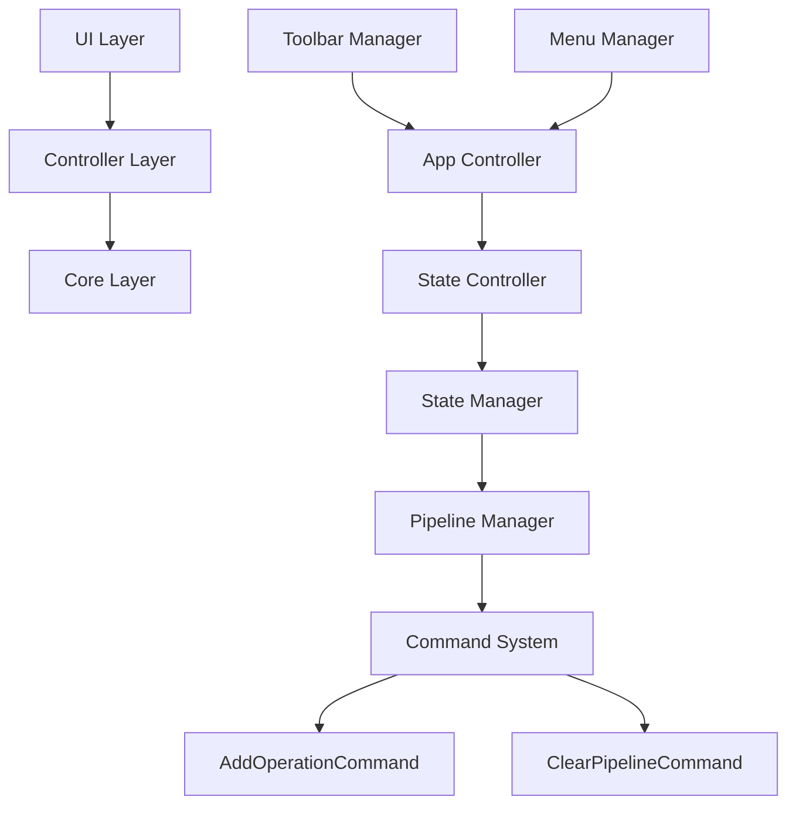
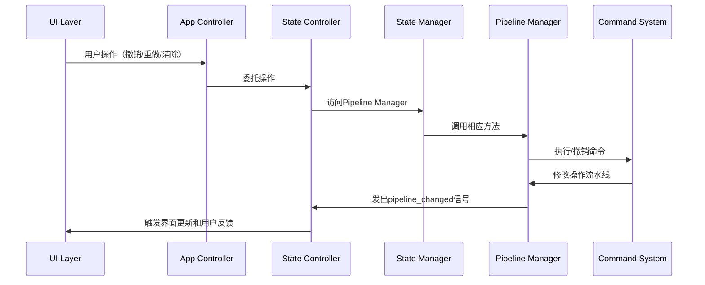

# 撤销重做功能修复和清除效果功能设计文档

## 概述

本设计文档描述了修复撤销重做功能和添加清除效果功能的技术实现方案。基于现有架构分析，PipelineManager已具备基本撤销重做功能，StateController应承担业务逻辑，StateManager保持纯粹门面职责，严格遵循分层架构原则。

## 架构

### 核心组件关系

## 组件和接口

### 1. PipelineManager 功能确认

**现有方法确认：**
- `can_undo() -> bool`: 已实现，检查撤销栈
- `can_redo() -> bool`: 已实现，检查重做栈  
- `get_undo_stack_size() -> int`: 已实现
- `get_redo_stack_size() -> int`: 已实现
- `add_operation(operation: ImageOperation)`: 已实现
- `clear_pipeline()`: 已实现

**需要修复：**
- 修复redo()方法缺失pipeline_changed信号发射
- 清理旧的向后兼容代码
- 修复get_redo_stack_size()方法的缩进错误

### 2. StateController 业务逻辑实现

**新增方法：**
- `undo_last_operation()`: 撤销最后一个操作
- `redo_last_operation()`: 重做被撤销的操作  
- `clear_all_effects()`: 清除所有效果
- `can_undo() -> bool`: 业务层撤销检查
- `can_redo() -> bool`: 业务层重做检查
- `has_effects() -> bool`: 检查是否有应用效果

**职责：**
- 处理撤销重做的业务逻辑和错误处理
- 使用ClearPipelineCommand实现清除效果
- 提供用户友好的反馈信息

### 3. StateManager 保持门面职责

**保持现有职责：**
- 作为状态访问的统一门面
- 聚合核心管理器（PipelineManager等）
- 信号转发和向后兼容

**严禁添加业务逻辑：**
- 不添加clear_all_effects()等业务方法
- 不添加具体的功能实现
- 保持纯粹的门面模式

### 4. UI组件扩展

**ToolbarManager:**
- 添加`clear_effects_triggered`信号
- 在保存按钮右边添加清除效果按钮
- 更新图像依赖actions列表

**MenuManager:**
- 添加`clear_effects_triggered`信号
- 在编辑菜单添加清除效果菜单项
- 设置Ctrl+Shift+C快捷键

### 5. 控制器层协调

**AppController:**
- 添加委托方法：`undo_last_operation()`, `redo_last_operation()`, `clear_all_effects()`
- 委托给StateController处理具体逻辑
- 不包含任何业务逻辑实现

## 数据模型

### 命令系统数据流

## 错误处理

### 异常情况处理

1. **空栈操作**：StateController检查栈状态，显示提示信息
2. **状态不一致**：StateController验证StateManager初始化状态
3. **命令执行失败**：StateController捕获异常，回滚状态并通知用户

### 错误恢复策略

- 操作失败时保持原有状态不变
- StateController显示用户友好的错误信息
- 记录详细错误日志用于调试

## 代码清理策略

### 清理PipelineManager

1. **清理向后兼容代码**：
   - 移除所有方法中的state_manager参数
   - 直接使用self操作，不依赖外部状态管理器

2. **修复现有问题**：
   - 修复redo()方法缺失pipeline_changed.emit()
   - 修复get_redo_stack_size()方法的缩进错误

### 清理命令系统

1. **简化命令接口**：
   - 命令不再依赖state_manager参数
   - 直接操作PipelineManager实例

2. **移除冗余代码**：
   - 清理未使用的导入和方法
   - 统一错误处理机制

## 测试策略

### 单元测试

1. **PipelineManager测试**
   - 测试修复后的redo()方法信号发射
   - 测试清理后的方法功能完整性

2. **StateController测试**
   - 测试撤销重做功能的完整流程
   - 测试清除效果功能
   - 测试错误处理逻辑

3. **UI组件测试**
   - 测试按钮状态的动态更新
   - 测试信号连接的正确性
   - 测试快捷键功能

### 集成测试

1. **端到端撤销重做测试**
   - 应用多个效果后测试撤销功能
   - 撤销后测试重做功能
   - 测试撤销重做的界面更新

2. **清除效果功能测试**
   - 测试清除效果的完整流程
   - 测试清除效果的撤销功能
   - 测试UI状态的正确更新

### 用户验收测试

1. 验证撤销重做功能符合用户预期
2. 验证清除效果按钮位置和功能
3. 验证快捷键和菜单项功能
4. 验证按钮状态管理的用户体验