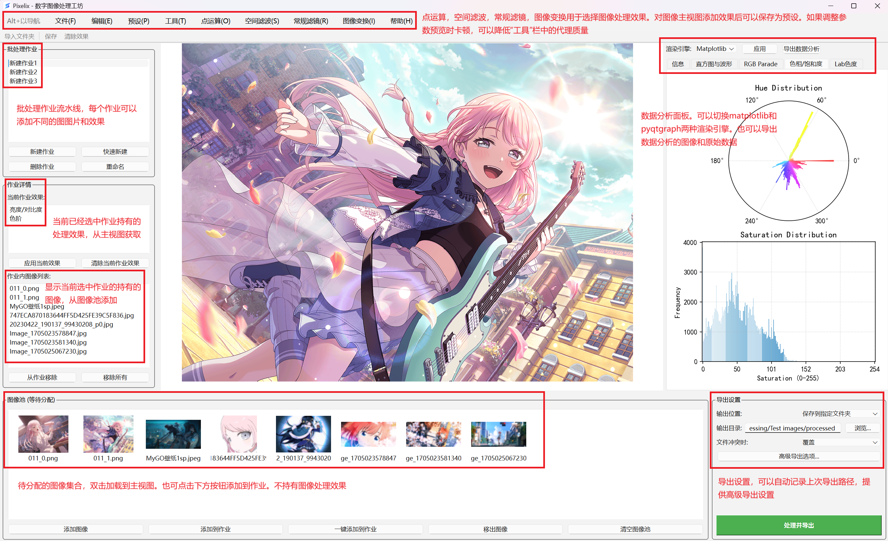

# Pixelix Image Processor

[//]: # (Badges will go here later)

A open-source desktop application for digital image processing, built with Python and PyQt6.

一个基于 Python 和 PyQt6 构建的开源桌面数字图像处理应用。

## Table of Contents / 目录
- [Features / 主要功能](#features--主要功能)
- [Getting Started / 快速开始](#getting-started--快速开始)
- [Usage / 使用说明](#usage--使用说明)
- [Project Structure / 项目结构](#project-structure--项目结构)
- [Contributing / 贡献指南](#contributing--贡献指南)
- [License / 许可证](#license--许可证)
- [Contact / 联系方式](#contact--联系方式)

## Features / 主要功能



### ✨ 工作流管理 / Workflow Management
- **多任务批处理 (Multi-Job Batch Processing):** 创建和管理多个独立的图像处理作业，每个作业可以包含不同的图像和处理流程。(Create and manage multiple independent image processing jobs, each with its own set of images and processing pipelines.)
- **灵活的图像管理 (Flexible Image Management):** 通过集中的图像池管理所有待处理的图像，并可轻松地将它们分配到不同的处理作业中。(Manage all pending images in a centralized pool and easily assign them to different processing jobs.)

### 🚀 图像处理与分析 / Image Processing & Analysis
- **丰富的处理工具 (Rich Processing Tools):** 提供包括点运算、空间滤波、常规滤镜和图像变换在内的多种图像处理工具。(Offers a variety of image processing tools, including point operations, spatial filtering, common filters, and geometric transformations.)
- **实时参数调整与预览 (Real-time Parameter Adjustment & Preview):** 所有处理效果均支持实时参数调整和即时预览，并可通过调整代理质量优化性能。(All processing effects support real-time parameter adjustment and instant preview, with performance optimization available by adjusting proxy quality.)
- **深度数据分析 (In-depth Data Analysis):** 提供专业的数据分析面板，可对色调、饱和度等进行可视化分析，支持多种渲染引擎切换，并可导出分析图表和原始数据。(Provides a professional data analysis panel for visualizing hue, saturation, and more. Supports multiple rendering engines and allows exporting charts and raw data.)

### 💾 导出与预设 / Export & Presets
- **高级导出选项 (Advanced Export Options):** 提供灵活的导出设置，可自动记忆导出路径，满足不同的输出需求。(Offers flexible export settings with automatic path memory to meet various output requirements.)
- **预设管理 (Preset Management):** 可将常用的处理流程保存为预设，方便一键调用，提升工作效率。(Save frequently used processing pipelines as presets for one-click application, boosting efficiency.)

## Getting Started / 快速开始

To get a local copy up and running, follow these simple steps.

请遵循以下步骤，在您的本地环境中安装并运行本项目。

### Prerequisites / 环境要求

- Python 3.8+
- Pip

### Installation / 安装步骤

1.  **Clone the repository / 克隆仓库**
    ```sh
    git clone git@github.com:Wendystar0628/Pixelix-Image-Processor.git
    ```
2.  **Navigate to the project directory / 进入项目目录**
    ```sh
    cd Pixelix-Image-Processor
    ```
3.  **Create and activate a virtual environment (Recommended) / 创建并激活虚拟环境 (推荐)**
    ```sh
    # For Windows
    python -m venv Rebirth
    .\Rebirth\Scripts\activate
    
    # For macOS/Linux
    python3 -m venv Rebirth
    source Rebirth/bin/activate
    ```
4.  **Install dependencies / 安装依赖**
    ```sh
    pip install -r requirements.txt
    ```
5.  **Run the application / 运行应用**
    ```sh
    python -m app.main
    ```

## Usage / 使用说明

This guide provides a step-by-step walkthrough of the application's workflow.

本指南将分步介绍应用的完整工作流程。

### 1. 导入图像 / Importing Images
- **添加图像 (Add Images):** 在主界面底部的“待分配图像集合”区域，点击“添加图像”按钮，或直接将图像文件拖拽到该区域，即可将图像导入到图像池中。
- **(In the "Image Pool" area at the bottom of the main interface, click the "Add Images" button or drag and drop image files directly into this area to import them into the pool.)**

### 2. 创建与管理处理作业 / Creating and Managing Processing Jobs
- **新建作业 (Create a New Job):** 在左上角的“批处理作业”面板中，点击“新建作业”来创建一个新的处理流程。
- **(In the "Batch Jobs" panel in the upper left corner, click "New Job" to create a new processing pipeline.)**
- **添加图像到作业 (Add Images to a Job):** 从底部的图像池中选择一张或多张图像，然后点击“添加到作业”按钮，将其分配到当前选中的作业中。
- **(Select one or more images from the image pool at the bottom, then click the "Add to Job" button to assign them to the currently selected job.)**

### 3. 应用处理与分析 / Applying Processing and Analysis
- **选择处理工具 (Select Processing Tools):** 在主界面顶部的工具栏中，选择您需要的处理工具，例如“点运算”、“空间滤波”或“图像变换”。
- **(In the toolbar at the top of the main interface, select the desired processing tools, such as "Point Operations," "Spatial Filtering," or "Geometric Transformations.")**
- **调整参数与预览 (Adjust Parameters and Preview):** 在右侧的“效果预览”面板中，实时调整所选工具的参数，主视图将即时显示处理效果。如果处理速度较慢，可以降低“工具栏”中的代理质量以提升性能。
- **(In the "Effect Preview" panel on the right, adjust the parameters of the selected tool in real-time. The main view will instantly display the processing effect. If performance is slow, you can lower the proxy quality in the toolbar to improve speed.)**
- **数据分析 (Data Analysis):** 切换到“数据分析”选项卡，可以查看图像的色调、饱和度分布等信息，并可导出分析图表。
- **(Switch to the "Data Analysis" tab to view information such as the image's hue and saturation distribution, and to export analysis charts.)**

### 4. 导出与保存 / Exporting and Saving
- **批量导出 (Batch Export):** 在右下角的“导出设置”面板中，配置好输出目录和文件格式，然后点击“处理并导出”按钮，即可将当前作业中的所有图像进行处理并保存。
- **(In the "Export Settings" panel in the lower right corner, configure the output directory and file format, then click the "Process and Export" button to process and save all images in the current job.)**
- **保存预设 (Save a Preset):** 如果您对当前的处理流程感到满意，可以在“文件”菜单中选择“保存预设”，将当前的操作组合保存起来，以便将来快速调用。
- **(If you are satisfied with the current processing pipeline, you can select "Save Preset" from the "File" menu to save the current combination of operations for future use.)**

## Project Structure / 项目结构

The project is organized to separate concerns, making it easier to maintain and extend.

本项目采用关注点分离的结构，以便于维护和扩展。

```
/
├── app/                  # Main application source code / 应用主源码
│   ├── core/             # Core business logic and processing engines / 核心业务逻辑与处理引擎
│   ├── ui/               # PyQt6 user interface components / PyQt6 用户界面组件
│   ├── handlers/         # Event handlers and controllers / 事件处理器与控制器
│   ├── resources/        # Icons, help files, etc. / 图标、帮助文件等资源
│   └── main.py           # Application entry point / 应用入口文件
├── Rebirth/              # Python virtual environment / Python 虚拟环境
├── presets/              # Default presets / 默认预设文件
└── README.md             # This file / 本文件
```

## Contributing / 贡献指南

If you have a suggestion that would make this better, please fork the repo and create a pull request. You can also simply open an issue with the tag "enhancement".

如果您有任何建议，请 Fork 本仓库并发起一个 Pull Request，或者直接提交一个带有 "enhancement" 标签的 Issue。

1.  Fork the Project
2.  Create your Feature Branch (`git checkout -b feature/AmazingFeature`)
3.  Commit your Changes (`git commit -m 'Add some AmazingFeature'`)
4.  Push to the Branch (`git push origin feature/AmazingFeature`)
5.  Open a Pull Request

## License / 许可证

Copyright (c) 2024 望月星逸 (Wendystar)

Distributed under the MIT License. See `LICENSE` file for more information.

本作品采用 MIT 授权许可协议。完整的许可证文本，请查阅 `LICENSE` 文件。

## Contact / 联系方式

望月星逸 - Bilibili - [https://space.bilibili.com/241360459?spm_id_from=333.1007.0.0](https://space.bilibili.com/241360459?spm_id_from=333.1007.0.0)

Project Link / 项目链接: [https://github.com/Wendystar0628/Pixelix-Image-Processor](https://github.com/Wendystar0628/Pixelix-Image-Processor)