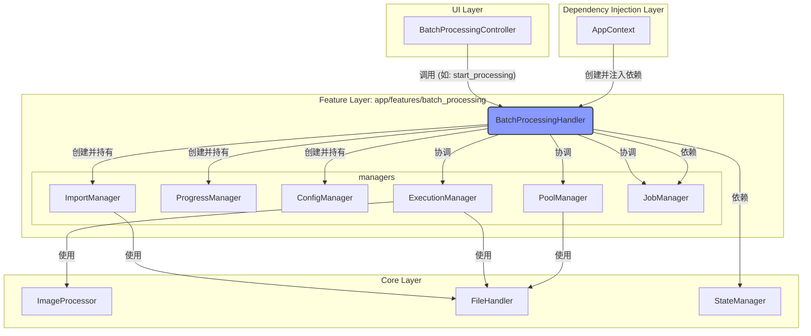

# 批处理协调器迁移与整合重构技术设计文档 (v1.1)

## 1. 概述

本文档旨在为“批处理协调器迁移与整合”重构任务提供具体的技术设计方案。方案的核心是将旧的、位于 `app/handlers/batch_processing/` 的协调层逻辑，无缝地、安全地迁移到 `app/features/batch_processing/` 模块中，形成一个职责清晰、高度内聚的功能单元。

## 2. 总体设计

### 2.1 目标架构
重构后的目标架构将严格遵循“按功能组织”的原则。UI控制器 (`BatchProcessingController`) 将直接与功能模块的统一入口 (`BatchProcessingHandler`) 对接。`BatchProcessingHandler` 则在模块内部对各个专业管理器进行协调和调度。

### 2.2 设计原则
1.  **单一入口原则**: `BatchProcessingHandler` 是 `batch_processing` 功能模块对外的**唯一**入口。外部模块（尤其是 `Controller`）不应绕过 `Handler` 直接访问内部的 `Manager`。
2.  **职责内聚原则**: `Handler` 负责**“协调” (Orchestration)**，`Manager` 负责**“执行” (Execution)**。`Handler` 决定“做什么”，`Manager` 负责“怎么做”。
3.  **依赖方向原则**: 依赖关系必须是单向的：`Controller` -> `Handler` -> `Managers` -> `Core Services`。不允许反向依赖。
4.  **依赖注入原则**: `BatchProcessingHandler` 的**核心依赖** (跨模块的服务，如 `JobManager`, `StateManager`) 应由 `AppContext` 从**外部注入**。其**内部依赖** (模块内的管理器，如 `ImportManager`, `ProgressManager`) 应由 `Handler` 自身在**构造时创建**。
5.  **无缝迁移原则**: 迁移过程应保持接口的稳定性。`BatchProcessingHandler` 对外暴露给 `Controller` 的公共方法签名应保持不变，以最小化对 `Controller` 层的代码改动。

## 3. 详细设计

### 3.1 `BatchProcessingHandler` 职责增强
- **定位**: `app/features/batch_processing/handler.py`
- **设计**:
    - 它将**完全取代**旧的 `app/handlers/batch_processing/batch_processing_handler.py`。
    - 其 `__init__` 方法的签名将被更新，以接收所有来自外部的核心依赖（`JobManager`, `StateManager` 等）。
    - 在其 `__init__` 方法中，它将**直接实例化**所有其内部依赖的管理器 (`ImportManager`, `ProgressManager`, `ConfigManager`)，并将所需的核心依赖传递给它们。
    - 它将负责连接内部各管理器之间的信号和槽，形成一个完整的事件驱动系统。

### 3.2 管理器迁移 (Managers Migration)
- **定位**: `app/features/batch_processing/managers/`
- **设计**:
    - **`ImportManager`**: 从 `app/handlers/batch_processing/import_manager.py` **直接移动**到 `app/features/batch_processing/managers/import_manager.py`。
    - **`ProgressManager`**: 从 `app/handlers/batch_processing/progress_manager.py` **直接移动**到 `app/features/batch_processing/managers/progress_manager.py`。
    - **`ConfigManager`**: 从 `app/handlers/batch_processing/config_manager.py` **直接移动**到 `app/features/batch_processing/managers/config_manager.py`。

### 3.3 连接层修复 (`Controller` and `AppContext`)
- **`BatchProcessingController`**:
    - **定位**: `app/controllers/batch_processing_controller.py`
    - **设计**: 修改其顶部的 `import` 语句，将 `from app.handlers.batch_processing import BatchProcessingHandler` 更改为 `from app.features/batch_processing/handler import BatchProcessingHandler`。
- **`AppContext`**:
    - **定位**: `app/context.py` (或类似文件)
    - **设计**: 修正 `BatchProcessingHandler` 的实例化过程。
        1.  修改 `import` 语句，指向新的 `handler.py`。
        2.  确保在创建 `BatchProcessingHandler` 实例时，传递了所有必要的外部依赖。

### 3.4 清理 (Cleanup)
- **设计**: 在完成所有代码迁移和导入修复，并通过功能测试后，**必须删除**整个 `app/handlers/batch_processing/` 目录。

## 4. 风险评估
- **主要风险**: **循环导入 (Circular Import)**。在修复导入路径时，可能无意中创建 `features` 模块到 `core` 模块，再反向到 `features` 模块的依赖环路。
- **缓解措施**:
    1.  严格遵守 `features` -> `core` 的单向依赖原则。
    2.  利用 Linter 工具（如 `pylint`）或 IDE 的静态分析功能，在编码阶段及时发现并解决循环导入问题。
    3.  在代码审查阶段，重点关注模块间的 `import` 关系。
