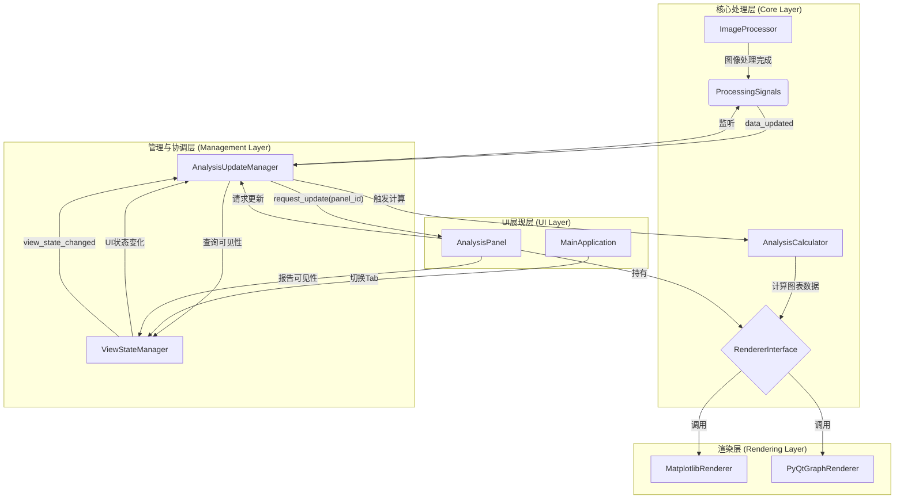

# 技术设计文档：数据分析图统一更新机制

## 1. 概述 (Overview)

**目标 (Goal)**:
建立一个集中式的、高效的数据分析图更新机制。该机制旨在解决当前因图像处理操作而导致的图表刷新延迟和不必要的计算资源浪费问题。核心目标是实现“可见的立即更新，不可见的延迟更新”。

**背景 (Context)**:
在当前系统中，数据分析图（如直方图、波形图等）的更新逻辑分散，且没有统一管理。当用户频繁应用图像处理效果时，所有图表（无论是否可见）都可能尝试更新，导致性能瓶颈和UI卡顿。部分图表甚至不会立即刷新，需要用户手动切换才能看到结果，用户体验不佳。

**范围 (Scope)**:
- **要做**:
    - 创建一个新的管理器 `AnalysisUpdateManager`，用于统一协调数据分析图的更新逻辑。
    - 实现一个UI可见性跟踪机制，用于判断哪些分析图面板当前对用户可见。
    - 定义清晰的信号/事件流，解耦数据处理模块与UI更新模块。
    - 确保无论是 PyQt 模式还是 Matplotlib 模式的图表，都能接入此更新机制。
    - 设计一个渲染器抽象层，以支持不同的绘图后端（Matplotlib, PyQtGraph）。
- **不做**:
    - 对现有的 `ImageProcessor` 或 `AnalysisCalculator` 的核心计算算法进行重构。
    - 改变现有UI布局或组件的基本交互方式。

## 2. 架构设计 (Architecture Design)

**整体架构图 (Overall Architecture)**:

**数据/信号流 (Data/Signal Flow)**:

1.  **数据变化流程**:
    - `ImageProcessor` 完成一次图像处理操作。
    - `ProcessingSignals` 发出 `data_updated` 信号，携带更新后的图像数据ID。
    - `AnalysisUpdateManager` 接收到 `data_updated` 信号。
    - `AnalysisUpdateManager` 向 `ViewStateManager` 查询当前哪个 `AnalysisPanel` 是可见的。
    - 对于可见的 `AnalysisPanel`，`AnalysisUpdateManager` 立即触发其更新流程：调用 `AnalysisCalculator` 计算新数据，然后由 `PlotRenderer` 渲染图表。
    - 对于不可见的 `AnalysisPanel`，`AnalysisUpdateManager` 仅将其标记为“过时”(stale)，不执行任何计算。

2.  **视图切换流程**:
    - 用户在UI上切换Tab，使一个原本隐藏的 `AnalysisPanel` 变为可见。
    - `MainApplication` 或相关的UI管理器通知 `ViewStateManager` 可见性状态已改变。
    - `ViewStateManager` 发出 `view_state_changed` 信号，携带新可见的 `panel_id`。
    - `AnalysisUpdateManager` 接收到 `view_state_changed` 信号。
    - `AnalysisUpdateManager` 检查该 `panel_id` 对应的图表是否被标记为“过时”。
    - 如果是“过时”状态，则立即触发其更新流程，并在更新后移除“过时”标记。

## 3. 组件与接口设计 (Component & Interface Design)

**`AnalysisUpdateManager` (app/core/managers/analysis_update_manager.py)**
- **职责**: 协调数据分析图的更新，是整个机制的核心。
- **接口**:
    - `handle_data_updated(image_id: str)`: 响应数据更新信号，处理图表刷新逻辑。
    - `handle_view_state_changed(panel_id: str, is_visible: bool)`: 响应UI可见性变化。
    - `register_panel(panel_id: str, panel_instance: AnalysisPanel)`: 注册一个新的分析图面板。
    - `request_force_update(panel_id: str)`: 强制更新一个指定的图表。
- **内部状态**:
    - `stale_panels: set[str]`: 存储需要更新但当前不可见的面板ID。

**`ViewStateManager` (app/ui/managers/view_state_manager.py)**
- **职责**: 跟踪和管理UI组件（尤其是分析图面板）的可见性状态。
- **接口**:
    - `set_panel_visibility(panel_id: str, is_visible: bool)`: 设置面板的可见状态，并发出信号。
    - `is_panel_visible(panel_id: str) -> bool`: 查询特定面板是否可见。
- **信号**:
    - `view_state_changed(panel_id: str, is_visible: bool)`: 当任何面板的可见性改变时发出。

**`AnalysisPanel` (app/ui/panels/base_analysis_panel.py - 接口/基类)**
- **职责**: 作为所有数据分析图UI面板的基类，提供统一的更新接口和渲染器管理。
- **接口**:
    - `update_plot(self, data: Any)`: 接收计算好的数据并调用其内部的渲染器进行绘图。
    - `get_panel_id(self) -> str`: 返回面板的唯一标识符。
    - `set_renderer(self, renderer: RendererInterface)`: 设置当前面板使用的渲染器实例。
    - `showEvent(self, event)` / `hideEvent(self, event)`: (PyQt) 重写这两个事件，在其中调用 `ViewStateManager` 来报告自身的可见性变化。

**`RendererInterface` (app/ui/renderers/base_renderer.py)**
- **职责**: 定义绘图渲染器的标准接口，解耦渲染逻辑。
- **接口**:
    - `render(self, target_widget: QWidget, data: Any)`: 在指定的目标控件上渲染数据。

**`MatplotlibRenderer` / `PyQtGraphRenderer` (app/ui/renderers/)**
- **职责**: `RendererInterface` 的具体实现，分别使用 Matplotlib 和 PyQtGraph 库进行绘图。
- **接口**:
    - `render(self, target_widget: QWidget, data: Any)`: 实现具体的绘图逻辑。

## 4. 数据模型 (Data Model)

**核心数据结构**:
- **`AnalysisViewState`**:
    - `panel_id: str`: 面板的唯一标识符。
    - `is_visible: bool`: 当前是否可见。
    - `is_stale: bool`: 数据是否已过时，需要更新。

**状态依赖**:
| UI 组件 | 依赖的状态 | 触发更新的事件 |
| :--- | :--- | :--- |
| `HistogramPanel` | `AnalysisViewState` | `data_updated`, `view_state_changed` |
| `WaveformPanel` | `AnalysisViewState` | `data_updated`, `view_state_changed` |
| `... (其他分析面板)` | `AnalysisViewState` | `data_updated`, `view_state_changed` |

## 5. 错误处理 (Error Handling)

| 异常场景 | 处理策略 |
| :--- | :--- |
| 1. 图表数据计算失败 (`AnalysisCalculator` 抛出异常) | `AnalysisUpdateManager` 捕获异常，记录错误日志，并通过UI提示用户“图表数据计算失败”。避免程序崩溃。 |
| 2. UI面板未在 `AnalysisUpdateManager` 中注册 | 在请求更新时，如果 `panel_id` 无效，记录警告日志。这通常表示开发阶段的集成错误。 |
| 3. 渲染过程中失败 (`PlotRenderer` 抛出异常) | `AnalysisPanel` 捕获异常，记录日志，并在UI上显示错误信息，而不是空白或错误的图表。 |

## 6. 实施计划 (Implementation Plan)

- **阶段一: 核心管理器开发**
    - 在 `app/ui/managers/` 下创建 `view_state_manager.py`。
    - 在 `app/core/managers/` 下创建 `analysis_update_manager.py`。
    - 实现 `ViewStateManager` 和 `AnalysisUpdateManager` 的基本结构和接口。
- **阶段二: 信号与事件集成**
    - 在 `ProcessingSignals` 中定义 `data_updated` 信号。
    - 在 `ImageProcessor` 或相关处理流程的末端发出 `data_updated` 信号。
    - 将 `AnalysisUpdateManager` 的槽函数连接到 `data_updated` 和 `view_state_changed` 信号。
- **阶段三: UI面板改造**
    - 创建或修改 `app/ui/panels/base_analysis_panel.py` 基类。
    - 让现有的分析图面板（如 `HistogramPanel`）继承自基类。
    - 重写 `showEvent` 和 `hideEvent`，使其与 `ViewStateManager` 通信。
    - 实现 `update_plot` 方法，解耦计算与渲染。

## 7. 向后兼容性 (Backward Compatibility)

本次修改主要是新增功能和重构更新逻辑，对现有系统的核心计算逻辑没有破坏性改动。通过为新旧逻辑提供并存期或使用特性开关，可以保证平滑过渡。旧的更新方式可以被逐步废弃。

## 8. 扩展性考虑 (Extensibility)

- **新图表类型的添加**:
    - 设计是可扩展的。要添加一个新的分析图表，开发者只需创建一个新的 `AnalysisPanel` 子类，实现其绘图逻辑，并在实例化时将其注册到 `AnalysisUpdateManager` 和 `ViewStateManager` 中即可。无需改动核心更新调度逻辑。
- **渲染引擎的替换与兼容**:
    - 通过 `RendererInterface` 抽象层，系统核心逻辑与具体渲染库完全解耦。当前设计可以无缝支持 Matplotlib 和 PyQtGraph。未来若要添加新的渲染引擎（如 VisPy），只需创建一个新的 `RendererInterface` 实现类，并在UI层进行相应配置即可，无需改动 `AnalysisUpdateManager` 等核心组件。
