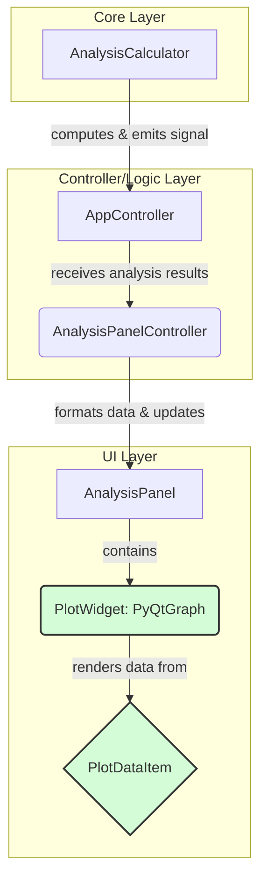

# 技术设计文档：引入PyQtGraph实现GPU加速渲染

### 1. 概述 (Overview)

- **目标 (Goal)**: 解决因高频重绘数据分析图表导致的UI卡顿问题，提升应用交互的流畅性。
- **背景 (Context)**: 当前应用在拖拽调整UI面板布局时，会实时重绘图表，由于图表数据量较大且渲染在CPU上完成，导致了明显的性能瓶颈。
- **范围 (Scope)**: 本次设计将重构数据分析面板的图表渲染部分。具体包括：引入`PyQtGraph`库，替换现有的图表控件，并重写相关的绘图逻辑。数据计算部分（`AnalysisCalculator`）的逻辑保持不变。

### 2. 架构设计 (Architecture Design)

- **整体架构图 (Overall Architecture)**:

- **数据/信号流 (Data/Signal Flow)**:
    1.  `AnalysisCalculator` 在后台线程完成数据计算（如直方图、波形图）。
    2.  计算完成后，`AnalysisCalculator` 发出 `analysis_finished(results: dict)` 信号。
    3.  `AppController` 捕获此信号，并将结果 `results` 传递给 `AnalysisPanelController`。
    4.  `AnalysisPanelController` 根据 `results` 中的数据，调用 `AnalysisPanel` 中对应图表的更新方法（如 `update_histogram_plot`）。
    5.  `AnalysisPanel` 的方法不再是完全重绘，而是调用其内部 `PlotWidget` 实例的 `PlotDataItem.setData(x, y)` 方法，高效地更新图表内容。`PyQtGraph` 底层通过OpenGL将渲染任务交由GPU处理。

### 3. 组件与接口设计 (Component & Interface Design)

- **`app.ui.panels.AnalysisPanel` (或类似面板)**
    - **组件职责**: 管理和展示所有数据分析图表（直方图、波形图等）。
    - **接口定义**:
        - `__init__(self)`: 构造函数中，将原有的Matplotlib或其他图表画布替换为 `pyqtgraph.PlotWidget` 实例。
        - `update_histogram_plot(self, hist_data: list)`: 使用 `plot_item.setData()` 更新直方图。
        - `update_waveform_plot(self, waveform_data: list)`: 使用 `image_item.setImage()` 更新波形图（波形图本质是图像）。
    - **内部状态**: 持有多个 `PlotWidget` 实例及其对应的 `PlotDataItem` 或 `ImageItem`。

- **`app.utils.plot_renderer.py` (将被废弃或重构)**
    - **组件职责**: 原本负责将数据渲染为图像。此模块的大部分功能将被`PyQtGraph`直接取代。
    - **接口定义**: 可能会保留一些辅助函数，用于将`AnalysisCalculator`的原始数据转换为`PyQtGraph`所需的格式，但核心的绘图函数将被移除。

### 4. 数据模型 (Data Model)

- **核心数据结构**:
    - `AnalysisCalculator` 输出的 `results` 字典结构保持不变。
    - `PyQtGraph` 直接消费NumPy数组，与现有数据格式兼容良好，无需引入新的数据模型。
- **状态依赖**:
| UI 组件 | 状态来源 | 更新方式 |
| :--- | :--- | :--- |
| `HistogramPlotWidget` | `results['histogram']` | `setData(x=np.arange(256), y=hist_data)` |
| `WaveformPlotWidget` | `results['rgb_parade']` | `setImage(img=waveform_image)` |
| `HueSatPlotWidget` | `results['hue_histogram']` | `setData(x=..., y=...)` |

### 5. 错误处理 (Error Handling)

- **异常场景**:
    1.  用户的电脑不支持OpenGL 2.0或以上版本。
    2.  传入`setData`的数据格式或维度不正确。
    3.  在非UI线程中尝试更新`PyQtGraph`组件。
- **处理策略**:
    1.  `PyQtGraph`在初始化时若检测到环境问题会抛出异常。程序应捕获此异常，并向用户显示一条明确的错误信息，提示“无法初始化图形加速功能，请检查显卡驱动程序”。
    2.  在调用`setData`等接口前，添加断言或类型检查，确保数据格式正确，避免运行时崩溃。
    3.  严格遵守Qt的线程规则，所有UI更新操作都必须通过信号槽机制在主线程中执行。

### 6. 实施计划 (Implementation Plan)

- **阶段一: 环境搭建与初步集成**
    - 在项目中添加 `pyqtgraph` 到 `requirements.txt`。
    - 创建一个简单的原型，在一个独立的窗口中加载并显示一个`PlotWidget`，验证`PyQtGraph`可以正常工作。
- **阶段二: 替换直方图**
    - 在`AnalysisPanel`中，将显示直方图的控件替换为`PlotWidget`。
    - 修改`update_histogram_plot`方法，使用`setData`更新图表。
    - 调整`PlotWidget`的样式，使其外观与旧版本尽量一致。
- **阶段三: 替换波形图及其他图表**
    - 将显示波形图的控件替换为`PlotWidget`。
    - 波形图数据是二维数组，应使用`ImageItem`并调用`setImage`来高效渲染。
    - 依次替换所有其他图表。
- **阶段四: 清理与测试**
    - 移除`app.utils.plot_renderer.py`中不再需要的旧代码。
    - 全面测试图表功能，确保数据更新正确、UI交互流畅。

### 7. 向后兼容性 (Backward Compatibility)

- **影响分析**: 本次修改属于内部重构，不影响项目对外暴露的接口或数据格式。主要影响的是UI渲染层。
- **兼容策略**: 无需特定策略。重构完成后，旧的渲染代码将被完全替代。

### 8. 扩展性考虑 (Extensibility)

- **未来扩展点**: 未来可能需要支持更复杂的交互，如在图表上进行缩放、拖拽、选取范围等。
- **设计预留**: `PyQtGraph`原生支持丰富的交互功能。通过其内置的ROI（Region of Interest）对象和信号槽系统，可以非常方便地为图表添加复杂的交互功能，本次设计为这些扩展打下了坚实的基础。
