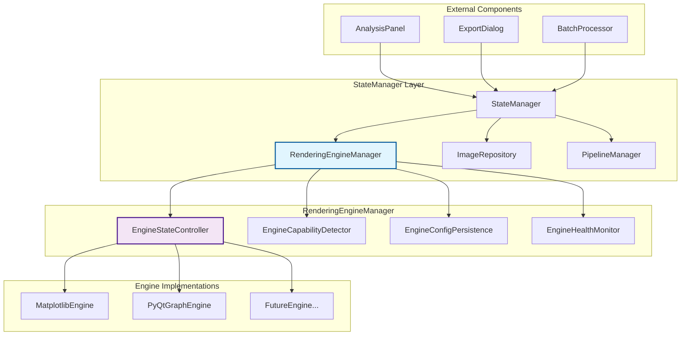
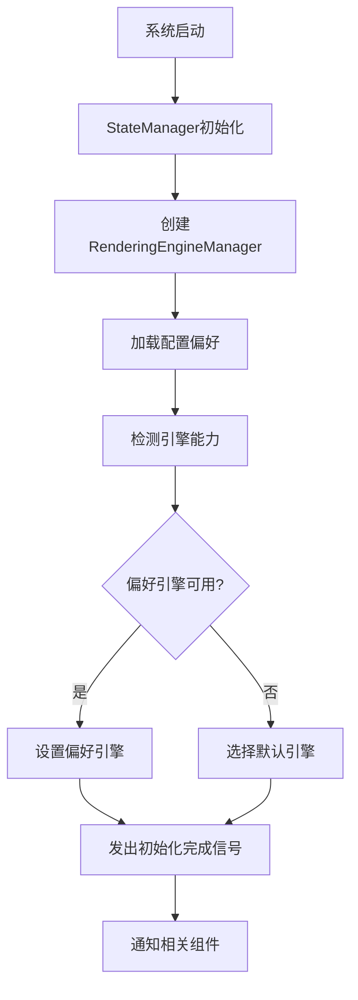
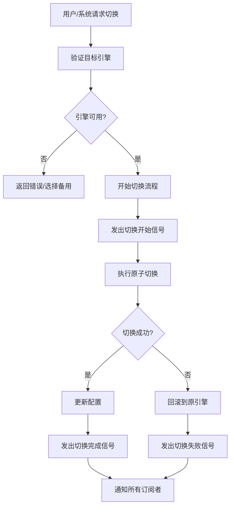
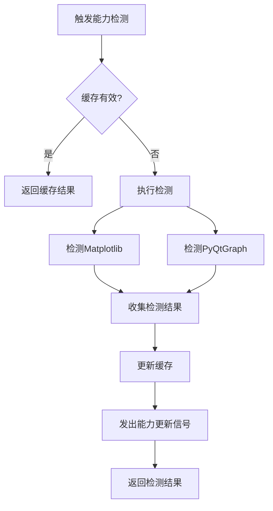

# 渲染引擎状态管理统一机制设计文档

## 概述

本设计文档详细描述了在现有StateManager中集成渲染引擎状态管理的技术方案。该方案将提供统一的引擎状态管理接口，支持全局状态同步，并为未来功能扩展预留良好的架构基础。

## 架构设计

### 整体架构概览

```
StateManager (现有)
├── 现有子模块 (ImageRepository, PipelineManager, etc.)
└── RenderingEngineManager (新增)
    ├── EngineStateController
    ├── EngineCapabilityDetector  
    ├── EngineConfigPersistence
    └── EngineHealthMonitor
```

### 核心组件架构



## 组件和接口设计

### 1. RenderingEngineManager (渲染引擎管理器)

```python
class RenderingEngineManager(QObject):
    """
    渲染引擎统一管理器 - StateManager的子模块
    
    职责：
    - 统一管理所有渲染引擎的状态
    - 提供引擎切换和状态查询接口
    - 协调各子组件的工作
    """
    
    # 信号定义
    engine_changed = pyqtSignal(str, str)  # (old_engine, new_engine)
    engine_status_changed = pyqtSignal(str, str)  # (engine, status)
    capability_detected = pyqtSignal(dict)  # {engine: capability_info}
    
    def __init__(self, config_manager):
        super().__init__()
        self.config_manager = config_manager
        self.state_controller = EngineStateController()
        self.capability_detector = EngineCapabilityDetector()
        self.config_persistence = EngineConfigPersistence(config_manager)
        self.health_monitor = EngineHealthMonitor()
        
        # 初始化连接
        self._setup_connections()
        
    def get_current_engine(self) -> str:
        """获取当前活动引擎"""
        return self.state_controller.current_engine
        
    def set_current_engine(self, engine_name: str) -> bool:
        """设置当前引擎（带验证和回滚）"""
        return self.state_controller.switch_engine(engine_name)
        
    def get_available_engines(self) -> List[str]:
        """获取可用引擎列表"""
        return self.capability_detector.get_available_engines()
        
    def get_engine_capability(self, engine_name: str) -> Dict[str, Any]:
        """获取引擎能力信息"""
        return self.capability_detector.get_capability(engine_name)
        
    def is_engine_available(self, engine_name: str) -> bool:
        """检查引擎是否可用"""
        return self.capability_detector.is_available(engine_name)
        
    def get_engine_status(self, engine_name: str) -> str:
        """获取引擎状态 (available/unavailable/error)"""
        return self.health_monitor.get_status(engine_name)
        
    def refresh_capabilities(self) -> Dict[str, Dict]:
        """刷新所有引擎的能力检测"""
        return self.capability_detector.refresh_all()
```

### 2. EngineStateController (引擎状态控制器)

```python
class EngineStateController(QObject):
    """
    引擎状态控制器
    
    职责：
    - 管理当前激活的引擎状态
    - 处理引擎切换逻辑
    - 提供状态变更的原子操作
    """
    
    engine_switching = pyqtSignal(str, str)  # (from_engine, to_engine)
    engine_switched = pyqtSignal(str, str)   # (from_engine, to_engine)
    switch_failed = pyqtSignal(str, str, str)  # (from_engine, to_engine, error)
    
    def __init__(self):
        super().__init__()
        self.current_engine = "matplotlib"  # 默认引擎
        self.previous_engine = None
        self.switch_lock = threading.Lock()
        self.engine_instances = {}
        
    def switch_engine(self, target_engine: str) -> bool:
        """
        线程安全的引擎切换
        
        Returns:
            bool: 切换是否成功
        """
        with self.switch_lock:
            if target_engine == self.current_engine:
                return True
                
            self.engine_switching.emit(self.current_engine, target_engine)
            
            try:
                # 验证目标引擎可用性
                if not self._validate_engine_availability(target_engine):
                    raise EngineNotAvailableError(f"Engine {target_engine} is not available")
                
                # 执行切换
                old_engine = self.current_engine
                self._perform_switch(target_engine)
                
                # 通知切换成功
                self.engine_switched.emit(old_engine, target_engine)
                return True
                
            except Exception as e:
                # 切换失败，发出错误信号
                self.switch_failed.emit(self.current_engine, target_engine, str(e))
                return False
    
    def _perform_switch(self, target_engine: str):
        """执行实际的引擎切换操作"""
        self.previous_engine = self.current_engine
        self.current_engine = target_engine
        
        # 初始化新引擎实例（如果需要）
        if target_engine not in self.engine_instances:
            self.engine_instances[target_engine] = self._create_engine_instance(target_engine)
    
    def rollback_to_previous(self) -> bool:
        """回滚到上一个引擎"""
        if self.previous_engine:
            return self.switch_engine(self.previous_engine)
        return False
        
    def get_engine_instance(self, engine_name: str = None):
        """获取引擎实例"""
        target = engine_name or self.current_engine
        return self.engine_instances.get(target)
```

### 3. EngineCapabilityDetector (引擎能力检测器)

```python
class EngineCapabilityDetector(QObject):
    """
    引擎能力检测器
    
    职责：
    - 检测系统对各种渲染引擎的支持能力
    - 提供引擎兼容性信息
    - 监控引擎可用性变化
    """
    
    capability_changed = pyqtSignal(str, dict)  # (engine, capability_info)
    
    def __init__(self):
        super().__init__()
        self.capabilities = {}
        self.detection_cache = {}
        self.cache_timeout = 300  # 5分钟缓存
        
    def detect_all_capabilities(self) -> Dict[str, Dict]:
        """检测所有引擎的能力"""
        engines = ["matplotlib", "pyqtgraph"]
        capabilities = {}
        
        for engine in engines:
            capabilities[engine] = self.detect_engine_capability(engine)
            
        self.capabilities = capabilities
        return capabilities
    
    def detect_engine_capability(self, engine_name: str) -> Dict[str, Any]:
        """检测特定引擎的能力"""
        cache_key = f"{engine_name}_{int(time.time() // self.cache_timeout)}"
        
        if cache_key in self.detection_cache:
            return self.detection_cache[cache_key]
            
        capability = self._perform_detection(engine_name)
        self.detection_cache[cache_key] = capability
        
        return capability
    
    def _perform_detection(self, engine_name: str) -> Dict[str, Any]:
        """执行实际的能力检测"""
        if engine_name == "matplotlib":
            return self._detect_matplotlib_capability()
        elif engine_name == "pyqtgraph":
            return self._detect_pyqtgraph_capability()
        else:
            return {"available": False, "reason": "Unknown engine"}
    
    def _detect_matplotlib_capability(self) -> Dict[str, Any]:
        """检测Matplotlib能力"""
        try:
            import matplotlib
            import matplotlib.pyplot as plt
            
            return {
                "available": True,
                "version": matplotlib.__version__,
                "backend": matplotlib.get_backend(),
                "features": {
                    "high_quality_export": True,
                    "vector_graphics": True,
                    "animation": True
                },
                "performance": "cpu",
                "last_check": time.time()
            }
        except ImportError as e:
            return {
                "available": False,
                "reason": f"Import error: {e}",
                "last_check": time.time()
            }
    
    def _detect_pyqtgraph_capability(self) -> Dict[str, Any]:
        """检测PyQtGraph能力"""
        try:
            import pyqtgraph as pg
            
            # 检查GPU支持
            gpu_support = self._check_gpu_support()
            
            return {
                "available": True,
                "version": pg.__version__,
                "gpu_supported": gpu_support["available"],
                "gpu_info": gpu_support,
                "features": {
                    "real_time_rendering": True,
                    "hardware_acceleration": gpu_support["available"],
                    "large_data_handling": True
                },
                "performance": "gpu" if gpu_support["available"] else "cpu",
                "last_check": time.time()
            }
        except ImportError as e:
            return {
                "available": False,
                "reason": f"Import error: {e}",
                "last_check": time.time()
            }
    
    def _check_gpu_support(self) -> Dict[str, Any]:
        """检查GPU支持情况"""
        try:
            from app.core.utils.system_check import check_gpu_support
            return {
                "available": check_gpu_support(),
                "details": "GPU acceleration available"
            }
        except Exception as e:
            return {
                "available": False,
                "details": f"GPU check failed: {e}"
            }
```

### 4. EngineConfigPersistence (引擎配置持久化)

```python
class EngineConfigPersistence:
    """
    引擎配置持久化管理器
    
    职责：
    - 保存和加载引擎配置
    - 管理用户偏好设置
    - 处理配置迁移和兼容性
    """
    
    def __init__(self, config_manager):
        self.config_manager = config_manager
        self.config_section = "rendering_engine"
        
    def save_engine_preference(self, engine_name: str, preferences: Dict = None):
        """保存引擎偏好设置"""
        config = {
            "preferred_engine": engine_name,
            "last_used": time.time(),
            "preferences": preferences or {}
        }
        
        self.config_manager.update_config(**{self.config_section: config})
        
    def load_engine_preference(self) -> Dict[str, Any]:
        """加载引擎偏好设置"""
        config = self.config_manager.get_config()
        engine_config = config.get(self.config_section, {})
        
        return {
            "preferred_engine": engine_config.get("preferred_engine", "matplotlib"),
            "last_used": engine_config.get("last_used", 0),
            "preferences": engine_config.get("preferences", {})
        }
    
    def get_default_engine(self) -> str:
        """获取默认引擎（考虑系统能力）"""
        preference = self.load_engine_preference()
        preferred = preference["preferred_engine"]
        
        # 检查偏好引擎是否可用
        detector = EngineCapabilityDetector()
        if detector.is_available(preferred):
            return preferred
            
        # 回退到安全默认值
        return "matplotlib"
    
    def migrate_config(self, old_version: str, new_version: str):
        """配置迁移处理"""
        # 处理配置格式变更
        pass
```

## 数据模型设计

### 引擎状态模型

```python
@dataclass
class EngineState:
    """引擎状态数据模型"""
    name: str
    status: str  # 'active', 'available', 'unavailable', 'error'
    capability: Dict[str, Any]
    last_used: float
    error_message: Optional[str] = None
    
@dataclass
class EngineCapability:
    """引擎能力数据模型"""
    available: bool
    version: Optional[str]
    features: Dict[str, bool]
    performance_tier: str  # 'gpu', 'cpu', 'hybrid'
    hardware_requirements: Dict[str, Any]
    last_check: float
    error_details: Optional[str] = None

@dataclass
class EngineSwitchEvent:
    """引擎切换事件模型"""
    timestamp: float
    from_engine: str
    to_engine: str
    success: bool
    duration_ms: int
    error_message: Optional[str] = None
    
@dataclass
class EngineConfig:
    """引擎配置模型"""
    preferred_engine: str
    auto_fallback: bool = True
    switch_timeout: int = 5000  # ms
    capability_cache_timeout: int = 300  # seconds
    health_check_interval: int = 60  # seconds
    preferences: Dict[str, Dict] = field(default_factory=dict)
```

## StateManager集成设计

### StateManager扩展

```python
class StateManager(QObject):
    """扩展后的StateManager"""
    
    # 新增信号
    engine_changed = pyqtSignal(str, str)
    engine_status_changed = pyqtSignal(str, str)
    
    def __init__(self):
        super().__init__()
        
        # 现有子模块
        self.image_repository = ImageRepository()
        self.pipeline_manager = PipelineManager()
        # ... 其他现有模块
        
        # 新增引擎管理器
        self.rendering_engine_manager = RenderingEngineManager(
            get_config_manager()
        )
        
        # 连接引擎管理器信号
        self._setup_engine_connections()
    
    def _setup_engine_connections(self):
        """设置引擎管理器信号连接"""
        self.rendering_engine_manager.engine_changed.connect(
            self.engine_changed.emit
        )
        self.rendering_engine_manager.engine_changed.connect(
            lambda old, new: self.notify()  # 通用状态变化通知
        )
        
        self.rendering_engine_manager.engine_status_changed.connect(
            self.engine_status_changed.emit
        )
    
    # 门面接口方法
    def get_current_rendering_engine(self) -> str:
        """获取当前渲染引擎"""
        return self.rendering_engine_manager.get_current_engine()
        
    def set_rendering_engine(self, engine_name: str) -> bool:
        """设置渲染引擎"""
        return self.rendering_engine_manager.set_current_engine(engine_name)
        
    def get_available_engines(self) -> List[str]:
        """获取可用引擎列表"""
        return self.rendering_engine_manager.get_available_engines()
        
    def is_engine_available(self, engine_name: str) -> bool:
        """检查引擎是否可用"""
        return self.rendering_engine_manager.is_engine_available(engine_name)
        
    def get_engine_capability(self, engine_name: str) -> Dict[str, Any]:
        """获取引擎能力信息"""
        return self.rendering_engine_manager.get_engine_capability(engine_name)
        
    def refresh_engine_capabilities(self) -> Dict[str, Dict]:
        """刷新引擎能力检测"""
        return self.rendering_engine_manager.refresh_capabilities()
```

## 流程设计

### 引擎初始化流程



### 引擎切换流程



### 能力检测流程



## 错误处理设计

### 错误分类和处理策略

1. **引擎不可用错误**
   - 自动回退到备用引擎
   - 记录错误日志和用户友好提示
   - 更新引擎状态为不可用

2. **引擎切换超时**
   - 强制终止切换操作
   - 回滚到原始引擎状态
   - 记录超时事件

3. **配置损坏错误**
   - 使用默认配置
   - 备份损坏配置
   - 重新初始化配置系统

4. **线程安全错误**
   - 使用锁机制防止竞争条件
   - 实现超时机制避免死锁
   - 提供错误恢复机制

### 异常处理机制

```python
class EngineError(Exception):
    """引擎相关错误基类"""
    pass

class EngineNotAvailableError(EngineError):
    """引擎不可用错误"""
    pass

class EngineSwitchTimeoutError(EngineError):
    """引擎切换超时错误"""
    pass

class EngineCapabilityError(EngineError):
    """引擎能力检测错误"""
    pass

class ErrorRecoveryManager:
    """错误恢复管理器"""
    
    def __init__(self, engine_manager):
        self.engine_manager = engine_manager
        self.recovery_strategies = {
            EngineNotAvailableError: self._handle_engine_unavailable,
            EngineSwitchTimeoutError: self._handle_switch_timeout,
            EngineCapabilityError: self._handle_capability_error
        }
    
    def handle_error(self, error: Exception) -> bool:
        """处理错误并尝试恢复"""
        error_type = type(error)
        if error_type in self.recovery_strategies:
            return self.recovery_strategies[error_type](error)
        return False
```

## 性能考虑

### 引擎切换性能优化

1. **预初始化策略**: 在系统启动时预初始化常用引擎
2. **异步切换**: 在后台线程执行引擎切换操作
3. **缓存机制**: 缓存引擎能力检测结果
4. **延迟加载**: 只在需要时创建引擎实例

### 内存管理

1. **引擎实例管理**: 及时释放不使用的引擎实例
2. **缓存大小限制**: 限制检测结果缓存的大小
3. **定期清理**: 定期清理过期的缓存数据

## 监控和日志

### 性能监控

```python
class EnginePerformanceMonitor:
    """引擎性能监控器"""
    
    def __init__(self):
        self.metrics = {
            "switch_times": [],
            "detection_times": [],
            "error_counts": defaultdict(int),
            "usage_stats": defaultdict(int)
        }
    
    def record_switch_time(self, from_engine: str, to_engine: str, duration: float):
        """记录引擎切换时间"""
        self.metrics["switch_times"].append({
            "from": from_engine,
            "to": to_engine,
            "duration": duration,
            "timestamp": time.time()
        })
    
    def get_performance_report(self) -> Dict[str, Any]:
        """生成性能报告"""
        return {
            "avg_switch_time": self._calculate_average_switch_time(),
            "error_rate": self._calculate_error_rate(),
            "most_used_engine": self._get_most_used_engine(),
            "performance_trends": self._analyze_trends()
        }
```

这个设计文档为渲染引擎状态管理提供了全面的技术指导，确保实现的安全性、性能和可扩展性。