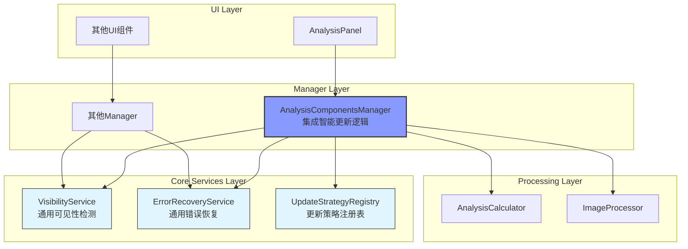

# 智能更新系统架构整合技术设计文档 (v1.0)

## 1. 概述

本文档旨在为"智能更新系统架构整合"任务提供具体的技术设计方案。方案的核心是将现有的`smart_update`模块从其当前位置（`app/ui/managers/smart_update/`）更好地整合到项目的整体架构中，实现架构的统一性和直观性，同时保持现有功能的完整性。

## 2. 总体设计

### 2.1 目标架构

整合后的目标架构将完全融入现有项目架构，通过直接增强现有组件和创建通用服务来实现智能更新能力，避免创建专门的"智能更新"层。



### 2.2 设计原则

1. **直接融入原则**: 将智能更新逻辑直接融入现有组件，而非创建独立的"智能更新"层。
2. **通用服务原则**: 创建通用的基础服务（可见性检测、错误恢复等），去除特定功能标识。
3. **职责回归原则**: 让文件名和类名回归其本质作用，避免技术实现细节泄露到命名中。
4. **最小改动原则**: 在保持功能完整的前提下，最小化对现有代码结构的改动。
5. **架构统一原则**: 确保整合后的代码完全符合项目现有的架构模式和命名约定。

## 3. 详细设计

### 3.1 增强的AnalysisComponentsManager

- **定位**: `app/ui/managers/analysis_components_manager.py` (直接修改现有文件)
- **设计**:
    - 直接在现有Manager中集成智能更新逻辑，无需创建新类
    - 内置防抖机制、stale标记、可见性检测等核心功能
    - 使用通用服务进行错误恢复和可见性检测
    - 保持现有公共接口完全不变

```python
class AnalysisComponentsManager:
    def __init__(self, state_manager, image_processor, analysis_calculator, 
                 analysis_tabs, image_info_widget, combined_analysis_widget, 
                 rgb_parade_widget, hue_saturation_widget, 
                 visibility_service, error_recovery, parent=None):
        # 现有初始化逻辑保持不变
        super().__init__(parent)
        self.state_manager = state_manager
        self.image_processor = image_processor
        # ... 其他现有依赖
        
        # 集成智能更新功能
        self._stale_tabs: Set[int] = set()
        self._debounce_timer = QTimer()
        self._debounce_timer.setSingleShot(True)
        self._debounce_timer.timeout.connect(self._process_pending_updates)
        self._pending_update = False
        
        # 注入的通用服务
        self.visibility_service = visibility_service
        self.error_recovery = error_recovery
        self.config = get_config_manager().get_config()
    
    def request_analysis_update(self, tab_index=None):
        """增强的更新请求方法（保持接口不变）"""
        # 内置智能更新逻辑
        pass
```

### 3.2 通用可见性服务

- **定位**: `app/core/services/visibility_service.py`
- **设计**:
    - 提供通用的可见性检测能力，不限于智能更新使用
    - 支持多种UI组件的可见性检测
    - 可被项目中其他组件复用

```python
class VisibilityService:
    def is_widget_visible(self, widget) -> bool:
        """检查组件是否可见"""
        pass
    
    def is_tab_active(self, tab_widget, tab_index) -> bool:
        """检查标签页是否为当前活动标签页"""
        pass
```

### 3.3 通用错误恢复服务

- **定位**: `app/core/services/error_recovery_service.py`
- **设计**:
    - 提供通用的错误恢复能力，适用于整个项目
    - 支持多种恢复策略，不仅限于更新失败
    - 去除"smart_update"特定标识，成为项目基础服务

```python
class ErrorRecoveryService:
    def register_recovery_strategy(self, error_type, strategy):
        """注册错误恢复策略"""
        pass
    
    def attempt_recovery(self, error_type, context):
        """尝试错误恢复"""
        pass
```

### 3.4 更新策略注册表

- **定位**: `app/core/strategies/update_strategies.py`
- **设计**:
    - 统一管理所有更新策略，支持项目范围的复用
    - 策略注册机制，支持动态扩展
    - 简化的策略接口

```python
class UpdateStrategyRegistry:
    _strategies = {}
    
    @classmethod
    def register(cls, name, strategy):
        """注册更新策略"""
        pass
    
    @classmethod
    def get_strategy(cls, name):
        """获取策略实例"""
        pass

# 内置策略
@UpdateStrategyRegistry.register('immediate')
class ImmediateUpdate:
    def should_update_now(self, context) -> bool:
        return True

@UpdateStrategyRegistry.register('debounced')
class DebouncedUpdate:
    def should_update_now(self, context) -> bool:
        # 防抖逻辑
        pass
```

### 3.5 配置管理扩展

- **定位**: `app/config.py` (扩展现有AppConfig类)
- **设计**:
    - 将更新配置直接整合到现有的AppConfig中
    - 保持现有配置结构的一致性
    - 简化的配置结构，专注于核心参数

```python
@dataclass
class AppConfig:
    """应用程序配置数据类。"""
    # 现有配置项保持不变...
    
    # 智能更新配置 (新增)
    # 使用update_前缀避免与现有配置冲突
    update_debounce_delay: int = 100  # 防抖延迟时间(ms)
    update_max_retry_attempts: int = 3  # 最大重试次数
    update_default_strategy: str = 'debounced'  # 默认更新策略
    update_enable_error_recovery: bool = True  # 启用错误恢复
    update_error_threshold: int = 5  # 错误阈值
    
    def __post_init__(self):
        """初始化默认值（扩展现有方法）"""
        # 现有初始化逻辑...
        
        # 新增：验证更新配置
        if self.update_debounce_delay < 0:
            self.update_debounce_delay = 100
        if self.update_max_retry_attempts < 1:
            self.update_max_retry_attempts = 3
```

## 4. 迁移策略

### 4.1 现有组件重构整合路径

| 现有组件 | 目标整合方式 | 说明 |
|---------|-------------|------|
| `SmartUpdateMixin` | **直接集成到** `AnalysisComponentsManager` | 核心逻辑直接融入现有管理器，无需单独服务 |
| `EnhancedAnalysisComponentsManager` | **删除** | 完全废弃，功能合并到原始管理器 |
| `SmartUpdateErrorHandler` | **重构为** `app/core/services/error_recovery_service.py` | 通用错误恢复服务，去除smart_update标识 |
| `VisibilityTracker` | **重构为** `app/core/services/visibility_service.py` | 通用可见性检测服务 |
| `smart_update`目录 | **完全删除** | 整个目录及其所有文件都将被删除 |

### 4.2 分阶段整合计划

**阶段1: 通用服务创建**
- 创建`VisibilityService`通用可见性服务
- 创建`ErrorRecoveryService`通用错误恢复服务
- 创建`UpdateStrategyRegistry`策略注册表

**阶段2: Manager直接增强**
- 直接在`AnalysisComponentsManager`中集成智能更新逻辑
- 将`SmartUpdateMixin`的核心功能直接合并到现有Manager
- 更新依赖注入，注入通用服务

**阶段3: 配置扩展和清理**
- 扩展现有的`AppConfig`类，添加智能更新配置项
- 完全删除`app/ui/managers/smart_update/`目录
- 删除`EnhancedAnalysisComponentsManager`

## 5. 接口设计

### 5.1 增强后的AnalysisComponentsManager接口 (保持不变)

```python
class AnalysisComponentsManager:
    # 现有接口完全保持不变
    def request_analysis_update(self, tab_index: Optional[int] = None) -> None:
        """请求分析更新（内部实现智能化）"""
        pass
    
    def on_analysis_tab_changed(self, index: int) -> None:
        """标签页切换处理（内部实现智能化）"""
        pass
    
    # 新增的配置接口
    def configure_update_behavior(self) -> None:
        """基于AppConfig配置更新行为"""
        pass
    
    def get_update_status(self) -> Dict:
        """获取更新状态信息"""
        pass
```

### 5.2 通用服务接口

```python
class VisibilityService:
    def is_widget_visible(self, widget) -> bool:
        """检查组件是否可见"""
        pass
    
    def is_tab_active(self, tab_widget, tab_index) -> bool:
        """检查标签页是否活动"""
        pass

class ErrorRecoveryService:
    def register_recovery_strategy(self, error_type: str, strategy: Callable) -> None:
        """注册恢复策略"""
        pass
    
    def attempt_recovery(self, error_type: str, context: Dict) -> bool:
        """尝试错误恢复"""
        pass
```

## 6. 实施注意事项

### 6.1 关键技术要点

- **性能保持**: 新的服务层应保持现有性能水平，避免引入额外开销
- **兼容性保证**: 采用适配器模式，最小化对现有代码的修改
- **架构简化**: 提供清晰、统一的接口设计，降低系统复杂性

### 6.2 实施策略

- 分阶段迁移，确保每个阶段的功能完整性
- 保留现有`smart_update`模块作为备用，直到新架构稳定运行
- 重点关注信号槽连接的正确迁移，确保事件通信链路完整