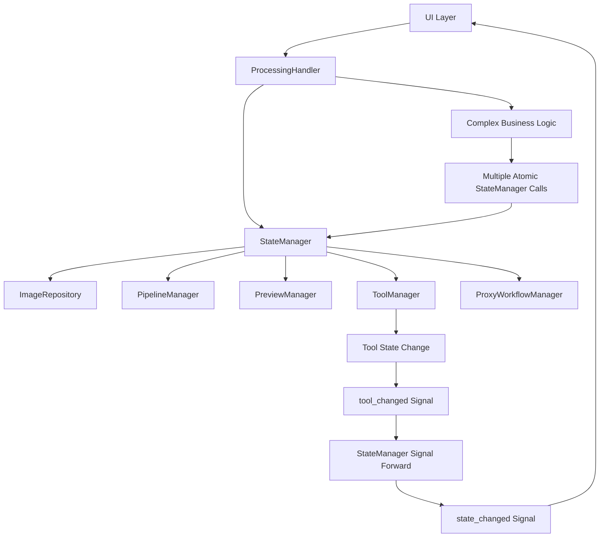

# StateManager深度重构设计文档

## 概述

本设计文档详细描述了将StateManager从承担过多职责的"上帝类"重构为纯粹状态管理门面的技术方案。重构将严格遵循单一职责原则和架构分层设计，通过剥离工具状态管理和业务流程编排职责，让StateManager专注于作为"应用运行时状态的唯一访问点"。

基于对现有tool系统的深入分析，本次重构将协调以下关键组件：
- `app/core/tools/tool_manager.py` - 现有工具控制器，需要赋能状态管理
- `app/core/tools/base_tool.py` - 工具基类，需要解耦StateManager依赖
- `app/core/models/tool_state_model.py` - 优秀的数据模型，需要推广使用
- `app/ui/managers/toolbar_manager.py` - UI工具栏管理器，职责清晰无需修改

重构将实现真正的职责分离：工具子系统完全自治，StateManager专注门面职责。

## 架构设计

### 重构前问题分析

当前StateManager和tool系统存在以下架构问题：

1. **StateManager职责过载**: 同时承担状态管理、工具状态存储、业务流程编排等多重职责
2. **ToolManager状态缺失**: 作为工具控制器，却将所有状态管理委托给StateManager，违背了控制器应有的职责
3. **BaseTool紧耦合**: 直接依赖StateManager，导致工具无法独立测试和复用
4. **数据模型未充分利用**: ToolStateModel提供了良好的数据结构，但StateManager仍使用原始字典
5. **违反分层架构**: 工具层直接调用状态层，跳过了应有的控制层

### 目标架构概览

```
重构后的架构分层：

┌─────────────────────────────────────────────────────────────┐
│                    Controller/Handler Layer                 │
├─────────────────────────────────────────────────────────────┤
│  ProcessingHandler (增强)                                   │
│  ├── 复杂业务流程编排                                        │
│  ├── 多模块协调操作                                          │  
│  ├── 错误处理和状态回滚                                      │
│  └── 调用StateManager原子方法                               │
└─────────────────────────────────────────────────────────────┘
                                │
                                ▼
┌─────────────────────────────────────────────────────────────┐
│                    Model/Core Layer                         │
├─────────────────────────────────────────────────────────────┤
│  StateManager (重构后) - 纯粹的状态管理门面                  │
│  ├── 子模块聚合 (ImageRepository, PipelineManager...)       │
│  ├── ToolManager聚合 (重构后的工具控制器)                   │
│  ├── 统一信号转发                                           │
│  ├── 统一接口暴露                                           │
│  └── 原子化状态操作                                         │
│                                                             │
│  ToolManager (重构后) - 有状态的工具控制器                   │
│  ├── 工具实例注册和管理                                     │
│  ├── 工具状态存储 (使用ToolStateModel)                      │
│  ├── 工具激活/停用控制                                      │
│  ├── 用户输入事件分发                                       │
│  ├── 工具变化信号发出                                       │
│  └── 工具操作指令处理                                       │
│                                                             │
│  BaseTool (解耦后) - 独立的工具实现                         │
│  ├── 工具特定的交互逻辑                                     │
│  ├── 内部状态管理 (_tool_state)                            │
│  ├── 操作完成信号发出                                       │
│  └── 完全独立，无外部依赖                                   │
└─────────────────────────────────────────────────────────────┘
```

### 分层设计原则

1. **状态管理层 (StateManager)**
   - 职责：纯粹的状态管理门面，聚合各状态子模块
   - 特点：高度抽象，不包含业务逻辑，只做代理和转发
   - 依赖方向：聚合各状态管理子模块

2. **有状态的工具控制器 (ToolManager重构后)**
   - 职责：工具生命周期管理、状态存储、事件分发
   - 特点：自治的工具子系统控制器，使用ToolStateModel管理状态
   - 依赖方向：独立模块，聚合BaseTool实例，被StateManager聚合

3. **独立的工具实现 (BaseTool解耦后)**
   - 职责：具体工具的交互逻辑实现
   - 特点：完全独立，通过信号与外界通信
   - 依赖方向：无外部依赖，被ToolManager管理

4. **业务编排层 (ProcessingHandler)**
   - 职责：处理复杂的多步骤业务流程
   - 特点：调用StateManager的原子方法组合实现复杂操作
   - 依赖方向：依赖StateManager提供的原子接口

## 组件和接口设计

### 核心组件重构

#### 1. StateManager (重构后)

```python
class StateManager(QObject):
    """
    中央状态管理器 - 纯粹的门面和聚合器
    
    职责：
    1. 聚合各个状态管理子模块（包括重构后的ToolManager）
    2. 提供统一的状态访问接口
    3. 转发和聚合状态变化信号
    4. 提供原子化的状态操作接口
    
    不包含：
    - 具体的工具状态管理逻辑（已移至ToolManager）
    - 复杂的业务流程编排（已移至ProcessingHandler）
    - 多步骤的状态操作（拆分为原子操作）
    """
    
    # 核心信号
    state_changed = pyqtSignal()
    image_state_changed = pyqtSignal(bool)
    tool_changed = pyqtSignal(str)  # 转发自ToolManager
    processing_started = pyqtSignal()
    processing_finished = pyqtSignal()
    
    def __init__(self):
        super().__init__()
        
        # 子模块聚合
        self.image_repository = ImageRepository()
        self.pipeline_manager = PipelineManager()
        self.preview_manager = PreviewManager()
        self.persistence_service = PersistenceService()
        self.image_processor = ImageProcessor()
        self.proxy_workflow_manager = ProxyWorkflowManager(...)
        
        # 聚合重构后的工具管理器（不再传入self作为依赖）
        self.tool_manager = ToolManager()
        
        # 信号连接
        self._connect_submodule_signals()
    
    def _connect_submodule_signals(self):
        """连接所有子模块信号"""
        # 连接ToolManager的信号并转发
        self.tool_manager.tool_changed.connect(self.tool_changed)
        self.tool_manager.tool_changed.connect(lambda: self.notify())
        
        # 监听工具操作完成信号，并将操作提交给PipelineManager
        self.tool_manager.operation_created.connect(
            lambda operation: self.pipeline_manager.add_operation(operation)
        )
    
    # 工具状态管理门面 - 代理到ToolManager（向后兼容）
    @property
    def active_tool_name(self) -> Optional[str]:
        """向后兼容：代理到ToolManager"""
        return self.tool_manager.active_tool_name
    
    def set_active_tool(self, name: str) -> bool:
        """向后兼容：代理到ToolManager"""
        return self.tool_manager.set_active_tool(name)
    
    def register_tool(self, name: str, tool_type: str):
        """向后兼容：代理到ToolManager"""
        # 注意：这里的tool_type参数在新架构中可能不再需要
        # 但为了兼容性保留接口
        pass  # ToolManager现在直接管理BaseTool实例
    
    def save_tool_state(self, tool_name: str, state: Dict[str, Any]):
        """向后兼容：代理到ToolManager"""
        self.tool_manager.save_tool_state(tool_name, state)
    
    def get_tool_state(self, tool_name: str) -> Dict[str, Any]:
        """向后兼容：代理到ToolManager"""
        return self.tool_manager.get_tool_state(tool_name)
    
    # 原子化的状态操作 - 简化的方法
    def set_image_data(self, image, file_path=None):
        """原子操作：仅设置图像数据"""
        self.image_repository.load_image(image, file_path)
        self.image_state_changed.emit(True)
    
    def set_proxy_image_data(self, proxy_image, file_path=None):
        """原子操作：仅设置代理图像数据"""
        self.image_repository.set_current_file_path(file_path)
        self.image_repository.set_proxy_image(proxy_image)
        self.image_repository.switch_to_proxy_mode()
        self.image_state_changed.emit(True)
    
    def reset_all_processing_state(self):
        """原子操作：重置所有处理状态"""
        self._reset_processing_state()
    
    def clear_image_data(self):
        """原子操作：仅清除图像数据"""
        self.image_repository._original_image = None
        self.image_repository._proxy_image = None
        self.image_repository.current_file_path = None
        self.image_state_changed.emit(False)
    
    # 向后兼容的复合方法 - 内部调用ProcessingHandler
    def load_image(self, image, file_path=None):
        """向后兼容：内部委托给ProcessingHandler"""
        from app.handlers.processing_handler import get_processing_handler
        handler = get_processing_handler()
        handler.load_image_complete(image, file_path)
    
    def clear_image(self):
        """向后兼容：内部委托给ProcessingHandler"""
        from app.handlers.processing_handler import get_processing_handler
        handler = get_processing_handler()
        handler.clear_image_complete()
```

#### 2. ToolManager (重构后)

```python
from app.core.models.tool_state_model import ToolStateModel

class ToolManager(QObject):
    """
    重构后的工具管理器 - 有状态的工具控制器
    
    职责：
    1. 管理工具实例的注册和生命周期
    2. 维护工具状态（使用ToolStateModel）
    3. 分发用户输入事件到活动工具
    4. 处理工具操作完成信号
    5. 发出工具状态变化通知
    """
    
    # 工具状态变化信号
    tool_changed = pyqtSignal(str)
    # 工具操作完成信号（新增）
    operation_created = pyqtSignal(object)  # 发送操作对象
    
    def __init__(self):
        super().__init__()
        
        # 工具实例注册表
        self._tools: Dict[str, BaseTool] = {}
        
        # 工具状态管理（使用ToolStateModel替代原始字典）
        self._active_tool_name: Optional[str] = None
        self._tool_states: Dict[str, ToolStateModel] = {}
        
        logger.debug("ToolManager初始化完成 - 独立状态管理")
    
    def register_tool(self, name: str, tool: BaseTool):
        """
        注册工具实例
        
        Args:
            name: 工具唯一名称
            tool: BaseTool实例（已解耦StateManager依赖）
        """
        self._tools[name] = tool
        
        # 连接工具的操作完成信号
        if hasattr(tool, 'operation_completed'):
            tool.operation_completed.connect(self.operation_created)
        
        # 初始化工具状态模型
        if name not in self._tool_states:
            self._tool_states[name] = ToolStateModel(name)
        
        # 恢复工具状态
        tool.set_state(self._tool_states[name].parameters)
        
        logger.debug(f"工具已注册: {name}")
    
    @property
    def active_tool_name(self) -> Optional[str]:
        return self._active_tool_name
    
    @property
    def active_tool(self) -> Optional[BaseTool]:
        if self._active_tool_name and self._active_tool_name in self._tools:
            return self._tools[self._active_tool_name]
        return None
    
    def set_active_tool(self, name: str) -> bool:
        """设置活动工具"""
        if name == self._active_tool_name:
            return True
        
        # 停用当前工具
        if self._active_tool_name and self._active_tool_name in self._tools:
            current_tool = self._tools[self._active_tool_name]
            current_tool.deactivate()
            # 保存工具状态到ToolStateModel
            self._tool_states[self._active_tool_name].parameters = current_tool.get_state()
        
        # 激活新工具
        if name in self._tools:
            self._tools[name].activate()
            self._active_tool_name = name
            self.tool_changed.emit(name)
            logger.info(f"工具激活: {name}")
            return True
        elif name == "":
            # 取消所有工具
            self._active_tool_name = None
            self.tool_changed.emit("")
            return True
        else:
            logger.warning(f"尝试激活未注册的工具: {name}")
            return False
    
    def save_tool_state(self, tool_name: str, state: Dict[str, Any]):
        """保存工具状态（向后兼容接口）"""
        if tool_name not in self._tool_states:
            self._tool_states[tool_name] = ToolStateModel(tool_name)
        self._tool_states[tool_name].parameters = state.copy()
    
    def get_tool_state(self, tool_name: str) -> Dict[str, Any]:
        """获取工具状态（向后兼容接口）"""
        if tool_name in self._tool_states:
            return self._tool_states[tool_name].parameters.copy()
        return {}
    
    def reset_all_tool_state(self):
        """重置所有工具状态"""
        old_tool = self._active_tool_name
        
        # 停用当前工具
        if old_tool and old_tool in self._tools:
            self._tools[old_tool].deactivate()
        
        self._active_tool_name = None
        self._tool_states.clear()
        
        logger.info("所有工具状态已重置")
        
        if old_tool is not None:
            self.tool_changed.emit("")
    
    # 用户输入事件分发（保持不变）
    def handle_mouse_press(self, pos: QPoint, button: int, modifiers: int) -> bool:
        if self.active_tool:
            return self.active_tool.mouse_press_event(pos, button, modifiers)
        return False
    
    def handle_mouse_move(self, pos: QPoint, buttons: int, modifiers: int) -> bool:
        if self.active_tool:
            return self.active_tool.mouse_move_event(pos, buttons, modifiers)
        return False
    
    def handle_mouse_release(self, pos: QPoint, button: int, modifiers: int) -> bool:
        if self.active_tool:
            return self.active_tool.mouse_release_event(pos, button, modifiers)
        return False
```

#### 3. BaseTool (解耦后)

```python
class BaseTool(QObject):
    """
    解耦后的工具基类 - 完全独立的工具实现
    
    职责：
    1. 实现具体的工具交互逻辑
    2. 管理工具自身的内部状态
    3. 通过信号发出操作完成通知
    4. 完全独立，无外部依赖
    """
    
    # 操作完成信号（新增）
    operation_completed = pyqtSignal(object)  # 发送操作对象
    
    def __init__(self):
        """
        初始化工具（移除StateManager依赖）
        """
        super().__init__()
        self._image_label: Optional['InteractiveImageLabel'] = None
        self._is_active = False
        self._tool_state: Dict[str, Any] = {}  # 工具特定的状态
    
    def set_image_label(self, image_label: 'InteractiveImageLabel'):
        """设置此工具将操作的图像标签"""
        self._image_label = image_label
    
    @abstractmethod
    def activate(self):
        """激活此工具"""
        self._is_active = True
    
    @abstractmethod
    def deactivate(self):
        """停用此工具"""
        self._is_active = False
    
    def get_state(self) -> Dict[str, Any]:
        """获取工具的当前状态"""
        return self._tool_state.copy()
    
    def set_state(self, state: Dict[str, Any]):
        """从字典设置工具状态"""
        self._tool_state = state.copy()
    
    def _emit_operation(self, operation):
        """
        发出操作完成信号（新增方法）
        
        当工具完成一个操作时，通过此方法发出信号
        ToolManager将监听此信号并处理后续逻辑
        """
        self.operation_completed.emit(operation)
    
    # 事件处理方法保持不变
    def mouse_press_event(self, pos: QPoint, button: int, modifiers: int) -> bool:
        return False
    
    def mouse_move_event(self, pos: QPoint, buttons: int, modifiers: int) -> bool:
        return False
    
    def mouse_release_event(self, pos: QPoint, button: int, modifiers: int) -> bool:
        return False
    
    # 具体工具实现示例
    def _complete_crop_operation(self, crop_rect):
        """示例：裁剪操作完成时的处理"""
        from app.core.operations.crop_operation import CropOperation
        operation = CropOperation(crop_rect)
        self._emit_operation(operation)  # 发出信号，不直接调用StateManager
```

#### 4. ProcessingHandler (增强)

```python
class ProcessingHandler:
    """
    处理器层负责复杂的业务流程编排
    
    承接从StateManager移出的业务编排逻辑
    """
    
    def __init__(self, state_manager: StateManager):
        self.state_manager = state_manager
    
    def load_image_complete(self, image, file_path=None):
        """
        完整的图像加载流程 - 从StateManager移出的业务编排逻辑
        
        业务流程：重置状态 -> 加载图像 -> 创建代理 -> 通知更新
        """
        try:
            # 1. 重置所有处理状态
            self.state_manager.reset_all_processing_state()
            
            # 2. 设置图像数据
            self.state_manager.set_image_data(image, file_path)
            
            # 3. 创建并设置代理图像
            proxy_image = self.state_manager.proxy_workflow_manager.create_proxy_for_main_view(image)
            self.state_manager.image_repository.set_proxy_image(proxy_image)
            
            # 4. 最终通知
            self.state_manager.notify()
            
        except Exception as e:
            # 错误处理和状态回滚
            self.state_manager.clear_image_data()
            raise
    
    def clear_image_complete(self):
        """
        完整的图像清除流程
        
        业务流程：重置状态 -> 清除图像 -> 通知更新
        """
        # 1. 重置所有处理状态
        self.state_manager.reset_all_processing_state()
        
        # 2. 清除图像数据
        self.state_manager.clear_image_data()
        
        # 3. 最终通知
        self.state_manager.notify()
    
    def load_image_proxy_complete(self, proxy_image, file_path=None):
        """
        完整的代理图像加载流程
        """
        try:
            # 1. 重置所有处理状态
            self.state_manager.reset_all_processing_state()
            
            # 2. 设置代理图像数据
            self.state_manager.set_proxy_image_data(proxy_image, file_path)
            
            # 3. 最终通知
            self.state_manager.notify()
            
        except Exception as e:
            # 错误处理
            self.state_manager.clear_image_data()
            raise
```

## 数据流设计

### 重构后的数据流



## 错误处理设计

### 状态一致性保证

1. **原子操作**: StateManager的所有方法都是原子性的
2. **业务编排错误处理**: ProcessingHandler负责复杂操作的错误恢复
3. **状态回滚**: 在ProcessingHandler中实现状态回滚机制

```python
def load_image_complete(self, image, file_path=None):
    """带完整错误处理的图像加载"""
    # 保存当前状态用于回滚
    original_state = self._capture_current_state()
    
    try:
        # 执行复杂业务流程
        self.state_manager.reset_all_processing_state()
        self.state_manager.set_image_data(image, file_path)
        # ... 其他步骤
        
    except Exception as e:
        # 回滚到原始状态
        self._restore_state(original_state)
        logger.error(f"图像加载失败，已回滚状态: {e}")
        raise
```

### 兼容性处理

```python
# StateManager中的向后兼容实现
def load_image(self, image, file_path=None):
    """向后兼容的复合方法"""
    # 内部委托给ProcessingHandler，保持外部接口不变
    handler = get_processing_handler()
    handler.load_image_complete(image, file_path)
    
    # 保持原有的信号发射行为
    self.image_state_changed.emit(True)
```

## 测试策略

### 单元测试重点

1. **ToolManager独立性测试**: 验证ToolManager可以独立工作
2. **StateManager门面测试**: 验证StateManager只做代理和转发
3. **ProcessingHandler业务逻辑测试**: 验证复杂业务流程的正确性
4. **向后兼容性测试**: 验证现有接口行为不变

### 集成测试重点

1. **StateManager与ToolManager集成**: 验证聚合关系正确
2. **ProcessingHandler与StateManager集成**: 验证业务编排正确
3. **信号转发机制测试**: 验证信号链路完整
4. **错误处理和状态回滚测试**: 验证异常情况下的系统稳定性

## 性能考虑

### 内存优化

1. **对象生命周期**: ToolManager作为StateManager的成员，生命周期一致
2. **信号转发开销**: 最小化信号转发链路的性能损失
3. **状态缓存**: 对频繁访问的状态进行适当缓存

### 执行效率

1. **原子操作优化**: 确保StateManager的原子操作高效执行
2. **业务编排优化**: 在ProcessingHandler中优化复杂流程的执行效率
3. **配置同步优化**: 减少不必要的配置文件写入操作

这个设计文档为StateManager深度重构提供了全面的技术指导，确保重构过程的系统性和架构一致性。